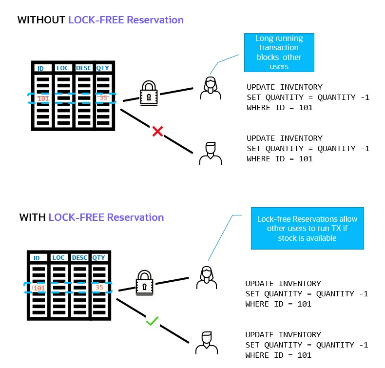
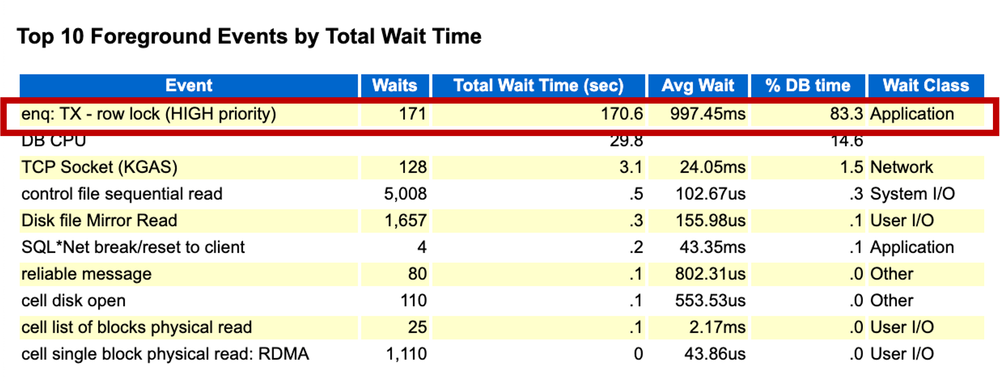
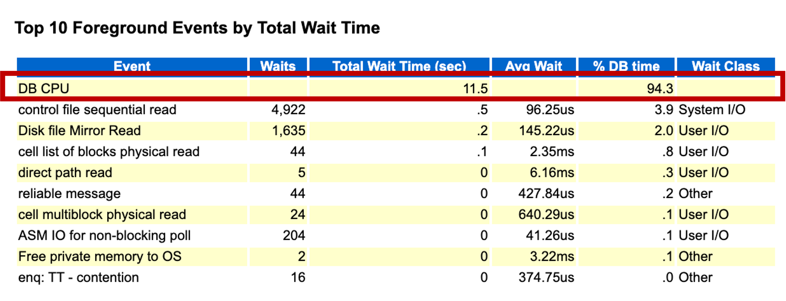

# Oracle Database 23ai : Lock-Free Reservations

- [Oracle Database 23ai : Lock-Free Reservations](#oracle-database-23ai--lock-free-reservations)
  - [Lock-Free Reserversion 개요](#lock-free-reserversion-개요)
  - [Lock-Free Reservation 기본 동작](#lock-free-reservation-기본-동작)
  - [RESERVABLE 컬럼 제약 사항](#reservable-컬럼-제약-사항)
  - [Lock-Free Reservation 동시성 성능 테스트](#lock-free-reservation-동시성-성능-테스트)

## Lock-Free Reserversion 개요

Oracle Database 23ai 에서 제공하는 Lock-Free Reservation 기능은 숫자 컬럼에 대한 여러 동시 업데이트가 발생할 때 커밋되지 않은 업데이트로 인해 Lock 대기가 발생하지 않고 진행될 수 있도록 합니다.

Lock-Free Reservation 기능을 사용하면 `Reservable Column`에 대한 빈번한 동시 업데이트가 있는 경우 기존의 Locking 메커니즘을 피함으로써 Lock 대기를 줄여 사용자 경험을 크게 개선할 수 있습니다. Lock-Free Reservation 기능은 업데이트가 진행될 수 있는 조건을 지정하여 트랜잭션이 서로를 차단하지 않고 동일한 행의 Reservable Column에서 동시에 더하거나 뺄 수 있도록 할 수 있습니다.  이는 숫자 열이 RESERVABLE 열임을 지정하고 열에 대한 CHECK 제약 조건을 생성하여 수행됩니다. 

Lock-Free Reservation 기능 활용에 대한 사례를 살펴보겠습니다.  
트랜잭션 처리에는 일반적으로 많은 수의 데이터 업데이트가 포함됩니다. 예를 들어, 쇼핑몰 애플리케이션의 경우 사용자가 상품을 카트에 넣을 때 해당 상품 정보(재고)에 대한 변경이 발생합니다. 카트에 상품을 추가하고 체크아웃하거나 카트를 삭제하는 여러 동시 트랜잭션이 있는 경우 커밋 또는 롤백으로 수량을 변경하기 전에 해당 행에 대해 Lock 이 발생합니다. 
데이터에 대한 Lock 이 장기간 유지되면, Lock이 해제될 때까지 다른 동시 트랜잭션이 항목을 수정하지 못하고 대기해야만 합니다.

이러한 장시간 Lock 대기 현상을 해결할 수 있는 한가지 방법으로, 23ai 에서는 [Priority Transaction](./23ai%20-%20Priority%20Transactions.html) 기능을 제공합니다.  하지만, Priotiry Transaction 기능은 트랜잭션에 우선순위를 할당하고 특정 대기 시간 후에만 낮은 우선순위의 트랜잭션을 종료할 수 있기 때문에 대기 시간이 발생하는 것을 없애지는 못합니다. 또한, 동일한 유형의 트랜잭션을 수행할 때 트랜잭션의 우선순위를 사전에 설정하는 것도 불가능합니다.

23ai 의 Lock-Free Reservation 기능은 Reservable Column 에 대한 업데이트를 수행하는 트랜잭션에 대해 Lock 대기가 발생하지 않고 동시 트랜잭션을 진행할 수 있도록 합니다.

이를 위해, Lock-free Reservation 기능은 "journal table" 이라는 개념을 도입합니다. 특정 행을 업데이트할 경우 Journal table 에 새로운 행을 삽입하여 업데이트하는 행에 대해 Lock이 발생하지 않도록 합니다.  커밋 시, 실제 행을 변경하기 위해 Lock을 획득합니다. 하지만, "커밋 시"에만 해당되므로 Lock 이 매우 빠르게 해제됩니다.



Lock-Free Reservation 기능에 대한 몇가지 테스트를 통해 동작 방식을 살펴보겠습니다.

- 참고 문서
    - [Database Development Guide - Using Lock-Free Revervation](https://docs.oracle.com/en/database/oracle/oracle-database/23/adfns/using-lock-free-reservation.html#GUID-60D87F8F-AD9B-40A6-BB3C-193FFF0E60BB)
    - [Concepts Guide Lock-free Reservation](https://docs.oracle.com/en/database/oracle/oracle-database/23/cncpt/tables-and-table-clusters.html#GUID-7C6A8E8A-F634-4D0D-877A-F948D6101066)


## Lock-Free Reservation 기본 동작

Lock-Free Reservation 기능은 트랜잭션이 업데이트가 진행될 수 있는 조건을 지정하여 서로를 차단하지 않고 동일한 행의 RESERVABLE 컬럼에 대해 동시에 숫자를 더하거나 뺄수 있도록 합니다.  `RESERVABLE` 컬럼 지정은 숫자 컬럼에 대해서만 가능하고, 컬럼에 대한 CHECK 제약 조건을 생성하여 수행됩니다. 

그럼, 간단한 예를 통해 Lock-Free Revervation 기능이 어떻게 작동하는지 알아보도록 하겠습니다.

- INVENTORY 테이블을 생성하고 QTY_ON_HAND 컬럼을 `RESERVABLE` 로 지정합니다.  `REVERVABLE` 컬럼은 숫자 데이터 타입만 지원되고, Primary Key 가 있는 테이블의 컬럼에만 지정할 수 있습니다.
    ```sql
    drop table if exists inventory purge;
    create table inventory ( 
        item_id            NUMBER          CONSTRAINT inv_pk PRIMARY KEY,
        item_display_name  VARCHAR2(100)   NOT NULL,
        item_desc          VARCHAR2(2000),
        qty_on_hand        NUMBER          RESERVABLE 
                                           CONSTRAINT qty_ck 
                                           CHECK (qty_on_hand >= 0) NOT NULL,
        shelf_capacity     NUMBER          NOT NULL,
        CONSTRAINT shelf_ck CHECK (qty_on_hand <= shelf_capacity)
    );

    insert into inventory values (123, 'Milk',  'Lowfat 2%',  100, 120);
    insert into inventory values (456, 'Bread', 'Multigrain', 50,  100);
    insert into inventory values (789, 'Eggs',  'Organic',    50,   75);
    commit;
    ```

    제약 조건의 사용은 선택 사항입니다. RESERVABLE 컬럼에 적용된 제약 조건에 따라 트랜잭션은 수량이 업데이트를 수행하기에 충분한지 여부를 결정합니다. 이 예에서는 업데이트 시 QTY_ON_HAND의 값이 항상 양수인지 체크합니다.

- RESERVABLE 컬럼 정보는 USER_TABLES, USER_TAB_COLS 뷰를 통해 확인할 수 있습니다.
    ```sql
    col table_name format a30
    col has_reservable_column format a30
    col reservable_column format a30
    col column_name format a30

    select table_name, has_reservable_column
    from user_tables
    where table_name = 'INVENTORY';

    TABLE_NAME                     HAS_RESERVABLE_COLUMN
    ------------------------------ ---------------------
    INVENTORY                      YES


    select column_name, reservable_column
    from user_tab_cols
    where table_name = 'INVENTORY' and reservable_column = 'YES';

    COLUMN_NAME               RESERVABLE_COLUMN
    ------------------------- -----------------
    QTY_ON_HAND               YES
    ```

- 제약 조건에 대한 자세한 내용은 USER_CONSTRAINTS에서 확인할 수 있습니다.
    ```sql
    col search_condition format a40
    col constraint_name format a20
    
    select constraint_name, search_condition
    from user_constraints 
    where table_name='INVENTORY';

    CONSTRAINT_NAME      SEARCH_CONDITION
    -------------------- ----------------------------------------
    SYS_C0024229         "ITEM_DISPLAY_NAME" IS NOT NULL
    SYS_C0024230         "QTY_ON_HAND" IS NOT NULL
    SYS_C0024231         "SHELF_CAPACITY" IS NOT NULL
    QTY_CK               qty_on_hand >= 0
    SHELF_CK             qty_on_hand <= shelf_capacity
    INV_PK

    6 rows selected.
    ```

- RESERVABLE 컬럼을 가지는 테이블을 생성하면 Journal Table 도 자동으로 생성됩니다.  테이블 명은 `SYS_RESERVJRNL_<OBJECT_ID>` 로 생성됩니다.
    ```sql
    select object_id, object_name, object_type 
    from   user_objects
    where  object_name = 'INVENTORY';

    OBJECT_ID OBJECT_NAME                    OBJECT_TYPE
    ---------- ------------------------------ -----------------------
        99753 INVENTORY                      TABLE
    
    select object_name, object_type, created
    from user_objects 
    where object_name like '%_99753';

    OBJECT_NAME                    OBJECT_TYPE             CREATED
    ------------------------------ ----------------------- ---------
    SYS_RESERVJRNL_99753           TABLE                   20-AUG-24

    select * from tab 
    where tname like '%_99753';     
    
    TNAME                          TABTYPE        CLUSTERID
    ------------------------------ ------------- ----------
    SYS_RESERVJRNL_99753           TABLE
    ```
 
- 생성된 Journal Table 을 활용하여 Lock-Free Reservation 기능은 트랜잭션 실행 중에 데이터베이스에서 발생하는 RESERVABLE 컬럼에 대한 업데이트를 추적할 수 있습니다.
    Journal Table 정보는 다음과 같습니다.
    ```sql
    desc SYS_RESERVJRNL_99753

    Name                                      Null?    Type
    ----------------------------------------- -------- ----------------------------
    ORA_SAGA_ID$                                       RAW(16)
    ORA_TXN_ID$                                        RAW(8)
    ORA_STATUS$                                        VARCHAR2(11)
    ORA_STMT_TYPE$                                     VARCHAR2(6)
    ITEM_ID                                   NOT NULL NUMBER
    QTY_ON_HAND_OP                                     VARCHAR2(1)
    QTY_ON_HAND_RESERVED                               NUMBER    
    ```

다음 시나리오에서는 두 트랜잭션에서 ITEM_ID 123에 대한 RESERVABLE 컬럼 QTY_ON_HAND의 값을 변경합니다.  
테스트를 위해 두개의 세션을 연결합니다.
 
- [세션 1] - 트랜잭션 1

    트랜잭션 1에서 두 개의 UPDATE를 수행하려고 합니다. 두 번째 UPDATE는 제약 조건 오류가 발생하는 것을 확인할 수 있습니다.

    ```sql
    select * from inventory;

       ITEM_ID ITEM_DISPLAY_NAME    ITEM_DESC            QTY_ON_HAND SHELF_CAPACITY
    ---------- -------------------- -------------------- ----------- --------------
           123 Milk                 Lowfat 2%                    100            120
           456 Bread                Multigrain                    50            100
           789 Eggs                 Organic                       50             75

    update inventory
    set qty_on_hand = qty_on_hand - 50
    where item_id = 123;

    1 row updated.


    update inventory 
    set qty_on_hand = qty_on_hand - 60 
    where item_id = 123;
    *
    ERROR at line 1:
    ORA-02290: check constraint (ADMIN.QTY_CK) violated
    ```

- 트랜잭션에 의해 변경된 사항은 저널 테이블을 조회하여 변경 사항을 확인할 수 있습니다.
    ```sql
    select * from SYS_RESERVJRNL_99753;

    ORA_SAGA_ID$                     ORA_TXN_ID$      ORA_STATUS$ ORA_ST    ITEM_ID Q QTY_ON_HAND_RESERVED
    -------------------------------- ---------------- ----------- ------ ---------- - --------------------
                                     0A001E00D6560000 ACTIVE      UPDATE        123 -                   50
    ```

- [세션 2] - 트랜잭션 2  
  
    다른 트랜잭션에서 동일한 항목의 UPDATE를 수행합니다.  Lock 대기없이 바로 업데이트가 수행되는 것을 확인할 수 있습니다.
    ```sql
    update inventory
     set qty_on_hand = qty_on_hand + 20
     where item_id = 123;

     1 row updated.         --> Lock 대기없이 UPDATE 수행 성공
    ```

- Journal 테이블 정보를 다시 확인해 봅니다. 
    ```sql
    select * from SYS_RESERVJRNL_99753;

    ORA_SAGA_ID$                     ORA_TXN_ID$      ORA_STATUS$ ORA_ST    ITEM_ID Q QTY_ON_HAND_RESERVED
    -------------------------------- ---------------- ----------- ------ ---------- - --------------------
                                     01001100190D0000 ACTIVE      UPDATE        123 +                   20
    ```

- [세션 2] - 트랜잭션 2
    
    트랜잭션이 커밋되지 않았기 때문에 행의 UPDATE가 아직 수행되지 않았습니다.

    ```sql
    select item_id, qty_on_hand, shelf_capacity 
    from inventory where item_id=123;

       ITEM_ID QTY_ON_HAND SHELF_CAPACITY
    ---------- ----------- --------------
           123         100            120
    ```

- [세션 2] - 트랜잭션 2
    
    COMMIT 을 수행합니다. Lock-Free Reservation은 트랜잭션의 COMMIT 시점에 실제 업데이트가 반영됩니다.
    ```sql
    commit; 
    Commit complete.

    select item_id, qty_on_hand, shelf_capacity 
    from inventory where item_id=123;

       ITEM_ID QTY_ON_HAND SHELF_CAPACITY
    ---------- ----------- --------------
           123         120            120
    ```

- [세션 1] - 트랜잭션 1

    세션 1에서 COMMIT을 수행합니다. 마지막으로 트랜잭션 1의 변경 사항이 적용되는 것을 확인할 수 있습니다.
    ```sql
    commit; 
    Commit complete.

    select item_id, qty_on_hand, shelf_capacity  
    from inventory where item_id=123;

       ITEM_ID QTY_ON_HAND SHELF_CAPACITY
    ---------- ----------- --------------
           123          70            120
    ```

## RESERVABLE 컬럼 제약 사항

Lock-Free Reservation 기능은 다양한 제약 사항이 있습니다.  

상세한 내용은 [Guidelines and Restrictions for Lock-Free Reservation](https://docs.oracle.com/en/database/oracle/oracle-database/23/adfns/using-lock-free-reservation.html#GUID-B2C0C556-64D0-47B6-B8AE-C97AD56A0F96) 문서를 참조하시기 바랍니다.

- Lock-Free Reservation 을 사용하기 위해서는 테이블에 반드시 Primary Key 가 있어야 합니다.
    ```sql
    drop table if exists t1 purge;

    create table t1 (
    code varchar2(10),
    res_col  number reservable
    );
    *
    ERROR at line 1:
    ORA-55728: Reservable column property can only be specified for a column on a table that has a primary key.
    ```

- RESERVABLE 컬럼에 값을 직접 할당하는 것은 허용되지 않습니다. RESERVABLE 컬럼은 +, - 연산만 가능합니다.  
    ```sql
    update inventory set qty_on_hand=qty_on_hand 
    where item_id = 123;   
        *
    ERROR at line 1:
    ORA-55746: Reservable column update statement only supports + or - operations on a reservable column.
    ```

- `+`, `-` 이외의 다른 연산 수행 시에도 에러가 발생합니다.
    ```sql
    update inventory set qty_on_hand=qty_on_hand * 5
    where item_id = 123;
       *
    ERROR at line 1:
    ORA-55746: Reservable column update statement only supports + or - operations on a reservable column.
    ```

- UPDATE 시 반드시 WHERE 구문에 Primary Key 조건이 있어야 합니다.
    ```sql
    update inventory set qty_on_hand=qty_on_hand + 5;
        *
    ERROR at line 1:
    ORA-55732: Reservable column update should specify all the primary key columns in the WHERE clause.
    ```

- RESERVABLE 컬럼에 대한 UPDATE 가 있다면, 해당 행을 삭제할 수 없습니다.
    ```sql
    update inventory set qty_on_hand=qty_on_hand + 5
    where item_id = 123;

    1 row updated.

    delete from inventory where item_id = 123;
    *
    ERROR at line 1:
    ORA-55754: Resource busy error is detected for the reservable column update statement. 
    A delete or a DDL operation is conflicting with this update statement.

    -- COMMIT 수행 후 정상 DELETE
    commit;
    delete from inventory where item_id = 123;  

    1 row deleted.

    rollback;
    ```

- 또한, 하나의 업데이트 문에서 RESERVABLE 컬럼과 일반 컬럼 업데이트를 같이 수행하는 것은 허용되지 않습니다.
    ```sql
    update inventory set 
        qty_on_hand=qty_on_hand + 5,
        shelf_capacity = shelf_capacity - 5
    where item_id = 123;
           *
    ERROR at line 1:
    ORA-55735: Reservable and non-reservable columns cannot be updated in the same statement.
    ```

## Lock-Free Reservation 동시성 성능 테스트

Lock-Free Reservation 의 동시 수행 트랜잭션의 성능을 테스트를 통해 살펴보겠습니다.

**테스트 1 : Standard Locking**

비교를 위해 일반적인 Row Locking 방식으로 수행할 경우를 먼저 확인합니다.

- 테스트를 위한 테이블과 프로시져 생성
    ```sql
    -- Create a table: we will update concurrently the VAL column
    drop table if exists T_COUNTER2 purge;

    create table T_COUNTER2
    (
        ID number primary key,
        VAL NUMBER
    );

    -- Insert a row
    insert into T_COUNTER2(ID,VAL) values (0,0);
    commit;

    -- Update 함수 생성
    -- Update 후 Commit 수행 전 1초 sleep 추가 - 1초간 Row Lock 발생
    CREATE OR REPLACE PROCEDURE PC_UPD_COUNTER2_TT
    IS
    BEGIN
        update T_COUNTER2
        set VAL = VAL+1
        where ID = 0;

        --- Sleep 1s to simulate think time
        DBMS_SESSION.SLEEP(1);
        --
        commit;
    END PC_UPD_COUNTER2_TT;
    /
    ```

- 성능 검증을 위해 AWR Snapshot 수행.  추후 AWR Report 상의 Wait Event 정보 조회
    ```sql
    -- login as ADMIN
    EXEC DBMS_WORKLOAD_REPOSITORY.create_snapshot;
    ```

- 두개의 SQL\*Plus 세션에서 다음의 코드를 동시 수행. 100회 UPDATE 수행. 단일 수행 시 소요시간은 약 100초가 조금 넘는 시간에 수행되어야 함
    ```sql
    BEGIN
        for i in 1..100
        LOOP
            PC_UPD_COUNTER2_TT;
        END LOOP;
    END;
    /
    ```

- 수행 시간 확인

    Row Lock 발생으로 인해 수행 시간이 길어지는 것을 확인할 수 있습니다.

    ```sql
    -- Session 1
    PL/SQL procedure successfully completed.

    Elapsed: 00:02:53.45
    ```

    ```sql
    -- Session 2
    PL/SQL procedure successfully completed.

    Elapsed: 00:03:17.98
    ```

- 수행 완료 후 AWR Sanpshot 수행 후 AWR Report 를 확인합니다.    
    ```sql
    EXEC DBMS_WORKLOAD_REPOSITORY.create_snapshot;
    ```

    AWR Report 는 Autonomous Database 의 Performance Hub 의 Report 메뉴에서 확인할 수 있습니다.  
    

    위의 AWR Report 에서 보는 바와 같이 DB Time 의 대부분이 `enq: TX - row lock` 대기에 소요된 것을 확인할 수 있습니다.  


**테스트 2 : Lock-Free Reservation**

이제 동일한 테스트를 Lock-Free RESERVABLE 컬럼을 사용하여 테스트해 보겠습니다.

- RESERVABLE 컬럼으로 테이블 재생성
    ```sql
    -- Create a table with a RESERVABLE column:
    drop table if exists T_COUNTER2 purge;
    create table T_COUNTER2
    (
        ID number primary key,
        VAL NUMBER RESERVABLE
    );

    -- Insert a row
    insert into T_COUNTER2(ID,VAL) values (0,0);
    commit;
    ```

- AWR Snapshot 수행.
    ```sql
    -- login as ADMIN
    EXEC DBMS_WORKLOAD_REPOSITORY.create_snapshot;
    ```

- 두개의 SQL\*Plus 세션에서 앞에서 수행한 코드를 동시 수행. 
    ```sql
    BEGIN
        for i in 1..100
        LOOP
            PC_UPD_COUNTER2_TT;
        END LOOP;
    END;
    /
    ```

- 수행 시간 확인  
    ```sql
    -- Session 1
    PL/SQL procedure successfully completed.

    Elapsed: 00:01:40.54
    ```

    ```sql
    -- Session 2
    PL/SQL procedure successfully completed.

    Elapsed: 00:01:40.34
    ```

    수행 시간이 약 100초 정도에 완료된 것을 확인할 수 있습니다.  동일한 행에 대한 UPDATE 가 동시에 발생하더라도 Row Lock 대기가 없다는 것을 추측할 수 있습니다.

- 수행 완료 후 AWR Sanpshot 수행 후 AWR Report 를 확인합니다.
    ```sql
    EXEC DBMS_WORKLOAD_REPOSITORY.create_snapshot;
    ```

    

    위의 AWR Report 에서 보는 바와 같이 DB Time 의 대부분이 CPU Time 인 것을 확인할 수 있습니다.  
    앞에서 테스트한 일반적인 Lock 환경에서 발생했던 `enq: TX - row lock` 대기가 발생하지 않는 것을 확인할 수 있습니다.


