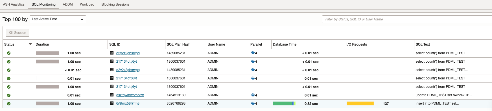

# Oracle Database 23ai - New Features for Developers

- [Oracle Database 23ai - New Features for Developers](#oracle-database-23ai---new-features-for-developers)
  - [Unrestricted Direct Load - PDML 기능 개선](#unrestricted-direct-load---pdml-기능-개선)
  - [GROUP BY 구문에 컬럼 Alias 사용 가능](#group-by-구문에-컬럼-alias-사용-가능)
  - [FROM 절이 없는 SELECT 구문](#from-절이-없는-select-구문)
  - [Boolean Data Type](#boolean-data-type)
  - [IF \[NOT\] EXISTS DDL 구문](#if-not-existsddl-구문)
  - [New Table Value Constructor](#new-table-value-constructor)
  - [Joins in UPDATE and DELETE](#joins-in-update-and-delete)
  - [DEFAULT ON NULL FOR INSERT AND UPDATE](#default-on-null-for-insert-and-update)

Oracle Database 23ai 의 새로운 기능 중 재밌는 몇 가지를 소개하겠습니다.

## Unrestricted Direct Load - PDML 기능 개선

Oracle Database 23ai 이전 릴리스에서는 병렬 DML 을 수행한 후 Commit 전에 동일한 테이블에 대한 조회나 추가 DML 이 허용되지 않았습니다.  
Unrestricted Direct Load 기능을 통해 PDML 을 수행한 동일한 테이블에 대해 DML을 수행하거나 조회를 할 수 있습니다.  Savepoint 로의 롤백도 지원됩니다.

이 기능은 데이터를 로드하고 쿼리할 때 발생할 수 있는 제한 사항을 제거합니다. 데이터 웨어하우징 및 복잡한 일괄 처리와 같은 작업 수행 시 애플리케이션 성능을 잠재적으로 향상시킬 수 있고, PDML 에 대한 트랜잭션 관리도 가능합니다.


다음은 19c 에서 PDML 테스트 결과입니다.  아래에서 보는 바와 같이 PDML 후 쿼리를 수행하면 `ORA-12838` 에러가 발생하는 것을 확인할 수 있습니다.

>ADW 의 ECPU = 2 일 경우, HIGH 서비스로 접속해도 병렬로 수행되지 않습니다.  ECPU 를 4 이상으로 구성하여 테스트해야 합니다.   
>ADW 의 Database Actions -> SQL (SQL Developer Web) 의 경우, AutoCommit 방식으로 동작합니다.  따라서, 테스트 시 Cloud Shell 이나 Compute Intance 등에서 SQLPlus 로 테스트해야 합니다.  [참고자료](https://asktom.oracle.com/ords/f?p=100:11:::::P11_QUESTION_ID:9545548900346904742)


```sql
$ sqlplus admin/<PWD>@<DBNAME>_high                  # 19c ADW - 병렬 처리를 위해 HIGH 서비스로 접속

-- Oracle Database 19c
SQL> drop table PDML_TEST purge;
drop table PDML_TEST purge
           *
ERROR at line 1:
ORA-00942: table or view does not exist


SQL> create table PDML_TEST as select * from all_objects;

Table created.

SQL> select count(*) from PDML_TEST;

  COUNT(*)
----------
     80912

--PDML 수행
--alter session enable parallel dml;
SQL> insert into PDML_TEST select * from PDML_TEST;    

80912 rows created.

-- SELECT -> 에러 발생
SQL> select count(*) from PDML_TEST;
select count(*) from PDML_TEST
                     *
ERROR at line 1:
ORA-12838: cannot read/modify an object after modifying it in parallel
```


동일한 작업을 23ai 에서 수행하면 정상 수행됩니다.

```sql
$ sqlplus admin/<PWD>@adb23ai_high         # 23ai ADB - 병렬 처리를 위해 HIGH 서비스로 접속

-- TEST 테이블 생성
SQL> drop table if exists PDML_TEST purge;

Table dropped.

SQL> create table PDML_TEST as select * from all_objects;

Table created.

SQL> select count(*) from PDML_TEST;

  COUNT(*)
----------
     86881

-- PDML 수행
--alter session enable parallel dml;

SQL> insert into PDML_TEST select * from PDML_TEST;

86881 rows created.

-- SELECT -> 정상동작
SQL> select count(*) from PDML_TEST;

  COUNT(*)
----------
    173762

-- PDML - UPDATE 수행 
SQL> update PDML_TEST set owner='TEST' where owner='ADMIN';

78 rows updated.

SQL> select count(*) from PDML_TEST where owner = 'TEST';

  COUNT(*)
----------
        78

-- Rollback 
SQL> rollback;

Rollback complete.

SQL> select count(*) from PDML_TEST;

  COUNT(*)
----------
     86881

SQL> select count(*) from PDML_TEST where owner = 'TEST';

  COUNT(*)
----------
         0

```


병렬 수행 확인


## GROUP BY 구문에 컬럼 Alias 사용 가능

Oracle 23ai 에서는 GROUP BY 구문에서 SELECT 구문의 컬럼 alias를 사용할 수 있게 되어 GROUP BY 문을 더 편하고 간단하게 작성할 수 있게 되었습니다.

이 기능은 다른 데이터베이스(Teradata, MySQL, PostgreSQL, ...)와 호환성을 제공하므로 SQL 변환 작업이 간단해지고, PoC나 BMT와 같은 작업 시 특히 유용합니다.

간단한 예제를 살펴보면, 이전에는 GROUP BY 문을 다음과 같이 작성해야 했습니다.

```sql
SELECT to_char(hiredate,'YYYY') "Year", count(*)
FROM emp
GROUP BY to_char(hiredate,'YYYY');
```

SELECT 구문에 컬럼 alias가 있어도, GROUP BY 구문에서는 컬럼 expression을 그대로 적어야 했습니다.

하지만, Oracle 23ai 에서는 컬럼 alias 를 사용하여 더 간단하게 GROUP BY 문을 작성할 수 있습니다. 기존 작성 방법과 비교해보면 더 편하고 간단해진 것을 확인할 수 있습니다.

```sql
SELECT to_char(hiredate,'YYYY') "Year", count(*)
FROM emp
GROUP BY "Year";

Year   COUNT(*)
---- ----------
1981          8
1982          1
              1
```

GROUP BY 구문에 Alias 뿐만 아니라 *position* (순서) 도 사용할 수 있습니다.   이를 위해서는 `group_by_position_enabled` 파라미터를 `true` 로 설정해야 합니다. (default = false)

```sql
SELECT to_char(hiredate,'YYYY') "Year", count(*)
FROM emp
GROUP BY 1;

SELECT to_char(hiredate,'YYYY') "Year", count(*)
               *
ERROR at line 1:
ORA-03162: "HIREDATE": must appear in the GROUP BY clause or be used in an aggregate function as
'group_by_position_enabled' is FALSE

alter session set group_by_position_enabled=true;

SELECT to_char(hiredate,'YYYY') "Year", count(*)
FROM emp
GROUP BY 1;

Year   COUNT(*)
---- ----------
1981          8
1982          1
              1
```


## FROM 절이 없는 SELECT 구문

- Oracle 23ai 에서는 `FROM` 구문없이 `SELECT` 문장을 사용할 수 있습니다.  
- 이 기능또한, 다른 데이터베이스(MS SQL Server, MySQL, PostgreSQL, 등)와 호환성을 제공해 줍니다.

```sql
SELECT sysdate;

SYSDATE
---------
09-JUL-24

-- 23ai 이전 버전 (19c)
select sysdate
*
ERROR at line 1:
ORA-00923: FROM keyword not found where expected
```

위의 구문을 23ai 이전 Oracle DB 에서 수행하면 에러가 발생하는데, 23ai 에서는 정상동작합니다.  또한, PL/SQL 에서도 지원합니다.

## Boolean Data Type

Oracle Database 23ai 에는 새로운 `BOOLEAN` Datatype이 도입되었습니다.  숫자 값으로 시뮬레이션하는 대신 실제 Boolean 컬럼/변수를 사용할 수 있습니다.  이를 통해, Boolean 비교 조건을 사용하는 SQL 문을 단순하게 작성할 수 있게됩니다.

```sql
create table TEST_BOOLEAN ( 
	name        VARCHAR2(100),
	IS_SLEEPING BOOLEAN
);

alter table TEST_BOOLEAN modify (IS_SLEEPING boolean NOT NULL);
alter table TEST_BOOLEAN modify (IS_SLEEPING default FALSE);

insert into TEST_BOOLEAN (name) values ('Mick');
insert into TEST_BOOLEAN (name, is_sleeping) values ('Keith','NO');
insert into TEST_BOOLEAN (name, is_sleeping) values ('Ron',1);

select name from test_boolean where not is_sleeping;

NAME    
-----   
Mick    
Keith

select * from test_boolean;

NAME  IS_SLEEPING   
----- -----------   
Mick            0   
Keith           0   
Ron             1

select dump(is_sleeping) from test_boolean where name = 'Ron';

DUMP(IS_SLEEPING) 
----------------- 
Typ=252 Len=1: 1  

```

>SQLPlus 23c 버전에서는 TRUE/FALSE 로 표시되지만, 예전 버전의 SQLPlus 에서는 1/0 으로 표시됩니다.  테스트 시 19c client SQLPLUS 로 테스트하여 결과가 1/0 으로 표시되었습니다.
>SQLcl 의 경우 모든 버전에서 (23ai 포함) 1/0 으로 표시됩니다.


## IF [NOT] EXISTS DDL 구문

​Oracle Database 23ai 부터 새로운 `IF [NOT] EXISTS DDL` 구문을 사용하여 DDL 오류 처리 방법을 결정할 수 있습니다.  이 기능은 Object (테이블등)들이 존재하거나 존재하지 않아 발생하는 에러를 스크립트에서 숨길 수 있으므로 DDL 스크립트 작업을 단순화할 수 있습니다.

```sql
desc dept

Name   Null?    Type           
------ -------- ------------   
DEPTNO NOT NULL NUMBER(2)      
DNAME           VARCHAR2(14)   
LOC             VARCHAR2(13)   


-- 존재하는 테이블 CREATE
create table if not exists dept (
	deptno number(2), 
	dname varchar2(14),
	loc varchar2(13)
);

Table DEPT created.


-- 존재하지 않는 테이블 DROP
drop table if exists dept1;

Table DEPT1 dropped.

-- CTAS
create table if not exists dept1 as select * from dept;

Table DEPT1 created.


drop table if exists dept1;

Table DEPT1 dropped.
```


## New Table Value Constructor

Table Value Constructor 를 사용하여 SQL 문에서 하나의 constructor를 사용하여 여러 개의 행을 정의할 수 있습니다.
이 기능은 INSERT 뿐만 아니라 SELECT 문 및 WITH 구문에서도 사용할 수 있습니다.   이를 통해 SQL 구문이 단순화되고, DUAL 테이블 사용을 피할 수 있습니다.

```sql
-- TEST 테이블 생성
create table if not exists test (
	deptno number(2), 
	dname varchar2(14),
	loc varchar2(13)
);

```

- **INSERT**  
	PostgreSQL 등과 같은 다른 데이터베이스와 마찬가지로 단일 INSERT 문에 여러 로우를 INSERT 할 수 있습니다.   이 구문을 사용하면 한번의 네트워크 round trip 에 수행됩니다. 또한, 이 기능은 Auto Commit 모드에서 일부 INSERT 작업의 일관성을 보장하는 데 사용될 수도 있습니다. 

  ```sql
  insert into test values
    (50,'HR','LOS ANGELES'), 
    (60,'IT','SAN FRANCISCO'), 
    (70,'MANUFACTURING','DETROIT')
  ;

  3 rows inserted.


  select * from test;

  DEPTNO DNAME         LOC             
  ------ ------------- -------------   
      50 HR            LOS ANGELES     
      60 IT            SAN FRANCISCO   
      70 MANUFACTURING DETROIT
  ```

- **SELECT**

  ```sql
  select * 
  from ( VALUES (50,'HR'), (60,'DEV'), (70,'AI') ) virt_dept (deptno, dname);

  DEPTNO DNAME   
  ------ -----   
      50 HR      
      60 DEV     
      70 AI
  ```

- **WITH Clause**

  ```sql
  WITH vtab (deptno, dname) AS ( 
    VALUES (50,'HR'), 
           (60,'DEV'), 
           (70,'AI') 
  ) 
  select * from vtab;

  DEPTNO DNAME   
  ------ -----   
      50 HR      
      60 DEV     
      70 AI
  ```

## Joins in UPDATE and DELETE

Foreign 테이블 조건에 따라 JOIN 을 통해 테이블 데이터를 UPDATE/DELETE 할 수 있습니다.  이 구문을 사용하면 Subquery 나 IN 구문을 사용하지 않아도 됩니다.

23ai 이전 버전에서는 다음의 구문을 통해 UPDATE를 수행해야 합니다.

```sql
update emp e 
set e.sal=e.sal*2
where e.deptno in 
	(select d.deptno 
	 from dept d 
	 where e.deptno=d.deptno 
	 and d.dname='RESEARCH')
;
```

23ai 에서는 다음과 같이 수행할 수 있습니다.
```sql
update emp e 
set e.sal=e.sal*2
from dept d
where e.deptno=d.deptno
and d.dname='RESEARCH';   
```

> ANSI Join 구문은 지원하지 않음.

DELETE 구문도 다음과 같이 수행할 수 있습니다.
```sql
delete emp e
from   dept d
where  e.deptno = d.deptno
and    d.dname = 'RESEARCH';
```


## DEFAULT ON NULL FOR INSERT AND UPDATE

Oracle Database 23ai 에서는 INSERT/UPDATE 에 대해 `DEFAULT ON NULL` 조건의 컬럼을 정의할 수 있습니다.  `DEFAULT ON NULL` 로 지정된 컬럼은 UPDATE 시 값을 `NULL`로 변경하려고 시도할 때 자동으로 특정 기본값으로 업데이트됩니다.

이 기능은 애플리케이션 개발을 단순화하고 원하는 동작을 달성하기 위해 복잡한 애플리케이션 코드나 데이터베이스 트리거가 필요하지 않게 해줍니다. 개발 생산성이 향상되고 코드 오류 가능성이 줄어듭니다.

Oracle 12c 에서 `DEFAULT ON NULL` 컬럼 정의 기능이 도입되었고, INSERT 문에서만 명시적으로 `NULL` 값을 지정한 경우에도 DEFAULT 값을 할당할 수 있었습니다.  Oracle 23ai 에서는 UPDATE 작업 시에도 Default 값 처리 기능을 제공합니다.

[View Documentation](https://www.oracle.com/pls/topic/lookup?ctx=en/database/oracle/oracle-database/23&id=SQLRF-GUID-F9CE0CC3-13AE-4744-A43C-EAC7A71AAAB6)

**DEFAULT 컬럼**

INSERT 작업 시 Default 값이 정의되어 있는 컬럼이  참조되지 않을 경우, 지정한 Default 값이 자동으로 INSERT 됩니다.

```sql
drop table if exists T_DEF purge;

create table T_DEF (
  id           number,
  name         varchar2(15) default 'DEF'
);

insert into T_DEF (id, name) values (1, NULL);
insert into T_DEF (id) values (2);

select * from T_DEF;

        ID NAME           
---------- ---------------
         1
         2 DEF

SQL> desc T_DEF
 Name                                      Null?    Type
 ----------------------------------------- -------- ----------------------------
 ID                                                 NUMBER
 NAME                                               VARCHAR2(15)
```

위의 결과에서 보듯이 명시적으로 `NULL` 을 지정한 경우 `NULL` 값이 입력되고, name 컬럼을 지정하지 않은 경우 default 값인 'DEF' 가 입력됩니다.

자, 그럼 UPDATE 테스트 결과를 확인해 보겠습니다.
```sql
update T_DEF
set    name = null
where  id = 2;

select * from T_DEF;

        ID NAME
---------- ---------------
         1
         2
```

UPDATE 시 명시적으로 `NULL`을 지정한 경우 default 값이 적용되지 않고 `NULL` 로 변경되는 것을 확인할 수 있습니다.

**DEFAULT ON NULL FOR INSERT AND UPDATE**

Oracle 23ai에는 INSERT/UPDATE에 대한 `DEFAULT ON NULL`로 컬럼을 정의하는 기능을 제공하여, 명시적으로 `NULL` 값이 할당된 경우에도 INSERT/UPDATE 에도 Default 값이 적용됩니다.

```sql
drop table if exists T_DEF purge;

create table T_DEF (
  id           number,
  name         varchar2(15) default on null for insert and update 'DEF'
);

-- INSERT 테스트
insert into T_DEF (id, name) values (1, null);
insert into T_DEF (id) values (2);

select * from T_DEF;

        ID NAME
---------- ---------------
         1 DEF
         2 DEF

-- UPDATE 테스트
update T_DEF set name = 'UPD'
where id = 2;

select * from T_DEF where id = 2;

        ID NAME
---------- ---------------
         2 UPD
     
update T_DEF set name = NULL
where id = 2;

select * from T_DEF where id = 2;

        ID NAME
---------- ---------------
         2 DEF
```

UPDATE 시 명시적으로 `NULL` 값을 지정하였지만, default 값인 'DEF' 로 변경된 것을 확인할 수 있습니다.
