# Oracle Cloud Login

- [Oracle Cloud Login](#oracle-cloud-login)
	- [Task 1 : Oracle Cloud Login](#task-1--oracle-cloud-login)
	- [Task 2 : Autonomous Database 서비스 확인](#task-2--autonomous-database-서비스-확인)

## Task 1 : Oracle Cloud Login

- 브라우저 주소창에 `cloud.oracle.com` 을 입력합니다.
	- Cloud Account Name : **apackrsct** 

	**Next** 클릭
	
	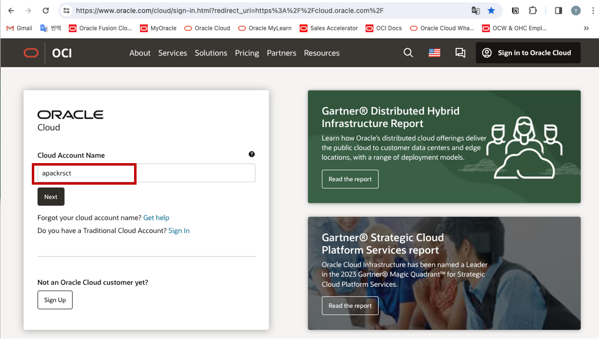

- **Identify Domain** = **Default** 선택 후 **Next** 클릭

	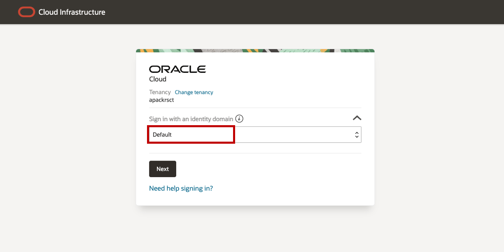

- User Name 과 Password 입력
	- User Name : **oci-bootcamp-user01** ~ **oci-bootcamp-user15**
	- Password : **WElcome123345__**

	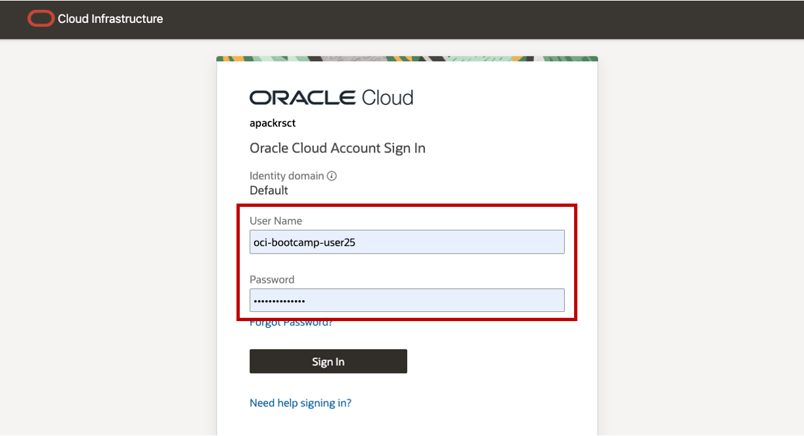

## Task 2 : Autonomous Database 서비스 확인

- Oracle Cloud Console 화면  
	Autonomous Database 서비스 화면으로 접속하기 위해 왼쪽 위의 햄버거 메뉴 클릭   
	**Oracle Database** 클릭
	**Autonomous Database** 클릭

	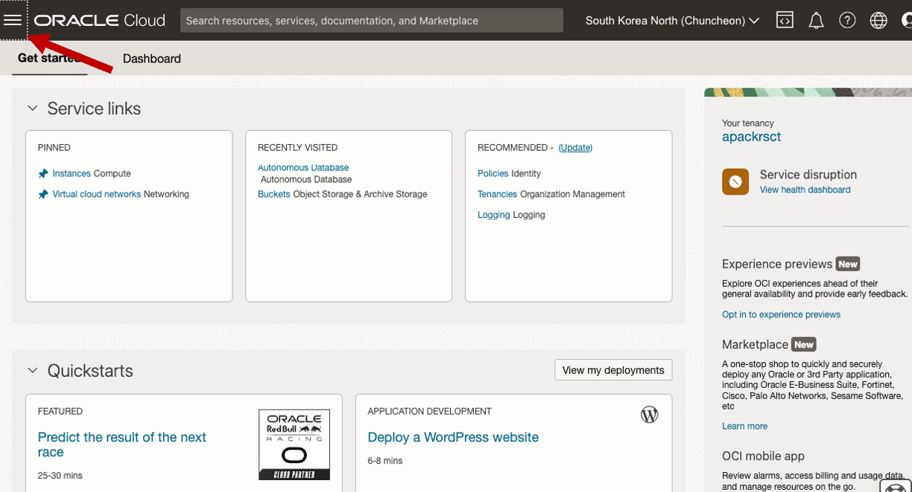

	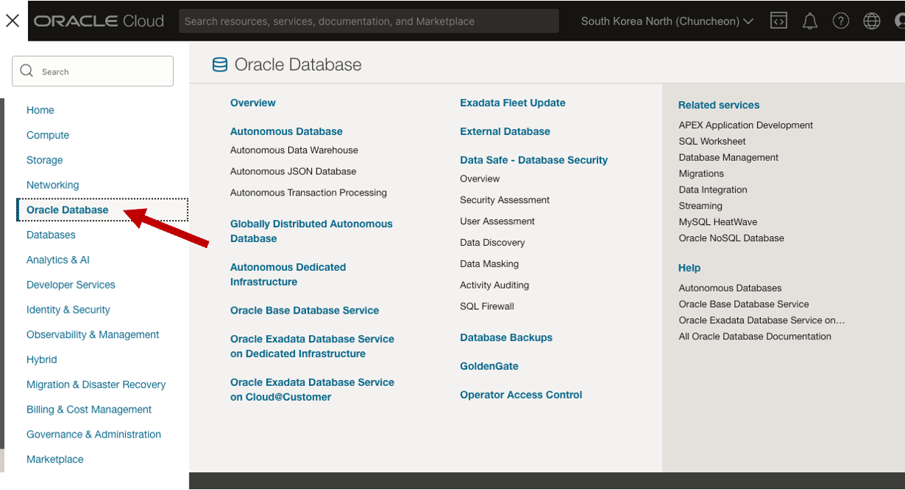

- Autonomous Database 서비스 콘솔 화면  
	화면과 같이 에러가 발생하는 것은 권한이 없기 때문으로 정상적인 상황입니다.

	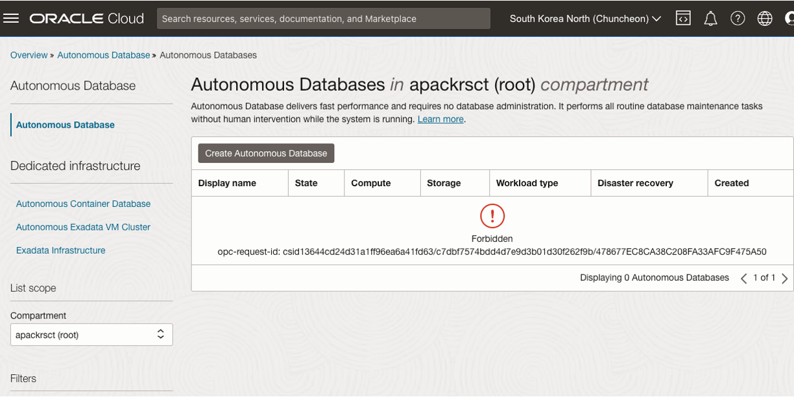

- Compartment 및 Region 설정
	- Compartment 지정 : 왼쪽 Compartment Drop-down 메뉴에서 **oci-bootcamp** 선택
	- Region : 오른쪽 위 **Region** 에서 사용자 별 지정 Region 선택
  

	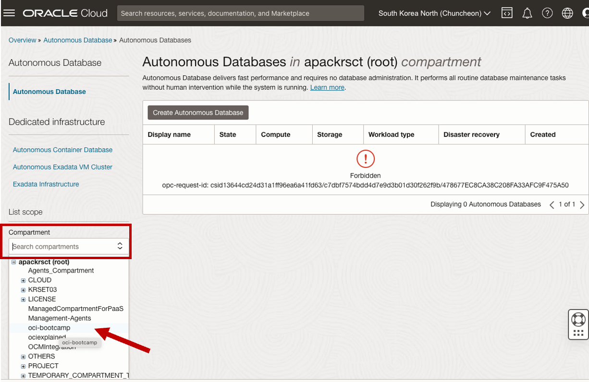

	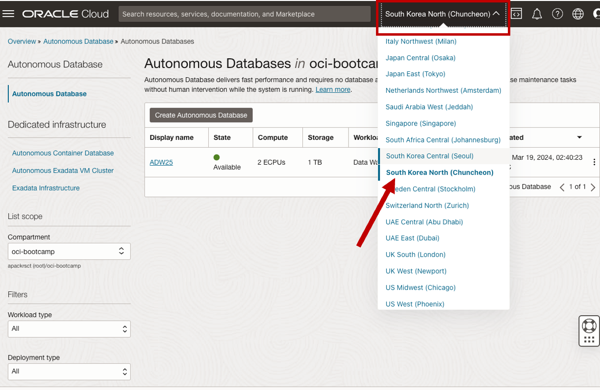

- 구성되어 있는 Autonomous Database 확인

	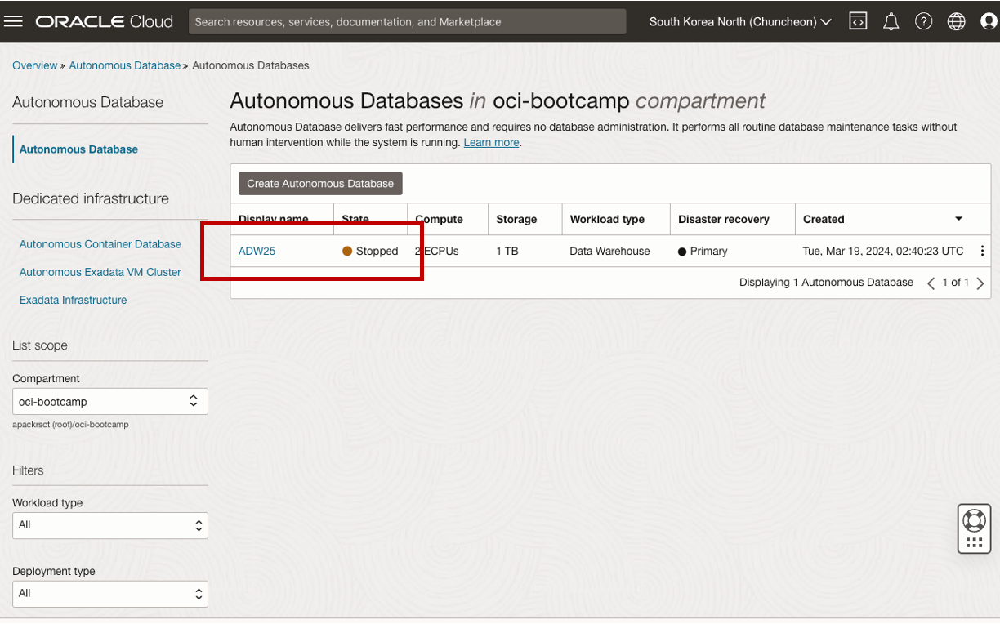

- 만약 **Stopped** 상태이면 Autonomous Database 구동
	- 데이터베이스 선택 : **ADW01 ~ ADW15**
	- **More Actions** 메뉴 클릭
	- **Start** 클릭 
	- **Confirm start** 창에서 **Start** 클릭

	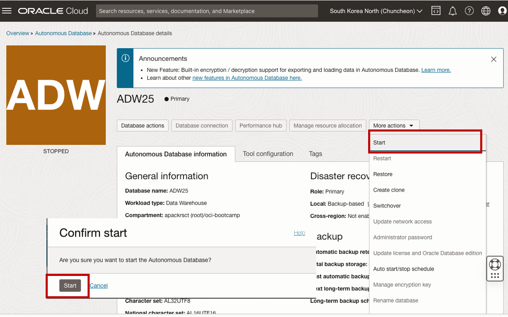

- Autonomous Database 구동 완료

	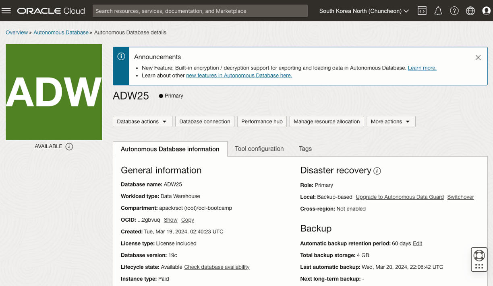
