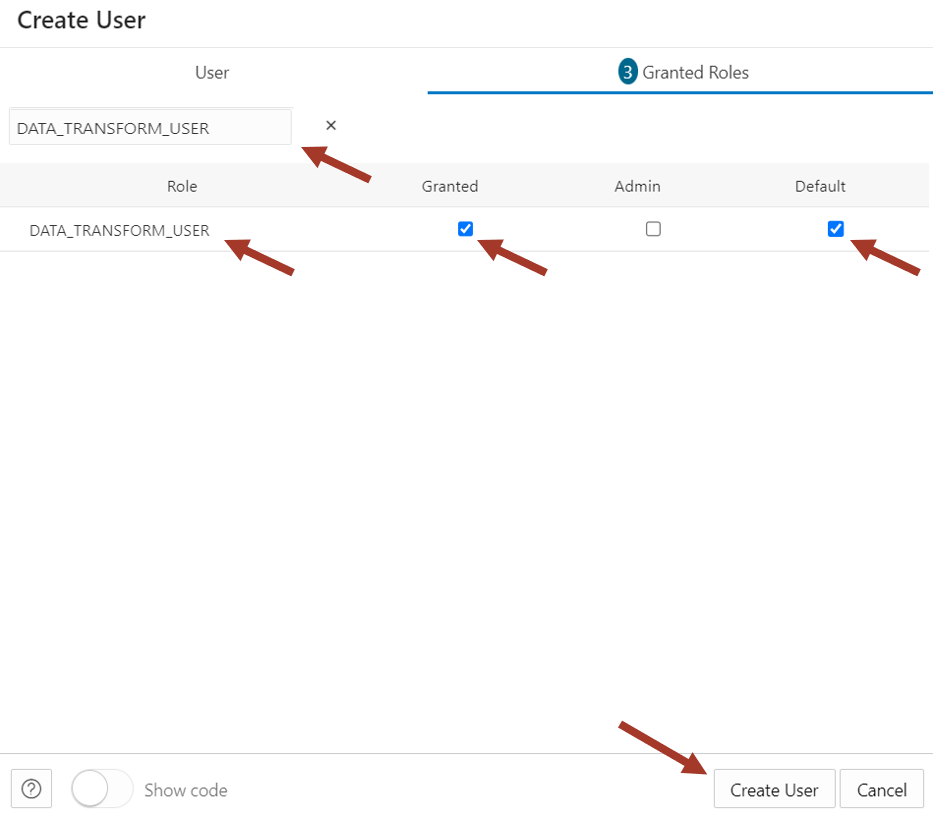

# Lab 2. 데이터베이스 사용자 생성 및 데모 데이터 로딩

- [Lab 2. 데이터베이스 사용자 생성 및 데모 데이터 로딩](#lab-2-데이터베이스-사용자-생성-및-데모-데이터-로딩)
	- [Task 1. 데이터베이스 사용자 생성](#task-1-데이터베이스-사용자-생성)
	- [Task 2. 데모 데이터 로딩](#task-2-데모-데이터-로딩)


## Task 1. 데이터베이스 사용자 생성 

- **Database Actions** 메뉴에서 **View all database actions** 선택

	

- 로그인 사용자 정보 확인 : ADMIN

- **Administration** 항목의 **Database Users** 선택

	

- **Create User** 클릭

	

- **Create User** 정보 :
	- User Name : **QTEAM**
	- Password : **WElcome12345__**
	- **Quota on tablespace DATA** : **UNLIMITED** 지정
	- **Web Access : Enable**
	

- **Granted Roles** 설정:
	- **DWROLE:** to grant access to load and store data
	- **DATA_TRANSFORM_USER:** to grant access to transform data
	- Note: **Granted** 와 **Default** 옵션 선택
	- Note: **CONNECT** 와 **RESOURCE** role 은 자동으로 적용되어 있음

	

	

- **Create User** 버튼 클릭하여 사용자 생성 완료

- QTEAM 사용자의 **Enable REST** 설정

	

- Database Users 화면에서 **QTEAM** 사용자의 아래쪽에 있는 아이콘 클릭(아래 그림의 화살표 표시)

	

- **QTEAM** 사용자명과 암호 입력

	

- **Database Actions Launchpad** 페이지 로딩 완료 - **User 정보 확인 : QTEAM**

	

## Task 2. 데모 데이터 로딩

- **Database Actions** 페이지에서 **SQL** 선택

	

- **SQL Worksheet** 에 다음의 SQL 문을 복사한 후 수행. 기존 테이블이 없다면 패스 가능.
	```sql
	DROP TABLE CUSTOMER_CA PURGE;
	DROP TABLE MOVIESALES_CA PURGE;
	DROP TABLE GENRE PURGE;
	DROP TABLE MOVIE PURGE;
	DROP TABLE TIME PURGE;
	DROP TABLE AGE_GROUP PURGE;
	DROP TABLE CUSTOMER_SALES_ANALYSIS PURGE;	
	```

	
	


- 워크샵에 필요한 테이블 생성
	다음의 SQL 문을 Worksheet 에 복사 후 수행 - **Run Script** 버튼 클릭
	
	```sql
	CREATE TABLE CUSTOMER_CA 
	    ( 
	    CUST_ID        NUMBER , 
	    AGE            NUMBER , 
	    EDUCATION      VARCHAR2 (40) , 
	    GENDER         VARCHAR2 (20) , 
	    INCOME_LEVEL   VARCHAR2 (20) , 
	    MARITAL_STATUS VARCHAR2 (8) , 
	    PET            VARCHAR2 (40) 
	    ) 
	;
	
	CREATE TABLE GENRE 
	    ( 
	    GENRE_ID NUMBER , 
	    GENRE    VARCHAR2 (30) 
	    ) 
	;
	
	CREATE UNIQUE INDEX PK_GENRE_ID ON GENRE 
	    ( 
	    GENRE_ID ASC 
	    ) 
	;
	
	ALTER TABLE GENRE 
	    ADD CONSTRAINT PK_GENRE_ID PRIMARY KEY ( GENRE_ID ) 
	    USING INDEX PK_GENRE_ID 
	;
	
	CREATE TABLE MOVIE 
	    ( 
	    MOVIE_ID     NUMBER , 
	    TITLE        VARCHAR2 (200) , 
	    BUDGET       NUMBER , 
	    GROSS        NUMBER , 
	    LIST_PRICE   NUMBER , 
	    GENRES       VARCHAR2 (4000) , 
	    SKU          VARCHAR2 (30) , 
	    YEAR         NUMBER , 
	    OPENING_DATE DATE , 
	    VIEWS        NUMBER , 
	    CAST         VARCHAR2 (4000) , 
	    CREW         VARCHAR2 (4000) , 
	    STUDIO       VARCHAR2 (4000) , 
	    MAIN_SUBJECT VARCHAR2 (4000) , 
	    AWARDS       VARCHAR2 (4000) , 
	    NOMINATIONS  VARCHAR2 (4000) , 
	    RUNTIME      NUMBER , 
	    SUMMARY      VARCHAR2 (16000) 
	    ) 
	;
	
	CREATE TABLE TIME 
	    ( 
	    DAY_ID           DATE , 
	    DAY_NAME         VARCHAR2 (36) , 
	    DAY_OF_WEEK      NUMBER , 
	    DAY_OF_MONTH     NUMBER , 
	    DAY_OF_YEAR      NUMBER , 
	    WEEK_OF_MONTH    NUMBER , 
	    WEEK_OF_YEAR     NUMBER , 
	    MONTH_OF_YEAR    NUMBER , 
	    MONTH_NAME       VARCHAR2 (36) , 
	    MONTH_SHORT_NAME VARCHAR2 (12) , 
	    QUARTER_NAME     VARCHAR2 (7) , 
	    QUARTER_OF_YEAR  NUMBER , 
	    YEAR_NAME        NUMBER 
	    ) 
	;

	CREATE TABLE AGE_GROUP
		(
	    MIN_AGE            NUMBER ,
	    MAX_AGE            NUMBER ,
	    AGE_GROUP          VARCHAR2(4000)
		)
	;

	CREATE TABLE CUSTOMER_SALES_ANALYSIS
	    (
	    MIN_AGE NUMBER(38),
	    GENRE VARCHAR2(30 CHAR),
	    AGE_GROUP VARCHAR2(4000 CHAR),
	    GENDER VARCHAR2(20 CHAR),
	    APP VARCHAR2(100 CHAR),
	    DEVICE VARCHAR2(100 CHAR),
	    OS VARCHAR2(100 CHAR),
	    PAYMENT_METHOD VARCHAR2(100 CHAR),
	    LIST_PRICE NUMBER(38),
	    DISCOUNT_TYPE VARCHAR2(100 CHAR),
	    DISCOUNT_PERCENT NUMBER(38),
	    TOTAL_SALES NUMBER(38),
	    MAX_AGE NUMBER(38),
	    AGE NUMBER(38),
	    EDUCATION VARCHAR2(40 CHAR),
	    INCOME_LEVEL VARCHAR2(20 CHAR),
	    MARITAL_STATUS VARCHAR2(8 CHAR),
	    PET VARCHAR2(40 CHAR),
	    CUST_VALUE NUMBER,
	    CUST_SALES NUMBER(38)
	    )
	;
	```

- 데이터 로딩 스크립트 수행  - 아래의 SQL 문을 Worksheet 에 복사한 후 **Run Script** 아이콘을 클릭하여 스크립트 수행

	```sql
	set define on
	define file_uri_base = 'https://objectstorage.ap-seoul-1.oraclecloud.com/n/apackrsct01/b/Shared_Data/o'
	begin
	dbms_cloud.copy_data(
	    table_name =>'CUSTOMER_CA',
	    file_uri_list =>'&file_uri_base/CUSTOMER_CA.csv',
	    format =>'{"type" : "csv", "skipheaders" : 1}'
	);
	dbms_cloud.copy_data(
	    table_name =>'GENRE',
	    file_uri_list =>'&file_uri_base/GENRE.csv',
	    format =>'{"type" : "csv", "skipheaders" : 1}'
	);
	dbms_cloud.copy_data(
	    table_name =>'MOVIE',
	    file_uri_list =>'&file_uri_base/MOVIE.csv',
	    format =>'{"type" : "csv", "skipheaders" : 1}'
	);
	dbms_cloud.copy_data(
	    table_name =>'TIME',
	    file_uri_list =>'&file_uri_base/TIME.csv',
	    format =>'{"type" : "csv", "skipheaders" : 1}'
	);
	dbms_cloud.copy_data(
	    table_name =>'AGE_GROUP',
	    file_uri_list =>'&file_uri_base/AGE_GROUP.csv',
	    format =>'{"type" : "csv", "skipheaders" : 1}'
	);
	FOR TNAME IN (SELECT table_name FROM user_tables  where table_name like 'COPY$%') LOOP
	EXECUTE IMMEDIATE ('DROP TABLE ' || TNAME.table_name || ' CASCADE CONSTRAINTS PURGE');
	END LOOP;
	end;
	/
	```

	

----

이제 테스트 용 데이터 준비가 완료되었습니다.

