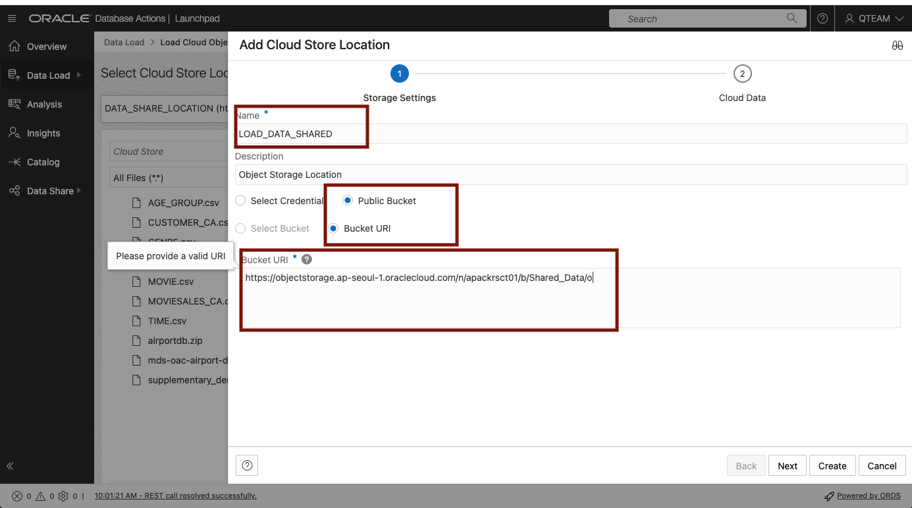

# Lab 4. Data Loading - 분석을 위한 데이터 로딩

- [Lab 4. Data Loading - 분석을 위한 데이터 로딩](#lab-4-data-loading---분석을-위한-데이터-로딩)
	- [개요](#개요)
	- [Task 0 : QTEAM 사용자 계정으로 Database Login](#task-0--qteam-사용자-계정으로-database-login)
	- [Task 1: Object Storage Bucket 에 있는 데이터 로딩](#task-1-object-storage-bucket-에-있는-데이터-로딩)

## 개요

이 랩에서는 Oracle Autonomous Database에 내장된 Data Studio의 **Data Load** 도구를 사용하여 Object Storage 에 있는 새로운 데이터를 로딩하는 과정을 살펴보겠습니다.

예상 소요 시간: 10분

## Task 0 : QTEAM 사용자 계정으로 Database Login

1. **Database Actions** 수행

	

2. **Administration** 항목의 **Database Users** 선택

	

3. 사용자 화면에서 **QTEAM** 사용자의 아래쪽에 있는 아이콘 클릭(아래 그림의 화살표 표시)

	

4. **QTEAM** 사용자명과 암호 입력
	- **QTEAM / WElcome12345__**

	

5. **Database Actions Launchpad** 페이지 로딩 완료

	

## Task 1: Object Storage Bucket 에 있는 데이터 로딩

매일 Object Storage Bucket 에 Upload 되는 판매 실적 데이터를 Autonomous Database 에 로딩하는 과정입니다.

 
 1. **Database Actions** 페이지의 **Data Studio** 도구 모음에서 **DATA LOAD** 를 클릭합니다.   
	   (로그인 정보 확인 : QTEAM)   
    

2. **LOAD DATA** 를 선택합니다.  

    [!

3. **Load Data** 페이지에서 **Cloud Store** 를 클릭합니다.  
	Cloud Store Location 은 **LOAD_DATA_SHARED** 를 선택합니다.  
	파일 탭에서 로딩 대상 파일인 **MOVIESALES_CA.csv** 파일을 끌어 놓습니다.  
	
	

	만약 Cloud Store Location 이 등록되어 있지 않다면, 아래와 같이 등록해 줍니다.  

	- **Create Cloud Store Location** 을 클릭합니다.
  
	    
    
	- **Add Cloud Store Location** 페이지에서 다음의 정보를 입력합니다.
	    - Name: **LODA_DATA_SHARED**
	    - Object Storage Location: **Public Bucket** 선택 
        - **Bucket URI** : `https://objectstorage.ap-seoul-1.oraclecloud.com/n/apackrsct01/b/Shared_Data/o`
   
	    

	- **Next** 클릭 후 Object Storage 의 파일 정보 확인
  
		

	- **Create** 클릭

4. **Settings** 아이콘(연필모양)을 클릭하여 테이블 정보를 확인해 봅니다.   
	정보 확인 후 **Close** 를 클릭합니다.
	

5. **Start** 버튼을 클릭합니다.    
    이후 **Run Data Load Job** 창이 뜨면, **Run** 버튼을 클릭하여 로딩 작업을 수행합니다.
    
    

6. 일정 시간이 지난 후 다음과 같이 로딩 작업이 완료됩니다. MOVIESALES_CA 테이블에 약 90만건의 데이터가 로딩됩니다.   
	로딩 완료 후 **Settings** 아이콘(연필모양)을 클릭하여 로딩 결과를 확인할 수 있습니다.
    

7. **Data Catalog** 를 수행하여 로딩된 테이블 정보를 확인합니다.
	

	로딩 완료한 **MOVIESALES_CA** 테이블을 선택합니다.
	

	

----

이제 분석에 필요한 모든 데이터가 준비되었습니다.