#  Lab 6. Data Analysis - 데이터 분석

- [Lab 6. Data Analysis - 데이터 분석](#lab-6-data-analysis---데이터-분석)
	- [개요](#개요)
		- [데모 데이터](#데모-데이터)
	- [Task 1: 데이터 분석을 위한 차원 모델 만들기](#task-1-데이터-분석을-위한-차원-모델-만들기)
	- [Task 2 : 데이터 분석 작업 시작하기](#task-2--데이터-분석-작업-시작하기)

## 개요

이 랩에서는 Oracle Autonomous Database에 구축된 데이터 분석 애플리케이션을 소개하고 데이터를 분석할 수 있는 다양한 방법을 살펴봅니다.

예상 시간: 20분

### 데모 데이터

이번 랩에서는 이전 랩에서 생성한 **CUSTOMER_SALES_ANALYSIS** 테이블을 사용합니다. 만약 이전 랩을 완료하지 않았다면, 다음을 수행하여 필요한 데이터를 준비합니다.

> **NOTE:** 이전 데이터 변환 단계에서 **CUSTOMER_SALES_ANALYSIS** 생성을 완료하였다면 다음으로 넘어가면 됩니다.

```
drop table CUSTOMER_SALES_ANALYSIS PURGE;

create table CUSTOMER_SALES_ANALYSIS
(
    MIN_AGE NUMBER(38),
    GENRE VARCHAR2(30 CHAR),
    AGE_GROUP VARCHAR2(4000 CHAR),
    GENDER VARCHAR2(20 CHAR),
    APP VARCHAR2(100 CHAR),
    DEVICE VARCHAR2(100 CHAR),
    OS VARCHAR2(100 CHAR),
    PAYMENT_METHOD VARCHAR2(100 CHAR),
    LIST_PRICE NUMBER(38),
    DISCOUNT_TYPE VARCHAR2(100 CHAR),
    DISCOUNT_PERCENT NUMBER(38),
    TOTAL_SALES NUMBER(38),
    MAX_AGE NUMBER(38),
    AGE NUMBER(38),
    EDUCATION VARCHAR2(40 CHAR),
    INCOME_LEVEL VARCHAR2(20 CHAR),
    MARITAL_STATUS VARCHAR2(8 CHAR),
    PET VARCHAR2(40 CHAR),
    CUST_VALUE NUMBER,
    CUST_SALES NUMBER(38)
);

set define on
define file_uri_base = 'https://objectstorage.ap-seoul-1.oraclecloud.com/n/apackrsct01/b/Shared_Data/o'


begin
dbms_cloud.copy_data(
    table_name =>'CUSTOMER_SALES_ANALYSIS',
    file_uri_list =>'&file_uri_base/CUSTOMER_SALES_ANALYSIS.csv',
    format =>'{"type" : "csv", "skipheaders" : 1}'
);
FOR TNAME IN (SELECT table_name FROM user_tables  where table_name like 'COPY$%') LOOP
    EXECUTE IMMEDIATE ('DROP TABLE ' || TNAME.table_name || ' CASCADE CONSTRAINTS PURGE');
END LOOP;
end;
/
```

위 SQL 문을 SQL Worksheet 에 복사한 후 **Run Script** 를 수행합니다.

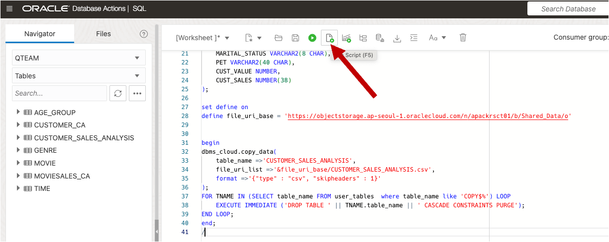

이제 이 워크숍의 나머지 실습을 진행할 준비가 되었습니다.

## Task 1: 데이터 분석을 위한 차원 모델 만들기

영화 판매량, 영화 장르, 연령대 정보, 고객 등급 정보가 있는 데이터를 활용하여 분석작업을 수행합니다.   
연령별, 결혼 여부에 따른 영화 장르 선호도, 고등급 고객과 저등급 고객에 따라 선호도가 다른지 등 몇 가지 예를 살펴보겠습니다.

1. **Data Studio** 페이지에서 **DATA ANALYSIS** 도구를 실행합니다.

	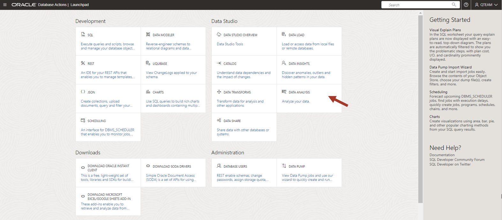

2. 데이터 분석 도구에 처음으로 액세스하면 도구의 다양한 기능을 사용하는 방법을 설명하는 도구 설명 세트가 표시됩니다. 이 간단한 튜토리얼을 단계별로 진행하거나 강조 표시된 상자의 오른쪽 상단에 있는 X를 눌러 언제든지 종료할 수 있습니다.

	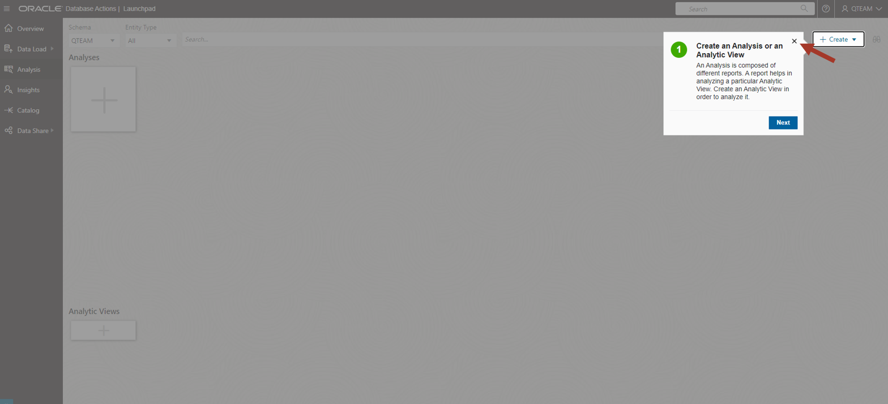

3. 이번 랩에서는 영화 판매 데이터에 대한 Analytic View를 생성하여 이를 분석하고 고객의 구매 패턴을 확인합니다. Analytic View는 차원 모델을 사용하여 데이터를 구성하므로 데이터 집계 및 계산을 쉽게 추가하고 비교적 간단한 SQL로 쿼리할 수 있도록 뷰를 구성할 수 있습니다.

	스키마 **QTEAM**을 선택하고 **Analytic Views 의 + 버튼을 클릭합니다.

	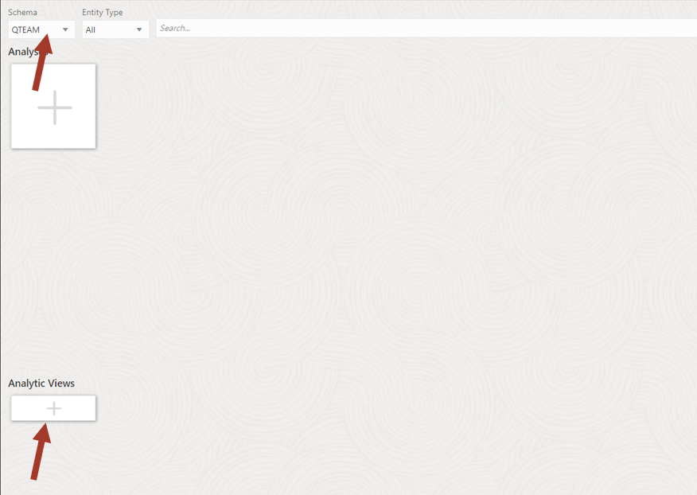


4. Fact Table 을 선택해 줍니다. 
	- Schema: **QTEAM**
	- Fact Table: **CUSTOMER_SALES_ANALYSIS** 선택   
		Analytic View 명은 Fact Table 에 따라 자동으로 생성됩니다.

	- Name: **CUSTOMER_SALES_ANALYSIS_AV**  
	- Caption: **Customer sales analysis av**  
	- Description: **Customer sales analysis av**  
	
	**Generate Hierarchies and Measures** 버튼을 클릭하면 관련 테이블과 계층 구조를 찾을 수 있습니다. 이렇게 하면 스키마를 스캔하여 CUSTOMER_SALES_ANALYSIS와 관련된 모든 테이블을 찾아 제공해 줍니다.   
	하지만 현재 테스트에서는 분석과 관련된 모든 속성을 하나의 테이블에 포함되도록 데이터를 준비하였기 때문에 자동화된 프로세스를 실행할 필요가 없습니다.

	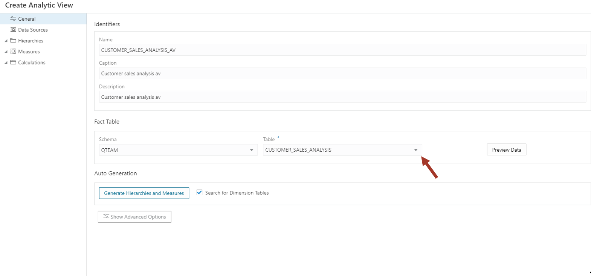
	

5. 왼쪽의 **Data Sources**를 클릭하여 **CUSTOMER_SALES_ANALYSIS**가 데이터 소스인지 확인합니다.

	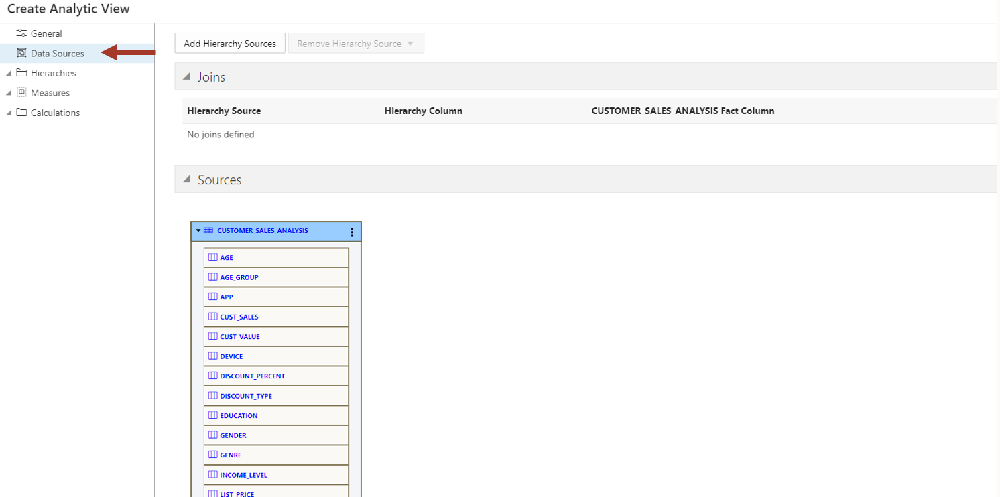

6. 이제 왼쪽의 **Hierarchies**를 클릭하여 분석을 원하는 속성을 추가합니다:  
	- AGE_GROUP
	- CUST_VALUE
	- DEVICE
	- MARITAL_STATUS
	- GENRE
	- PET

	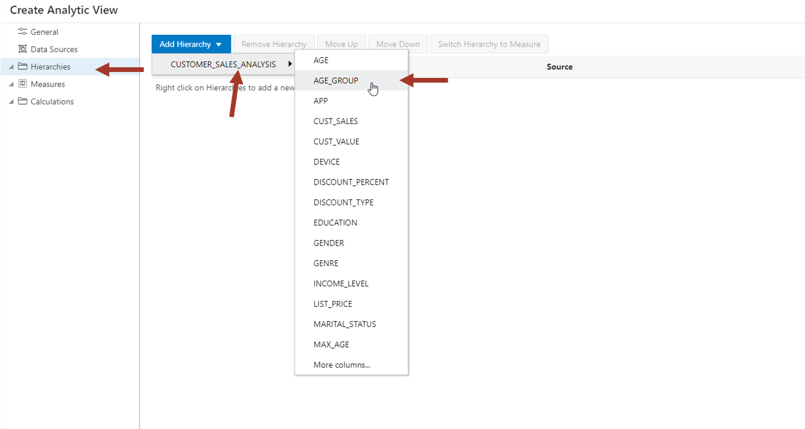

7. Hierarchy 컬럼을 추가한 결과는 아래 스크린샷과 같습니다.

	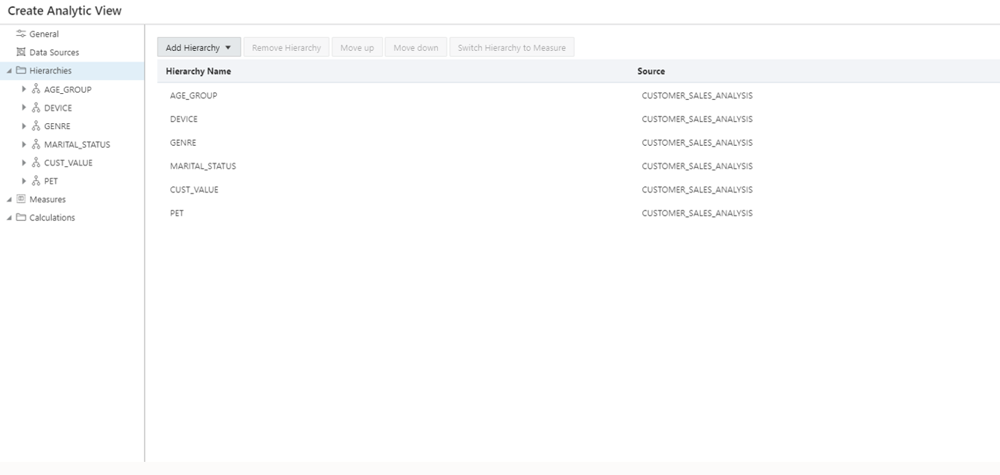

8. 이제 **Measures** 를 클릭한 후 **TOTAL_SALES** 컬럼을 measure 로 추가합니다.

	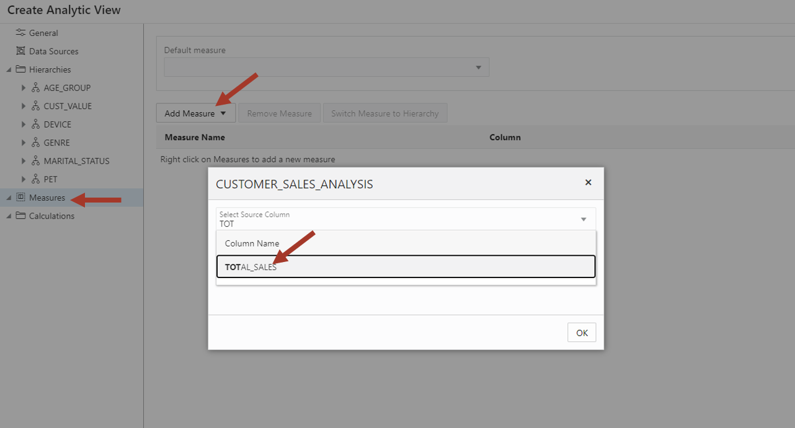

9. 이제 Analytic View(AV)의 설정이 완료되었으므로, **Create** 를 클릭한 후 **OK**.

	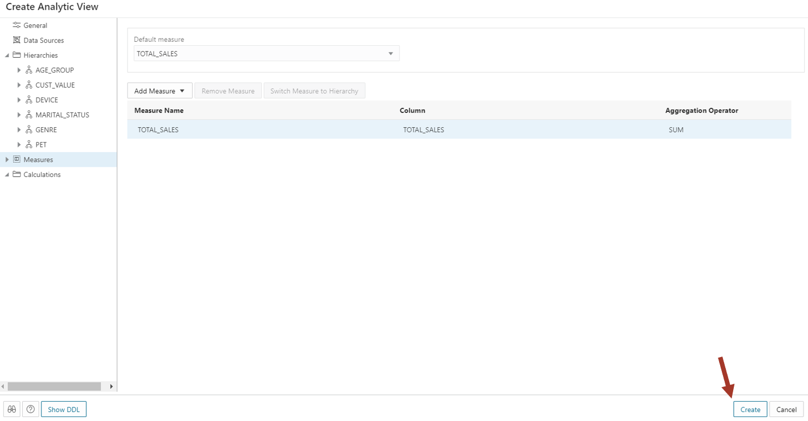

## Task 2 : 데이터 분석 작업 시작하기

1. 이제 Analytic View가 준비되었으며 데이터 분석을 시작할 수 있습니다.   
	Analytic View 이름 옆에 있는 세 개의 점을 클릭하고 **Analyze**를 클릭합니다.

	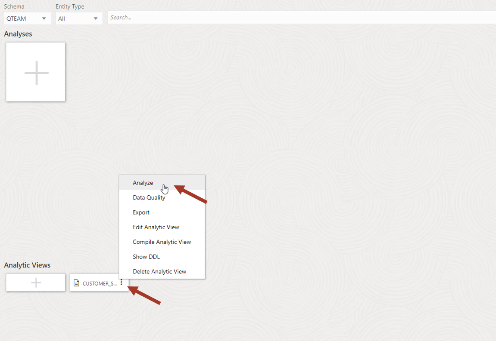

2. **Data Analysis** UI 다음의 영역으로 구분됩니다.

	1. Hierarchies and measures
	
	2. 영역 1의 구성 요소를 끌어서 데이터를 분할할 수 있는 Columns, Rows, Values 및 Filters 정보
	
	3. 분석 대시보드에 보고서와 차트를 표시하는 영역
	
	4. Table/Pivot/Chart Report. 분석 대시보드에는 여러 개의 Report를 생성할 수 있지만, 테스트에서는 하나의 Report 만 생성합니다.

	5. Dimension hierarchy member 값 기준 필터링 정보

	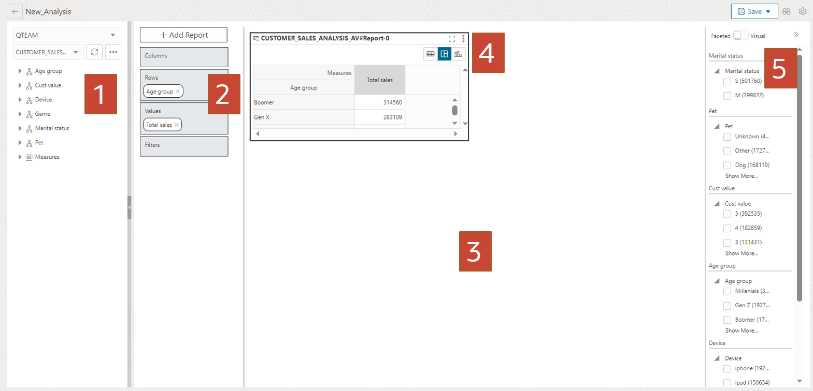

3. 이제 첫 번째 분석 작업을 수행해 보겠습니다.    
	오른쪽 하단 모서리를 드래그하여 대시보드에서 보고서를 확장하고 막대형 차트를 클릭합니다. 막대 차트를 사용하면 데이터를 더 쉽게 시각화할 수 있습니다.

	**분석 내용: 연령별 판매량 정보 보기**
	
	오른쪽 상단 차트 아이콘을 클릭하여 차트 모드를 선택합니다.   
	기본적으로 X축은 첫 번째 Hierarchy 구조로 채워집니다.    
	
	Age Group이 아닌 경우 X축의 모든 계층을 지우고 Age Group을 X축으로 설정하고,  
	Y축에는 Measure 항목의 Total Sales를 끌어 놓습니다.
	
	아래 스크린샷과 같이 연령대별 총 매출 정보를 확인할 수 있습니다.

	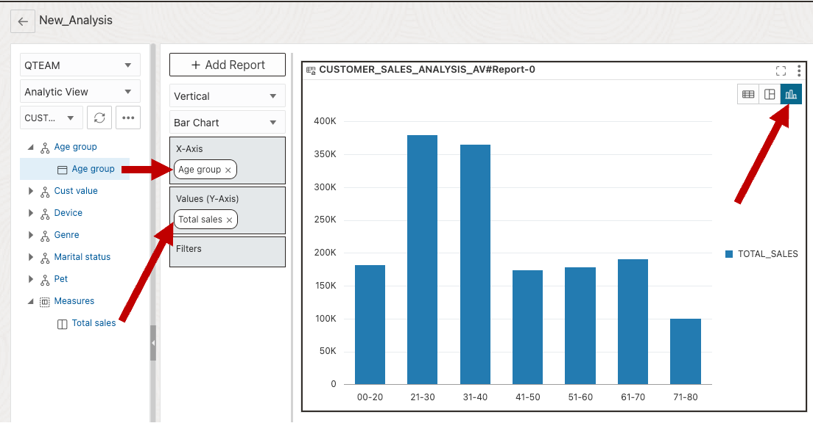

4. **분석 내용: 결혼여부별 매출 분석**

	X축을 지운 후 **Marital status**를 끌어 놓습니다. 
	결혼한 사람보다 싱글이 영화를 더 많이 보는 것을 알 수 있습니다.

	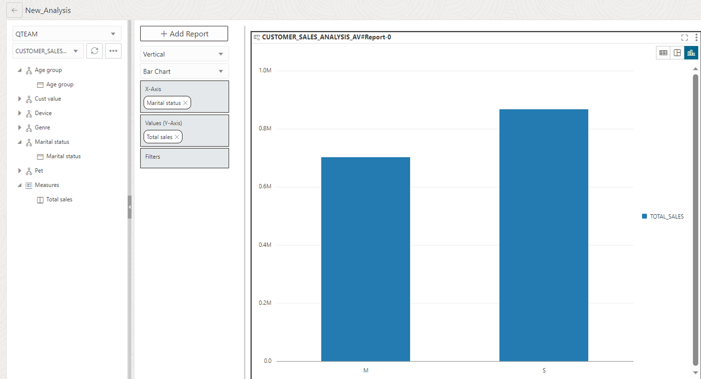

5. 이제 우리는 어떤 장르가 가장 많이 팔리는지 분석해 보겠습니다.

	X축을 지운 후 **Genre**를 끌어 놓습니다.   
	드라마 장르가 가장 많이 팔리고, 그 다음으로 액션 장르라는 것을 확인할 수 있습니다.

	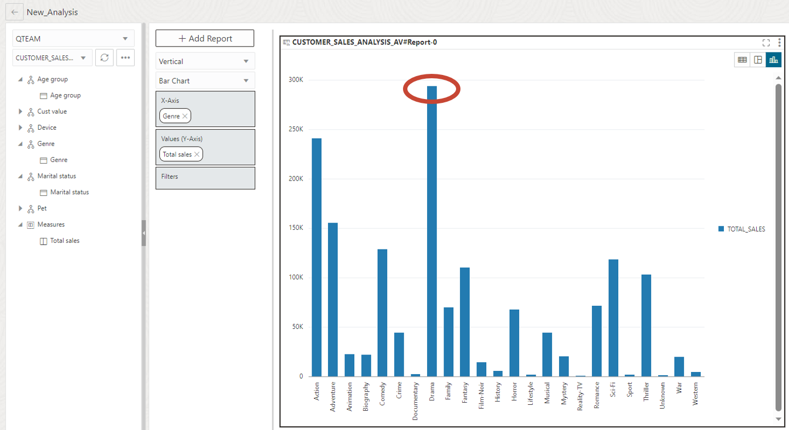

6. 두 Hierarchy을 혼합하여 분석할 수 있습니다.   

	고객을 매출액 기준으로 5등급으로 분류하였습니다. 고객 등급 별 선호하는 영화 장르가 있는지 분석해 보겠습니다.  

	X축에 **Cust value** 를 끌어 놓습니다. **Cust value** 가 **Genre** 보다 위에 있는지 확인합니다.  

	차트가 매우 넓어 오른쪽이 잘 보이지 않습니다. 전체 너비를 맞추려면 모든 고객 값이 한 페이지에 표시될 때까지 아래쪽 창의 오른쪽 가장자리를 오른쪽으로 끌면 됩니다. 아래쪽 창이 보이지 않으면 Ctrl -을 사용하여 브라우저를 축소할 수 있습니다.

	> **참고:** 차트가 크기 때문에 왼쪽 데이터 스튜디오 메뉴와 계층구조 브라우저 창을 접어 차트 영역을 확장할 수 있습니다.

	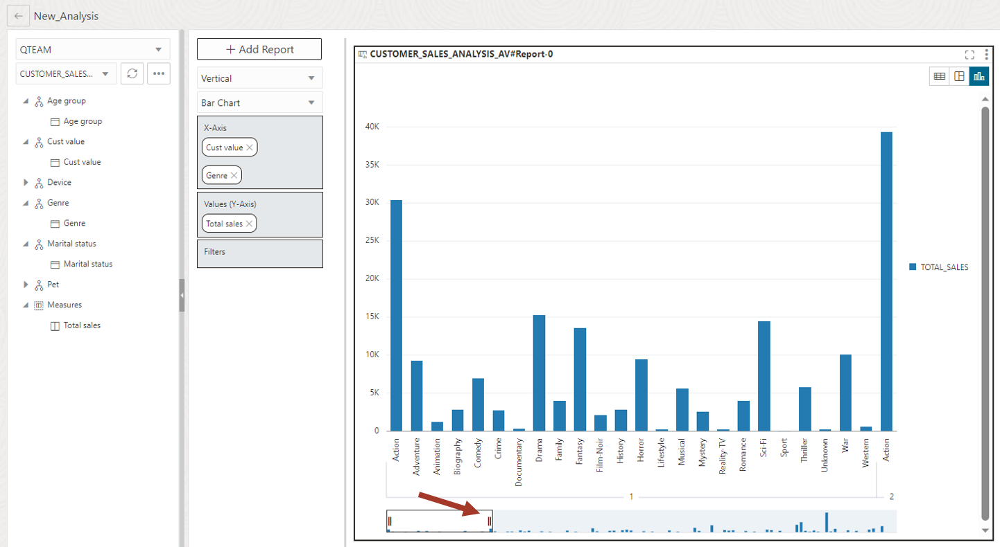

7. 차트를 살펴보면, 드라마는 높은 등급 고객(고객 가치=5)에게 인기가 많은 반면, 액션은 낮은 등급 고객(고객 가치=1)에게 더 인기가 있다는 것을 알 수 있습니다.  

	물론, 고등급 고객의 경우 전체적으로 더 많은 비용을 지출하기 때문에 대부분의 막대가 더 높습니다. 하지만, 상대적인 장르 선호도 정보는 확인할 수 있습니다.
	

	다른 흥미로운 패턴을 찾을 수 있는지 확인해 보세요. 다양한 연령대에서 인기 있는 영화 장르는 무엇인가요? 다양한 속성 조합으로 데이터를 시각화하는 분석 도구를 다양하게 테스트해 보실 수 있습니다.

	> **참고:** 지금까지 차트만 살펴봤지만 이 데이터는 표 형식과 피벗 테이블 형식으로도 표시할 수 있습니다. 고급 사용자는 Excel 또는 Google Sheets에서 이 Analytic View의 데이터에 액세스할 수 있습니다.

	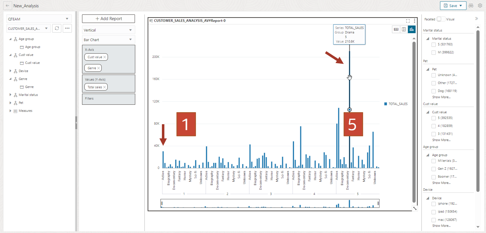

8. **Add Report** 버튼을 클릭하면 두 개 이상의 보고서를 추가하고 캔버스에 정렬할 수 있습니다.   

	보고서 작성을 완료한 후 오른쪽 상단에 있는 저장 버튼을 클릭하여 저장할 수 있습니다. 데이터 분석 메인 페이지로 돌아가려면 왼쪽 상단에 있는 왼쪽 화살표 버튼을 클릭하면 됩니다.

	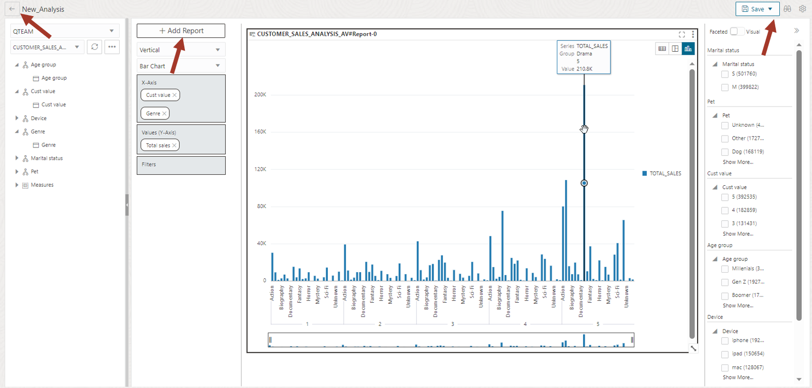

	메인 페이지에서 저장된 보고서를 볼 수 있습니다.

	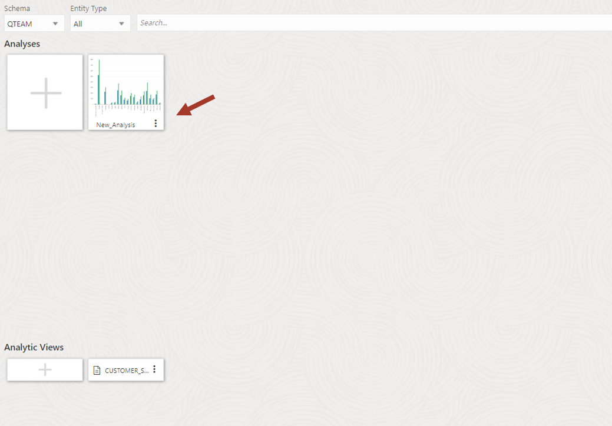

