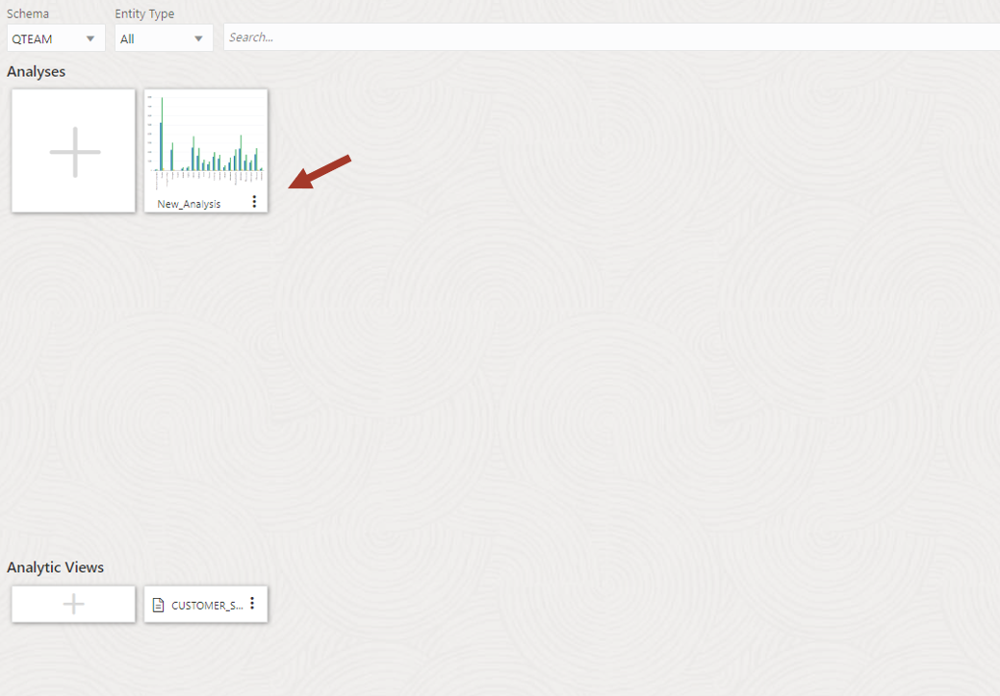

# Lab 7. Data Insights - 데이터에 숨겨진 패턴 탐색

- [Lab 7. Data Insights - 데이터에 숨겨진 패턴 탐색](#lab-7-data-insights---데이터에-숨겨진-패턴-탐색)
	- [개요](#개요)
	- [Task 1: Data Insights 도구 사용](#task-1-data-insights-도구-사용)

## 개요

이 랩에서는 Oracle Autonomous Database에 내장된 Data Studio의 **Data Insights** 도구를 소개하고 데이터 Insights를 탐색하고 해석하는 방법을 보여줍니다.

예상 시간: 15분

## Task 1: Data Insights 도구 사용

Data Studio의 insights 프로세스는 백그라운드에서 실행되어 데이터에서 흥미로운 패턴을 찾아 줍니다. 이는 데이터에 숨어 있는 다양한 insights 를 자동으로 찾아주는 접근 방식입니다.  
이 실습에서는 **Data Insights** 도구를 통해 생성된 몇 가지 샘플 Insights를 확인합니다. 

> **참고:** Insights 프로세스는 데이터 세트의 복잡성과 사용 가능한 컴퓨팅 리소스에 따라 수행 시간이 길 수도 있습니다. 그러나 실행 중에 insights 목록이 새로 고쳐지는 것을 확인할 수 있습니다.

1. 앞에서 수행한 Data Analysis 작업을 클릭합니다.

	

2. Measure 의 **Total Sales** 항목을 마우스 오른쪽 클릭한 후 **Discover Insights** 를 클릭합니다.

	

3. 다양한 Insights 목록이 시간이 지나면서 추가되어 페이지에 표시됩니다.   

	**Data Insights** 도구는 데이터를 검토하고 영화 판매 데이터를 기반으로 다양한 패턴을 찾아서 보여줍니다.

	

4. 검색된 Insights 정보 중 몇가지를 살펴보겠습니다.
	- 미혼(Martial Status = S) 의 Genre 별 매출 정보입니다.
		- 각 Bar 에는 평균을 나타내는 **녹색** 수평선이 있습니다. 즉, 결혼 유무와 상관없는 평균의 기대값을 보여줍니다.  필터(결혼 여부=S)에 따라 파란색 Bar와 차이가 클 경우 데이터가 치우쳐 있다는 것을 의미합니다.
		- 몇 개의 Bar는 검은색 테두리로 둘러싸여 있습니다(화살표로 표시). 이는 예외적인 값을 강조 표시해 줍니다.
		- 아래 그래프를 보면 다음과 같은 패턴을 확인할 수 있습니다:  
			_싱글은 평균보다 모험과 코미디를 더 많이 구매하고 있으며 드라마에는 별로 관심이 없다._
			
		

5. Genre = Adventure 에 대한 나이대별 매출 정보입니다.
	이 그래프를 통해 10대가 어드벤처 장르에 평균 이상의 관심을 가지고 있음을 알 수 있습니다.

	

6. 이제 애완동물 소유와 영화구매 관계를 살펴보도록 하겠습니다.  

	상단에 **Dog** 으로 표시되고 하단에 **Cust Value** 가 표시된 그래프를 클릭합니다.  

	개를 소유한 사람 중 최고 등급(5등급) 고객이 개를 소유하지 않은 사람에 비해 평균보다 훨씬 더 많은 영화를 구매하고 있음을 보여줍니다.  
	단순한 상관 관계일 수도 있지만 이 데이터를 사용하여 등급이 높은 고객에게 강아지 관련 제품을 제공할 수 있습니다.

	
	

----
**Data Insights** 도구를 사용하여 데이터를 크롤링하는 것만으로 데이터의 다양한 패턴을 발견할 수 있습니다.  

목록에는 다른 많은 Insights 들이 있습니다. 목록으로 돌아가서 다른 몇 가지를 확인해 보시기 바랍니다.

