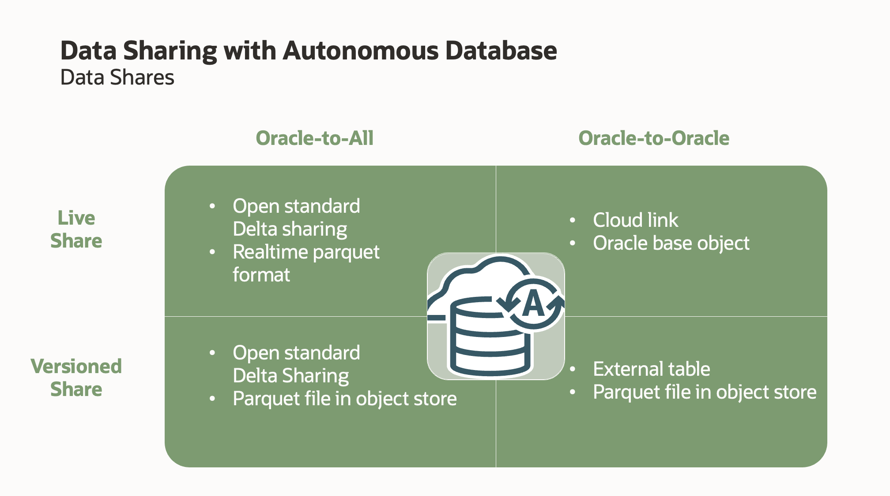

# Using Cloud Links for Read Only Data Access on Autonomous Database

- Data Sharing with Autonomous Database

    

    - Delta Sharing 기반의 데이터 공유 방법외에 Oracle 간의 데이터 공유를 위한 Cloud Link 기능 제공
    - Cloud Link 데이터 공유를 위한 Package 제공
    - Data Studio의 Data Sharing UI 에는 현재 포함되어 있지 않음.  향후 추가될 것으로 예상됨

## About Cloud Links on Autonomous Database

- Cloud Links를 사용하면 데이터 소유자는 선택된 대상에 대한 원격 액세스를 위한 테이블 또는 뷰를 등록
- 데이터는 등록 시 접근 권한이 부여된 대상만 접근 가능
- Cloud Link는 Oracle Cloud Infrastructure 액세스 메커니즘을 활용하여 특정 범위의 권한 제공
    + Region, Tenancy, Comparemnt, 특정 ADB 인스턴스 지정 가능
- 기존 데이터 공유 방법인 Database Link 에 비해 Cloud Link 는 훨씬 데이터 공유 방법을 단순화시킴. Cloud Links를 사용하면 복잡한 데이터베이스 링크 설정 없이도 데이터 검색 가능.
- 현재 Autonomous Database 버전 19c 에서만 Cloud Link를 지원함.  21c 에서는 지원 안 함.
- Cloud Link 를 통해 read only 접근만 허용함.  원격데이터에 대한 DML 이 필요할 경우 Database Link 사용
- 등록된 Cloud Link data set 을 접근하려면 SELECT 구문의 FROM 절에 `<nanespace>.<name>@cloud$link` 형태로 사용:
    + 기존 Oracle DB 의 `SCHEMA.TABLE` 형태와 유사
    + Cloud Link 는 regional 레벨의 namespace 와 name 을 제공.
    + 단일 ADB 에 한정되지 않고, scope 내의 모든 ADB 에 적용됨.

## Cloud Link 구성 절차

- 테스트 환경
    + ADB Instance 및 사용자 구성
        * ADB1 - Data Provider ( Username: CLSRC ) - Source
        * ADB2 - Data Consumer ( Username: CLTGT)  - Target
    + Test Data
        * SALES Table 
        * SALES_AGG_VIEW View 
        
1. **[SOURCE]** 특정 DB 사용자(CLSRC) 에게 Cloud Link 를 사용하여 공유할 데이터 집합을 등록(Register)할 수 있는 권한 부여

    ```
    -- Connect ADMIN @ ADB1
    
    BEGIN
    DBMS_CLOUD_LINK_ADMIN.GRANT_REGISTER(
       username => 'CLSRC',
       scope    => 'MY$REGION');
    END;
    /
    
    GRANT EXECUTE ON DBMS_CLOUD_LINK TO CLSRC;

    ```

    - CLSRC 사용자는 지정한 Scope - `MY$REGION` (소스 ADB 와 동일 Region) - 의 데이터 등록 권한 부여
    - Scope는 사용자가 데이터 세트를 등록할 때 가능한 최대 범위를 의미함.  `DBMS_CLOUD_LINK_ADMIN.GRANT_REGISTER` 시 사용할 수 있는 Scope:
        * `MY$REGION`
        * `MY$TENANCY`
        * `MY$COMPARTMENT`
                    
2. **[SOURCE]** 테스트 용 데이터 생성

    ```
    -- Connect CLSRC @ ADB1
    
    create table SALES as select * from SH.SALES;

           
    create or replace force editionable view SALES_AGG_VIEW
    ( PROD_ID, TIME_ID, CHANNEL_ID, PROMO_ID, QUANTITY_SOLD, AMOUNT_SOLD )
    as
    select prod_id, time_id, channel_id, promo_id,
           sum(quantity_sold) quantity_sold,
           sum(amount_sold)   amount_sold
    from sales
    group by prod_id, time_id, channel_id, promo_id;
    
    ```

3. Cloud Link 를 통해 공유할 데이터 등록

    ```
    -- Connect CLSRC @ ADB1
    
    -- SALES_AGG_VIEW 뷰를 동일한 Compartment의 모든 ADB 에서 접근할 수 있도록 등록
    -- nnamespace(SALES_AGG), name(SALES_AGG_VIEW) 지정
    
    BEGIN
       DBMS_CLOUD_LINK.REGISTER(
        schema_name => 'CLSRC',
        schema_object  => 'SALES_AGG_VIEW',
        namespace   => 'SALES_AGG', 
        name        => 'SALES_AGG_VIEW',
        description => 'Aggregated Sales Information.',
        scope       => 'MY$COMPARTMENT' );
    END;
    /
    
    ```

    - 공유할 데이터 등록 후 약 10분 정도 후부터 Cloud Links 를 통해 데이터 접근 가능함.

4. **[SOURCE]** 등록된 객체 확인

    - 아래 정보도 약 10분 정도 지난 후에 조회 가능
    
    ```
    -- Connect ADMIN @ ADB1
    
    select * from dba_cloud_link_registrations;
    ```

    

5. **[TARGET]** 등록된 데이터 집합을 접근할 수 있는 권한 부여

    ```
    -- Connect ADMIN @ ADB2
    EXEC DBMS_CLOUD_LINK_ADMIN.GRANT_READ( 'CLTGT' );
    ```

6. **[TARGET]** 등록된 공유 데이터 집합 검색 

    ```
    -- SALES 라는 문자열을 포함한 공유 데이터 세트 조회
        
    -- Connect CLTGT @ ADB2
    set serveroutput on
    
    
    DECLARE
        result CLOB DEFAULT NULL;
    BEGIN
        DBMS_CLOUD_LINK.FIND('SALES', result);
        DBMS_OUTPUT.PUT_LINE(result);
    END;
    /
    
    [{"name":"SALES_AGG_VIEW","namespace":"SALES_AGG","description":"Aggregated Sales Information."}]

    PL/SQL procedure successfully completed.

    Elapsed: 00:00:00.906
    
    ```

    `DBMS_CLOUD_LINK.DESCRIBE` 프로시져를 사용하여 상세 정보 조회 가능

    ```
    SELECT DBMS_CLOUD_LINK.DESCRIBE('SALES_AGG','SALES_AGG_VIEW') FROM DUAL;
    
    DBMS_CLOUD_LINK.DESCRIBE('SALES_AGG','SALES_AGG_VIEW') 
    ------------------------------------------------------ 
    Aggregated Sales Information.                          


    Elapsed: 00:00:00.030
    1 rows selected.
    ```

    `DBA_CLOUD_LINK_ACCESS` 뷰에서 조회 가능:

    ```
    -- Connect CLTGT @ ADB2
    select * from dba_cloud_link_access;

    NAMESPACE     NAME           CREATED              LAST_MODIFIED        AUTHORIZATION_REQUIRED DATA_SET_OWNER 
    ------------- -------------- -------------------- -------------------- ---------------------- -------------- 
    SALES_AGG     SALES_AGG_VIEW 2023-08-22T11:05:38Z 2023-08-22T11:05:38Z N                                      <-- 등록한 정보

    ```

7. **[TARGET]** Cloud Link 를 통해 공유된 데이터 조회

    ```
    -- CLTGT @ ADB2
    -- <namespace>.<name>@cloud$link; 형태로 공유된 데이터를 조회할 수 있음.
    
    select * from select count(*) from SALES_AGG.SALES_AGG_VIEW@cloud$link 
    fetch first 10 rows only;
    ```

    


