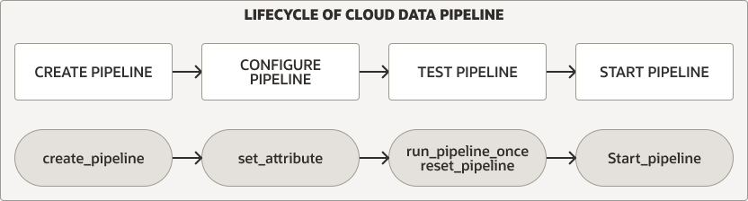

# Data Pipeline 이란?

- Data Pipelines은 Object Store 로 부터 데이터를 로딩하거나 Object Store 로 데이터를 export 하는 작업을 반복적으로 수행하는 기능 제공
- Pipelines 은 database scheduler를 사용하여 주기적으로 증분 데이터를 load / export 수행
- Load Pipelines
    + 외부 소스(object store에 주기적으로 데이터 생성)로 부터 incremental data loading 기능 제공
- Export Pipelines
    + Object Store로 incremental data export기능 제공(Database table에 새로운 데이터가 생성되면 Object store로 export)

Autonomous Database 데이터 파이프라인은 다음을 제공함:

- **Unified Operations** 
    + `BMS_CLOUD_PIPELINE` 통합 PL/SQL Package 제공
    + Pipeline 구성과 로드 또는 내보내기 작업을 위한 예약된 작업 생성 및 시작을 위한 통합 PL/SQL 프로시저 세트를 제공
- **Scheduled Data Processing** 
    + 데이터 소스를 주기적으로 모니터링하여 새로운 데이터 생성 시 로드 혹은 내보내기 작업 수행
- **High Performance** 
    + 기본적으로 Autonomous Database 의 병렬 처리 기능 활용
    + Autonomous Database 의 CPU 혹은 우선순위 속성에 따라 성능 확장
- **Atomicity and Recovery**
    + load 작업 시 automicity 보장 
- **Monitoring and Troubleshooting**
    + 상세 로그 정보와 상태 테이블을 제공하여 모니터링과 pipeline 작업 디버그 작업 수행 가능
- **Multicloud Compatible**
    + 어플리케이션 변경없이 cloud provider를 쉽게 전환 가능 
    + Autonomous Database가 지원하는 모든 credential 및 object store URI format 지원
    + Oracle Cloud Infrastructure Object Storage, Amazon S3, Azure Blob Storage, Google Cloud Storage, and Amazon S3-Compatible object stores

## About the Data Pipeline Lifecycle on Autonomous Database




## Load Pipeline 구성

- 주기적(Interval 지정)으로 Object store 를 체크하여 새로운 파일이 도착하면 대상 테이블로 로딩함.
- Load Pipeline은 data loading 을 위해 `DBMS_CLOUD.COPY_DATA` 를 사용함

### Load Pipeline 구성 절차

#### Load Pipeline 생성

1. 로딩 대상 테이블 생성

    ```sql
    CREATE TABLE EMPLOYEE (
        name     VARCHAR2(128),
        age      NUMBER,
        salary   NUMBER
    );
    ```

2. Load Pipeline 생성 

    ```sql
    BEGIN
    DBMS_CLOUD_PIPELINE.CREATE_PIPELINE(
        pipeline_name => 'MY_PIPE1',
        pipeline_type => 'LOAD',
        description   => 'Load metrics from object store into a table'
    );
    END;
    /
    ```

    [`CREATE_PIPELINE` procedure 상세 정보 보기](https://docs.oracle.com/en/cloud/paas/autonomous-database/adbsa/autonomous-pipeline.html#GUID-DD05BF1F-CC4D-431F-A6D8-B9D3A5D3AFD3)

3. `DBMS_CLOUD.CREATE_CREDENTIAL` 함수를 사용하여 Credential 객체 생성 

    ```sql
    BEGIN
    DBMS_CLOUD.CREATE_CREDENTIAL(
        credential_name => 'OBJECT_STORE_CRED',
        username => '<OCI username>',
        password => '<Auth Token>' );
    END;
    /
    ```

    [`Working with Auth Tokens`](https://docs.oracle.com/en-us/iaas/Content/Identity/Tasks/managingcredentials.htm#create_swift_password) - Auth Token 생성 절차 보기 

4. Pipeline 속성 설정 - `location, table_name, format`

    - JSON File 일 경우 예
    
        ```sql
        BEGIN
        DBMS_CLOUD_PIPELINE.SET_ATTRIBUTE(
           pipeline_name => 'MY_PIPE1',
           attributes    => JSON_OBJECT(
                'credential_name' VALUE 'OBJECT_STORE_CRED',
                'location' VALUE 'https://objectstorage.ap-seoul-1.oraclecloud.com/n/apackrsct01/b/load-pipeline/o/',
                'table_name' VALUE 'employee',
                'format' VALUE '{"type":"json", "columnpath":["$.NAME", "$.AGE", "$.SALARY"]}',
                'priority' VALUE 'HIGH',
                'interval' VALUE '1')
        );
        END;
        /
        ```
        속성 설정 정보: 

        + `location` : Object Storage bucket URL
        + `table_name` : 로딩할 테이블. The location you specify is for one table_name per pipeline.
        + `format` : object storage 파일 포맷 지정. [`DBMS_CLOUD Package Format Options` 상세 정보 보기](https://docs.oracle.com/en/cloud/paas/autonomous-database/adbsa/format-options.html#GUID-08C44CDA-7C81-481A-BA0A-F7346473B703)
        + `credential_name` : `DBMS_CLOUD.CREATE_CREDENTIAL` 에서 생성한 `credential_name` 
        + `priority` : 병렬로 로딩할 파일 수에 영향
        + `interval` : pipeline job 수행 interval. 분 단위
    
    
        object storage bucket 은 별도로 생성해야 합니다.  
        [`DBMS_CLOUD_PIPELINE Attributes` 상세 정보 보기](https://docs.oracle.com/en/cloud/paas/autonomous-database/adbsa/autonomous-pipeline.html#GUID-BCD7B803-7464-4389-8077-1E47D86D0C11)

    - CSV File 일 경우 예
    
        ```sql
        BEGIN
        DBMS_CLOUD_PIPELINE.SET_ATTRIBUTE(
           pipeline_name => 'MY_PIPE1',
           attributes    => JSON_OBJECT (
                'credential_name' VALUE 'OBJECT_STORE_CRED',
                'location' VALUE 'https://objectstorage.ap-seoul-1.oraclecloud.com/n/apackrsct01/b/load-pipeline/o/',
                'table_name' VALUE 'employee',
                'format' VALUE '{"type":"csv", "delimiter":","}',
                'priority' VALUE 'HIGH',
                'interval' VALUE '1')
        );
        END;
        /
        ```
#### Pipeline 테스트

1. 생성된 Load Pipeline 이 정상적으로 동작하는지 검증하기 위해 한번 수행

    ```sql
    BEGIN
    DBMS_CLOUD_PIPELINE.RUN_PIPELINE_ONCE(
        pipeline_name => 'MY_PIPE1'
    );
    END;
    /
    ```
    
2. Pipeline 이 정상적으로 처리되었는지 체크

    - View Pipeline Status Information

        ```sql
        SELECT pipeline_name, pipeline_type, status FROM USER_CLOUD_PIPELINES
        WHERE pipeline_name = 'MY_PIPE1';
        ``` 

    - View Pipeline History
    
        ```sql
        SELECT pipeline_id, pipeline_name, status, error_message  FROM user_cloud_pipeline_history      
        WHERE pipeline_name = 'MY_PIPE1';
        ```

    - Pipeline Status Table
    
        ```sql
        SELECT pipeline_name, status_table FROM user_cloud_pipelines;

        select * from PIPELINE$3$13_STATUS;    --> STATUS_TABLE 
        ```

3. Reset Pipeline

    ```sql
    BEGIN  
    DBMS_CLOUD_PIPELINE.RESET_PIPELINE(
        pipeline_name => 'MY_PIPE1',
        purge_data => TRUE
    );
    END;
    /
    ```

    - `DBMS_CLOUD_PIPELINE.RUN_PIPELINE_ONCE` 를 수행하여 테스트 수행을 한 후, `DBMS_CLOUD_PIPELINE.RESET_PIPELINE` 수행하여야 함
    - Pipeline 상태 초기화 작업
    - If a pipeline is in the started state, then it cannot be run in the foreground session.


#### Pipeline Start 및 테스트

1. Start a Pipeline

    ```sql
    BEGIN
    DBMS_CLOUD_PIPELINE.START_PIPELINE(
        pipeline_name => 'MY_PIPE1'
    );
    END;
    /
    ```

2. Pipeline 동작 여부 확인

    ```sql
    SELECT pipeline_name, status from USER_CLOUD_PIPELINES
    WHERE pipeline_name = 'MY_PIPE1';

    PIPELINE_NAME            STATUS  
    ------------------------ ------- 
    MY_PIPE1                 STARTED
    ```

3. 테스트 스크립트 수행
    
    - 10초 마다 1건의 데이터를 object storage 에 put

        ```
        #!/usr/bin/bash

        for i in `seq 1 10`
        do
                echo "emp$i,$i,$i" > employee_$i.csv
                oci os object put --namespace apackrsct01 --bucket-name load-pipeline --file $file

                sleep 10
        done
        ```

    - 데이터 로딩 정보 확인
        
        Load Pipeline 생성 시 1분 주기로 수행되도록 설정(interval)하였으므로 모든 데이터는 2분 후 정상 로딩되는 지 확인

        ```sql
        select  e.* from employee e;

        NAME  AGE SALARY 
        ----- --- ------ 
        emp1    1      1 
        emp2    2      2 
        emp3    3      3 
        emp4    4      4 
        emp5    5      5 
        emp6    6      6 
        emp8    8      8 
        emp9    9      9 
        emp10  10     10 
        emp7    7      7 
        ```

