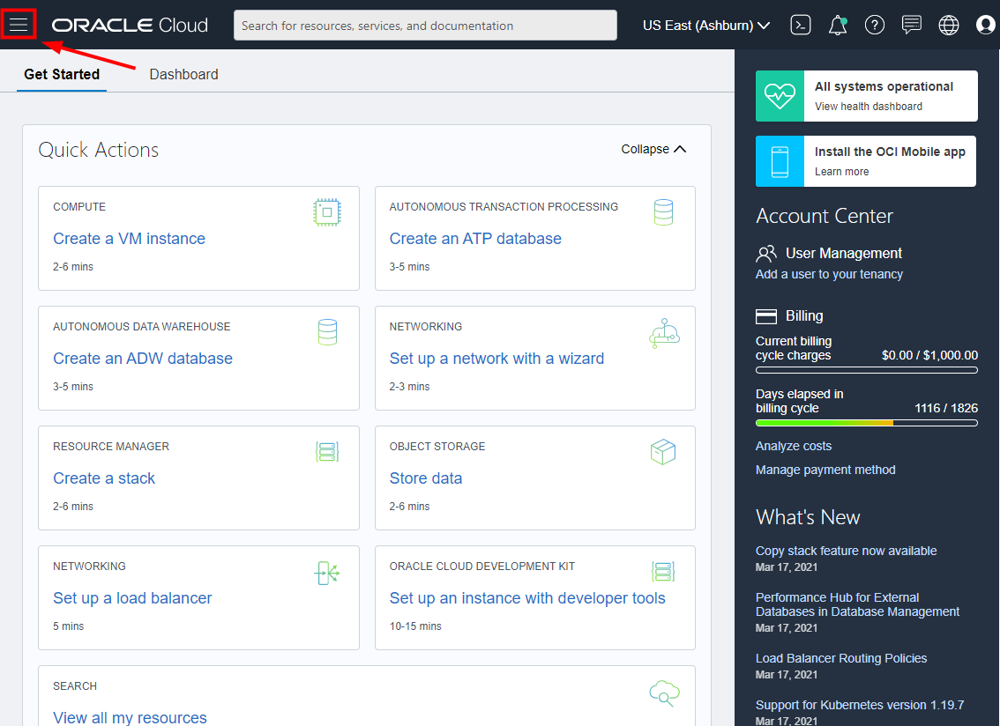
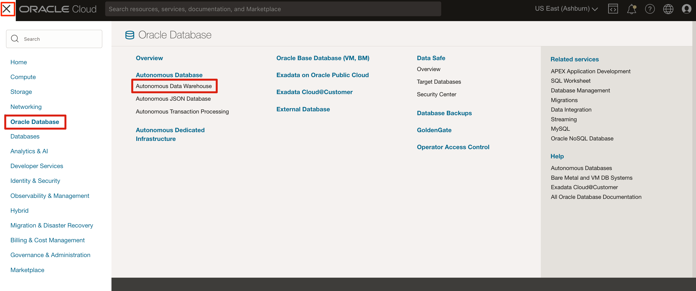
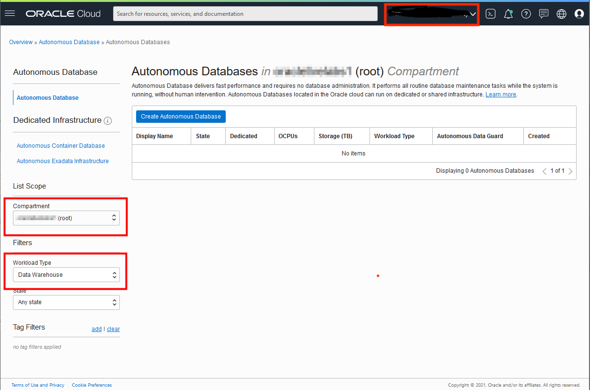
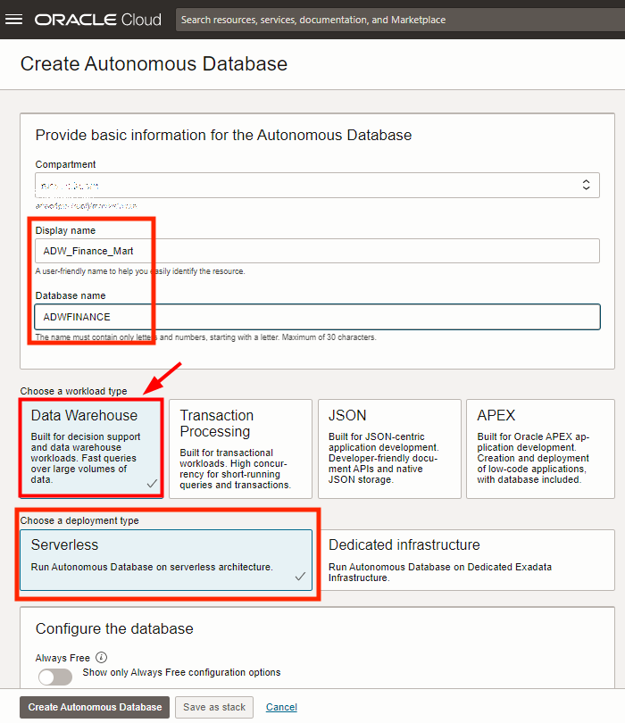
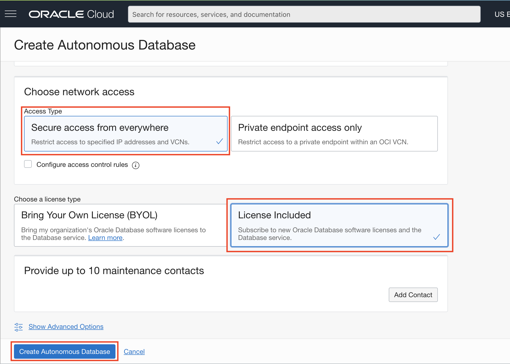
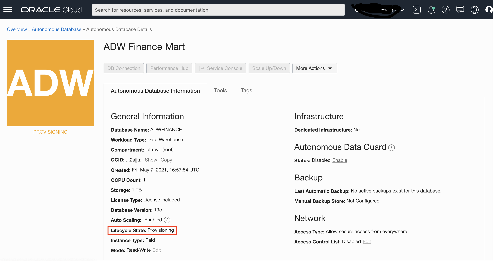

# Provision an Autonomous Database (ADW and ATP)

- [Provision an Autonomous Database (ADW and ATP)](#provision-an-autonomous-database-adw-and-atp)
  - [개요](#개요)
  - [Task 1: Choosing ADW or ATP from the Services Menu](#task-1-choosing-adw-or-atp-from-the-services-menu)
  - [Task 2: Creating the ADB Instance](#task-2-creating-the-adb-instance)

## 개요

이 실습에서는 Oracle Cloud에서 Oracle Autonomous Database (ADW(Autonomous Data Warehouse) 및 ATP(Autonomous Transaction Processing))를 사용하여 시작하는 단계를 안내합니다. 이 실습에서는 새로운 ADW 인스턴스를 프로비저닝합니다.

*참고: 이 실습에서는 ADW를 사용하지만 ATP 데이터베이스 생성 단계는 동일합니다.*

예상 소요 시간: 5분

## Task 1: Choosing ADW or ATP from the Services Menu

1. Oracle Cloud에 로그인
2. 클라우드 서비스 대시보드로 이동. 최상위 Navigation 메뉴를 표시하려면 왼쪽 상단의 Navigation 메뉴 클릭

     __참고:__ 대시보드의 __빠른 작업__ 섹션에서 Autonomous Data Warehouse 또는 Autonomous Transaction Processing 서비스에 직접 액세스 가능

    

3. **Autonomous Data Warehouse** 클릭

    

4. 왼쪽 Compartment Drop Down 메뉴에서 원하는 Compartment 선택 및 Workload Type 이 Data Warehouse 인지 확인.
   오른쪽 상단의 Region 확인 

    

## Task 2: Creating the ADB Instance

1. **Create Autonomous Database**를 클릭하여 인스턴스 생성 작업 시작

    

2.  Autonomous Database 인스턴스 구성 정보 입력 페이지에서 기본 정보 입력 

    - __Choose a compartment__ - Compartment 선택 
    - __Display Name__ - __ADW_Finance_Mart__
    - __Database Name__ - __ADWFINANCE__

3. 워크로드 유형 :  __Data Warehouse__ 선택

4. Deployment 유형 : __Serverless__ 선택

    

5. 데이터베이스 구성 정보:

    - __Choose database version__ - __19c__ 선택
    - __ECPU count__ - __2 CPUs__ 선택
    - __Storage (TB)__ - __1 TB__ 선택 
    - __Auto Scaling__ - __Compute Auto Scaling__ 선택

    <!--  -->

    

6. 관리자 Credentials 설정  - ADMIN 사용자 암호 설정:
   - __Password and Confirm Password__ - 암호 생성 규칙에 맞는 암호 설정 
    
    

7. 네트워크 액세스 선택 : "Secure access from everywhere." 선택 

8. 라이센스 유형 선택 : __License Included__ 선택

9.  __Create Autonomous Database__ 클릭

    

10. 인스턴스 프로비저닝 작업은 몇 분 후 완료됨.  
    프로비저닝 완료 후 이름, 데이터베이스 버전, ECPU 수, 스토리지 크기를 포함한 인스턴스 세부 정보 확인 
    

