# 데이터베이스 사용자 생성 및 데모 데이터 로딩

- [데이터베이스 사용자 생성 및 데모 데이터 로딩](#데이터베이스-사용자-생성-및-데모-데이터-로딩)
  - [개요](#개요)
  - [Task 1: 데이터베이스 사용자 생성](#task-1-데이터베이스-사용자-생성)
  - [Task 2: QTEAM 사용자로 로그인](#task-2-qteam-사용자로-로그인)
  - [Task 3: 데모 데이터 로딩](#task-3-데모-데이터-로딩)
  - [Learn More](#learn-more)

## 개요

Workshop에 필요한 데이터베이스 사용자 생성 및 테스트 진행을 위한 초기 데모 데이터 로딩 작업 수행

예상 소요 시간: 15 minutes


## Task 1: 데이터베이스 사용자 생성

Autonomous Database를 생성하면 관리자 계정인 ADMIN 계정이 자동으로 생성됩니다.  실제로는 데이터를 관리자 계정과 분리하여 유지하여야 하므로 별도의 사용자를 생성하고 Data Warehouse에 대한 접근 권한을 부여하는 방법 및 과정을 살펴봅니다.

1.  앞에서 생성한 Autonomous Database의 상세페이지 접속.  
        __Database Actions__ 메뉴에서 __View all database actions__ 선택

    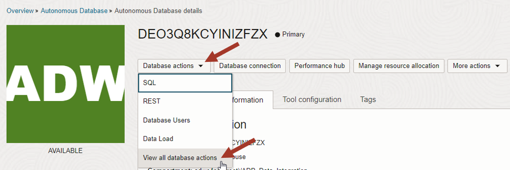

2.  __Administration__ 항목의 __Database Users__ 선택 

    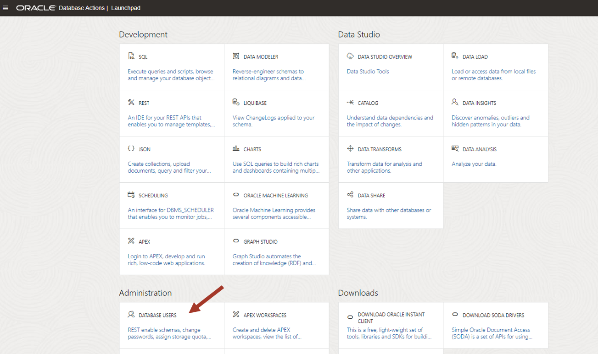

3.  현재 사용자가 **ADMIN** 인지 확인  
        **Create User** 버튼 클릭

    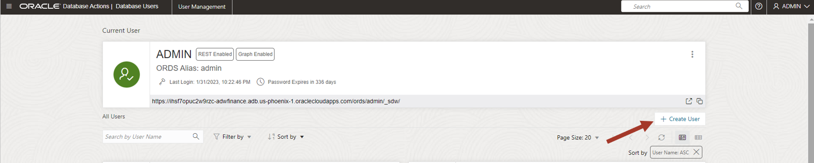

4.  **Create User** 화면에서 다음의 정보 입력:

    - User Name: **QTEAM**
    - Password: 암호 복잡성 규칙에 맞는 암호 입력
 
        비밀번호 생성 규칙과 관련한 자세한 내용은 다음 참조:  [Create Users on Autonomous Database](https://docs.oracle.com/en/cloud/paas/autonomous-database/adbsa/manage-users-create.html#GUID-B5846072-995B-4B81-BDCB-AF530BC42847)
  
    - **Quota on tablespace DATA** : **UNLIMITED** 지정
  
    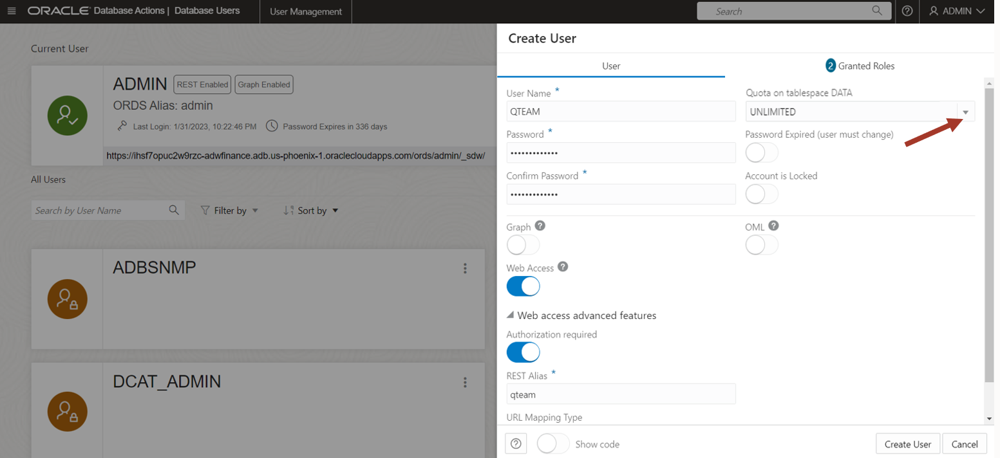

5.  **Granted Roles** 설정:

    - **DWROLE:** to grant access to load and store data
    - **DATA\_TRANSFORM\_USER:** to grant access to transform data
        > Note: **Granted** 와 **Default** 옵션 선택
    
    > Note: **CONNECT** 와 **RESOURCE** role 은 자동으로 적용되어 있음
 
    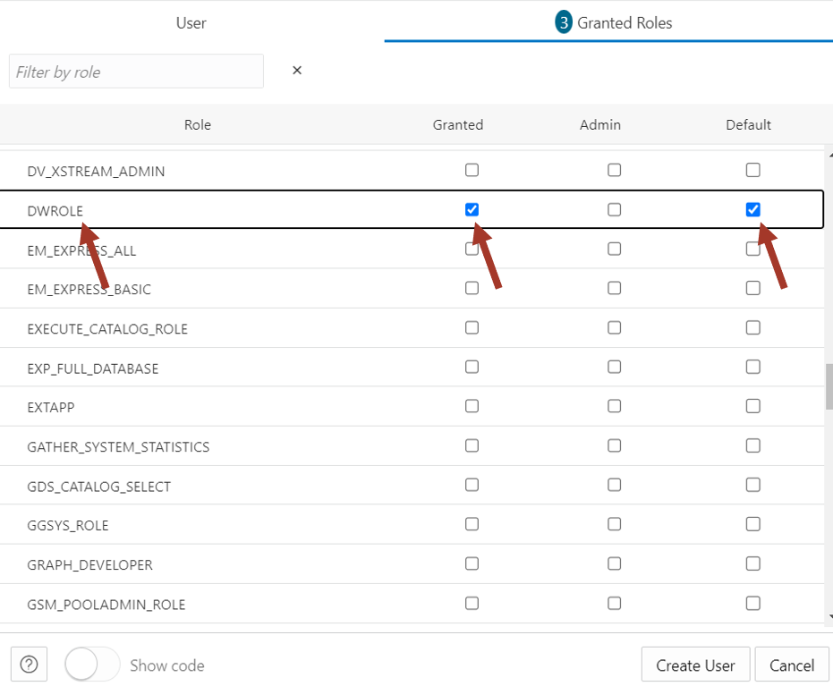

    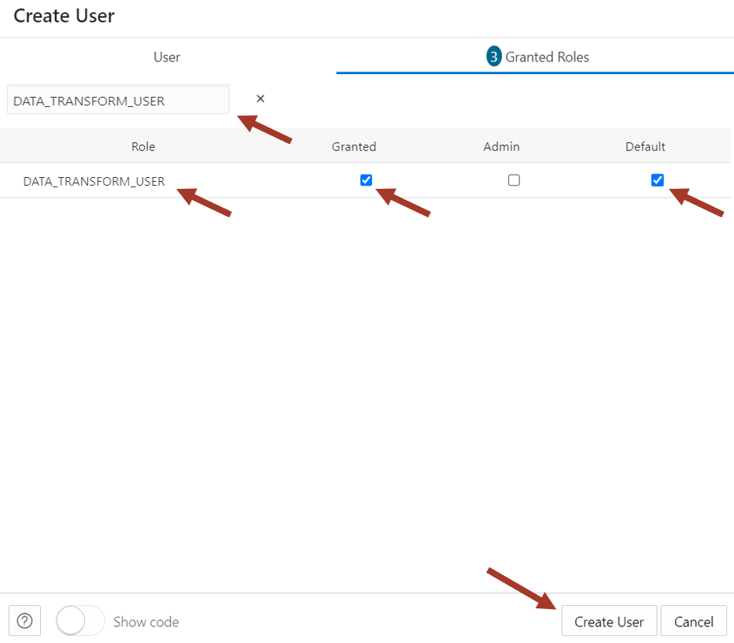
    
    **Create User** 버튼 클릭하여 사용자 생성 완료
    
## Task 2: QTEAM 사용자로 로그인

이제 데이터 로딩 실습을 시작할 수 있도록 QTEAM 사용자로 로그인합니다.

1.  사용자 화면에서 **QTEAM** 사용자의 아래쪽에 있는 아이콘 클릭(아래 그림의 화살표 표시)

    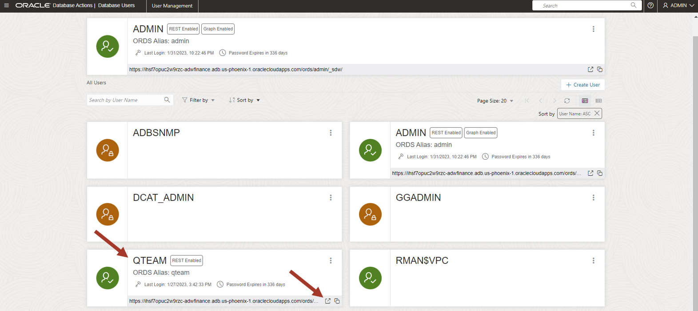

2.  **QTEAM** 사용자명과 암호 입력

    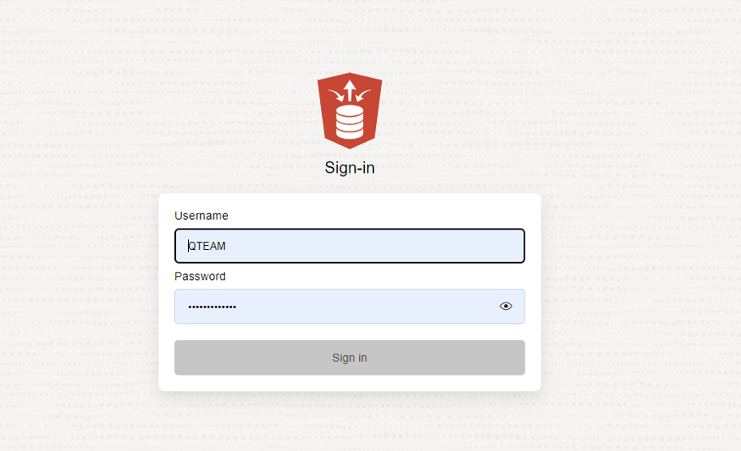

3.  **Database Actions Launchpad** 페이지 로딩 완료

    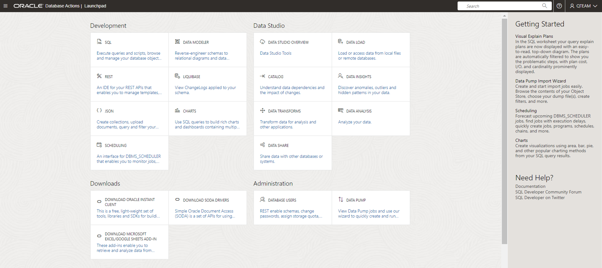


    이제 새로운 사용자로 Autonomous Data Warehouse에 접속되었습니다.


## Task 3: 데모 데이터 로딩

1. **Database Actions** 페이지에서 **SQL** 선택

    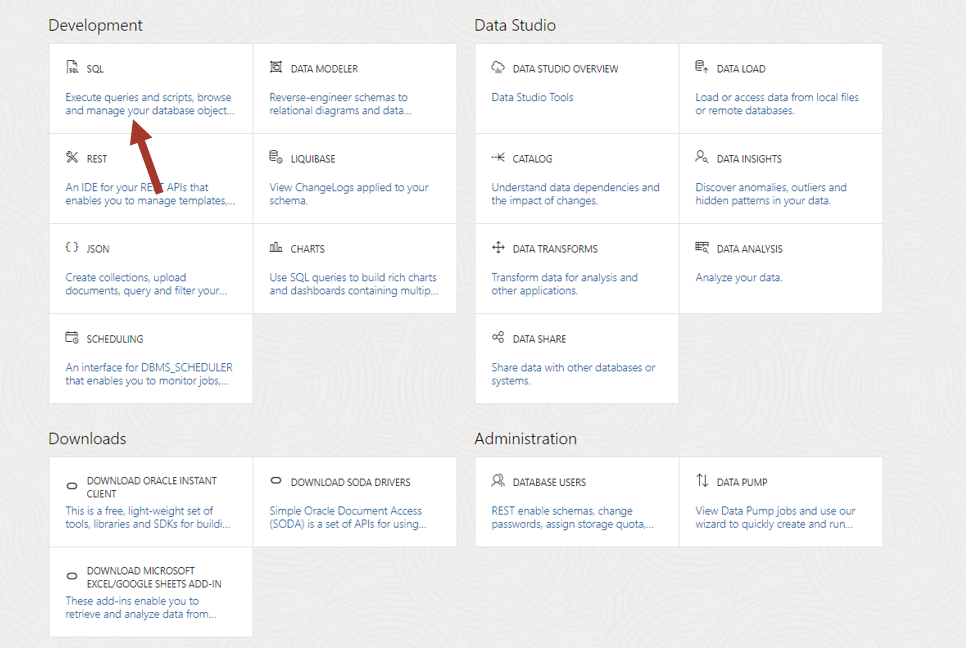

2. 기존 테스트 시 생성한 테이블이 있다면 **SQL Worksheet** 에 다음의 SQL 문을 복사한 후 수행. 기존 테이블이 없다면 패스 가능.

    ```sql
    DROP TABLE CUSTOMER_CA;
    DROP TABLE MOVIESALES_CA;
    DROP TABLE GENRE;
    DROP TABLE MOVIE;
    DROP TABLE TIME;
    DROP TABLE CUSTOMER_SALES_ANALYSIS;
    ```

    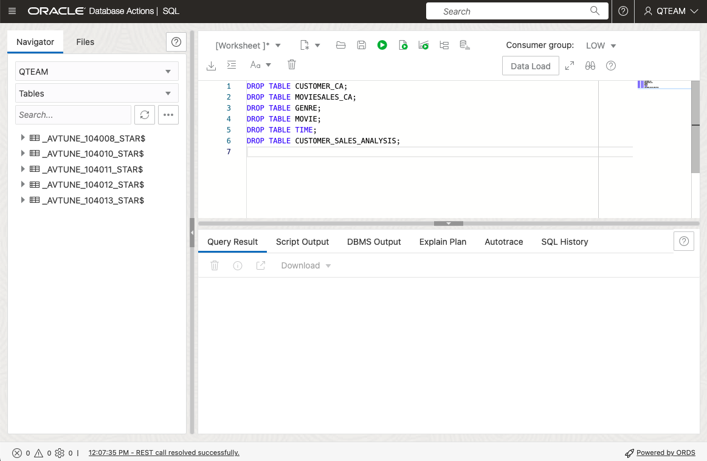

3. 워크샵에 필요한 테이블 생성  
   다음의 SQL 문을 Worksheet 에 복사 후 수행
   
    ```sql
    CREATE TABLE CUSTOMER_CA 
        ( 
        CUST_ID        NUMBER , 
        AGE            NUMBER , 
        EDUCATION      VARCHAR2 (40) , 
        GENDER         VARCHAR2 (20) , 
        INCOME_LEVEL   VARCHAR2 (20) , 
        MARITAL_STATUS VARCHAR2 (8) , 
        PET            VARCHAR2 (40) 
        ) 
    ;

    CREATE TABLE MOVIESALES_CA 
        ( 
        DAY_ID           DATE , 
        GENRE_ID         NUMBER , 
        MOVIE_ID         NUMBER , 
        CUST_ID          NUMBER , 
        APP              VARCHAR2 (100) , 
        DEVICE           VARCHAR2 (100) , 
        OS               VARCHAR2 (100) , 
        PAYMENT_METHOD   VARCHAR2 (100) , 
        LIST_PRICE       NUMBER , 
        DISCOUNT_TYPE    VARCHAR2 (100) , 
        DISCOUNT_PERCENT NUMBER , 
        TOTAL_SALES      NUMBER 
        ) 
    ;

    CREATE TABLE GENRE 
        ( 
        GENRE_ID NUMBER , 
        GENRE    VARCHAR2 (30) 
        ) 
    ;

    CREATE UNIQUE INDEX PK_GENRE_ID ON GENRE 
        ( 
        GENRE_ID ASC 
        ) 
    ;

    ALTER TABLE GENRE 
        ADD CONSTRAINT PK_GENRE_ID PRIMARY KEY ( GENRE_ID ) 
        USING INDEX PK_GENRE_ID 
    ;

    CREATE TABLE MOVIE 
        ( 
        MOVIE_ID     NUMBER , 
        TITLE        VARCHAR2 (200) , 
        BUDGET       NUMBER , 
        GROSS        NUMBER , 
        LIST_PRICE   NUMBER , 
        GENRES       VARCHAR2 (4000) , 
        SKU          VARCHAR2 (30) , 
        YEAR         NUMBER , 
        OPENING_DATE DATE , 
        VIEWS        NUMBER , 
        CAST         VARCHAR2 (4000) , 
        CREW         VARCHAR2 (4000) , 
        STUDIO       VARCHAR2 (4000) , 
        MAIN_SUBJECT VARCHAR2 (4000) , 
        AWARDS       VARCHAR2 (4000) , 
        NOMINATIONS  VARCHAR2 (4000) , 
        RUNTIME      NUMBER , 
        SUMMARY      VARCHAR2 (16000) 
        ) 
    ;

    CREATE TABLE TIME 
        ( 
        DAY_ID           DATE , 
        DAY_NAME         VARCHAR2 (36) , 
        DAY_OF_WEEK      NUMBER , 
        DAY_OF_MONTH     NUMBER , 
        DAY_OF_YEAR      NUMBER , 
        WEEK_OF_MONTH    NUMBER , 
        WEEK_OF_YEAR     NUMBER , 
        MONTH_OF_YEAR    NUMBER , 
        MONTH_NAME       VARCHAR2 (36) , 
        MONTH_SHORT_NAME VARCHAR2 (12) , 
        QUARTER_NAME     VARCHAR2 (7) , 
        QUARTER_OF_YEAR  NUMBER , 
        YEAR_NAME        NUMBER 
        ) 
    ;

    CREATE TABLE CUSTOMER_SALES_ANALYSIS
        (
        MIN_AGE NUMBER(38),
        GENRE VARCHAR2(30 CHAR),
        AGE_GROUP VARCHAR2(4000 CHAR),
        GENDER VARCHAR2(20 CHAR),
        APP VARCHAR2(100 CHAR),
        DEVICE VARCHAR2(100 CHAR),
        OS VARCHAR2(100 CHAR),
        PAYMENT_METHOD VARCHAR2(100 CHAR),
        LIST_PRICE NUMBER(38),
        DISCOUNT_TYPE VARCHAR2(100 CHAR),
        DISCOUNT_PERCENT NUMBER(38),
        TOTAL_SALES NUMBER(38),
        MAX_AGE NUMBER(38),
        AGE NUMBER(38),
        EDUCATION VARCHAR2(40 CHAR),
        INCOME_LEVEL VARCHAR2(20 CHAR),
        MARITAL_STATUS VARCHAR2(8 CHAR),
        PET VARCHAR2(40 CHAR),
        CUST_VALUE NUMBER,
        CUST_SALES NUMBER(38)
        )
    ;
    ```

4. 데이터 로딩 스크립트 수행  
   아래의 SQL 문을 Worksheet 에 복사한 후 **Run Script** 아이콘을 클릭하여 스크립트 수행

    ```sql
    set define on
    define file_uri_base = 'https://objectstorage.ap-seoul-1.oraclecloud.com/n/apackrsct01/b/Shared_Data/o'
    begin
    dbms_cloud.copy_data(
        table_name =>'CUSTOMER_CA',
        file_uri_list =>'&file_uri_base/CUSTOMER_CA.csv',
        format =>'{"type" : "csv", "skipheaders" : 1}'
    );
    dbms_cloud.copy_data(
        table_name =>'GENRE',
        file_uri_list =>'&file_uri_base/GENRE.csv',
        format =>'{"type" : "csv", "skipheaders" : 1}'
    );
    dbms_cloud.copy_data(
        table_name =>'MOVIE',
        file_uri_list =>'&file_uri_base/MOVIE.csv',
        format =>'{"type" : "csv", "skipheaders" : 1}'
    );
    dbms_cloud.copy_data(
        table_name =>'TIME',
        file_uri_list =>'&file_uri_base/TIME.csv',
        format =>'{"type" : "csv", "skipheaders" : 1}'
    );
    FOR TNAME IN (SELECT table_name FROM user_tables  where table_name like 'COPY$%') LOOP
    EXECUTE IMMEDIATE ('DROP TABLE ' || TNAME.table_name || ' CASCADE CONSTRAINTS PURGE');
    END LOOP;
    end;
    /
    ```

    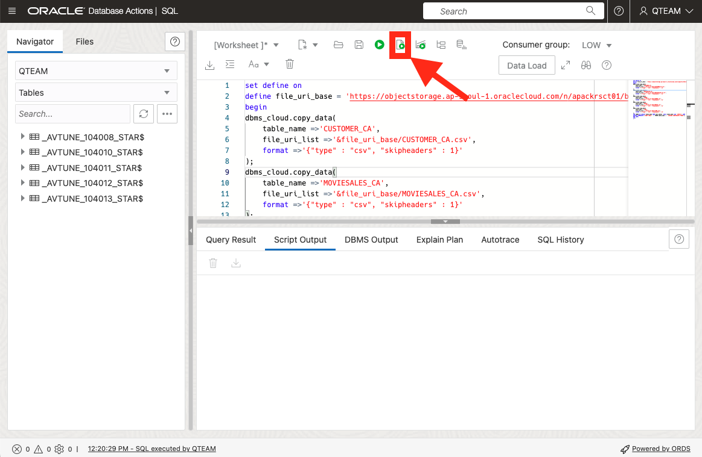

## Learn More

Autonomous Database 의 사용자 관리 상세 정보는 다음 문서 참조: [Managing Users on Autonomous Database](https://docs.oracle.com/en/cloud/paas/autonomous-database/adbsa/manage.html#GUID-AD7ACC07-AAF7-482A-8845-9C726B1BA86D). 


