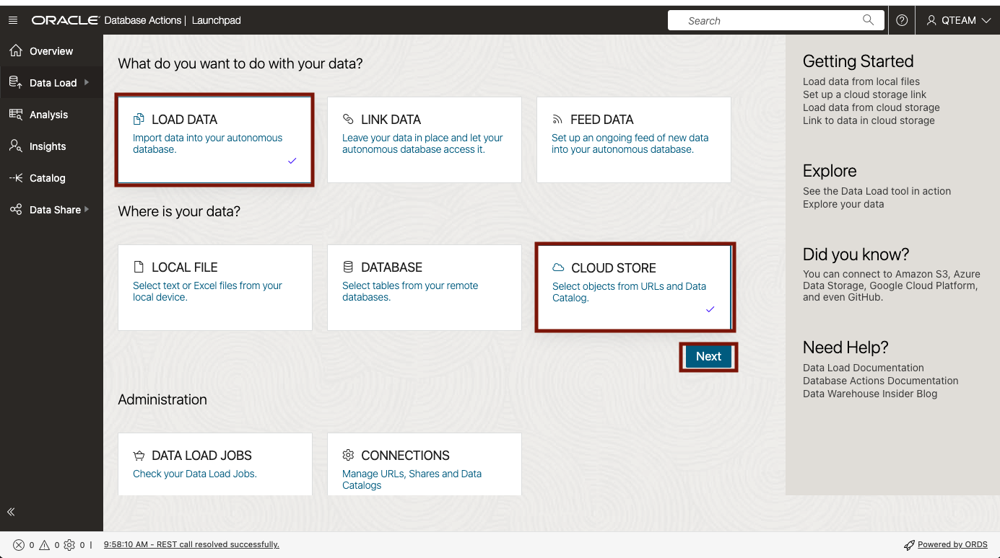
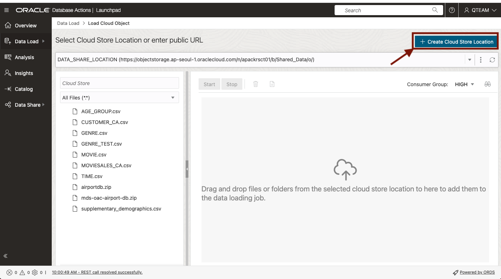
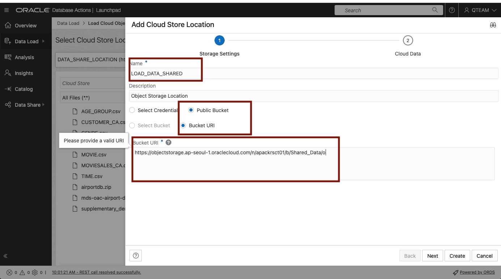
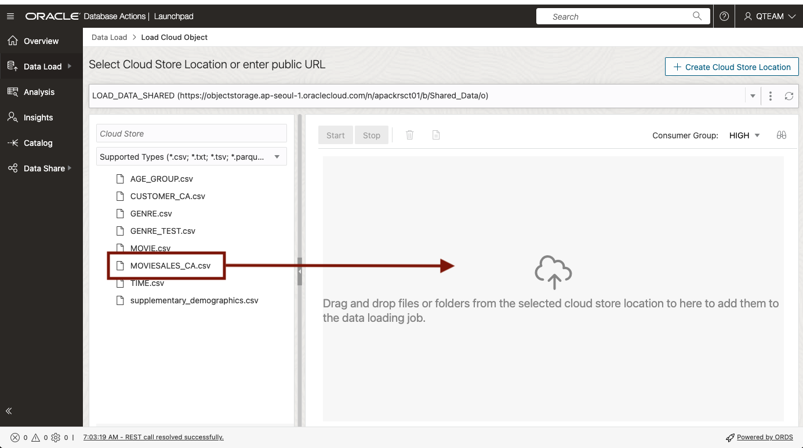
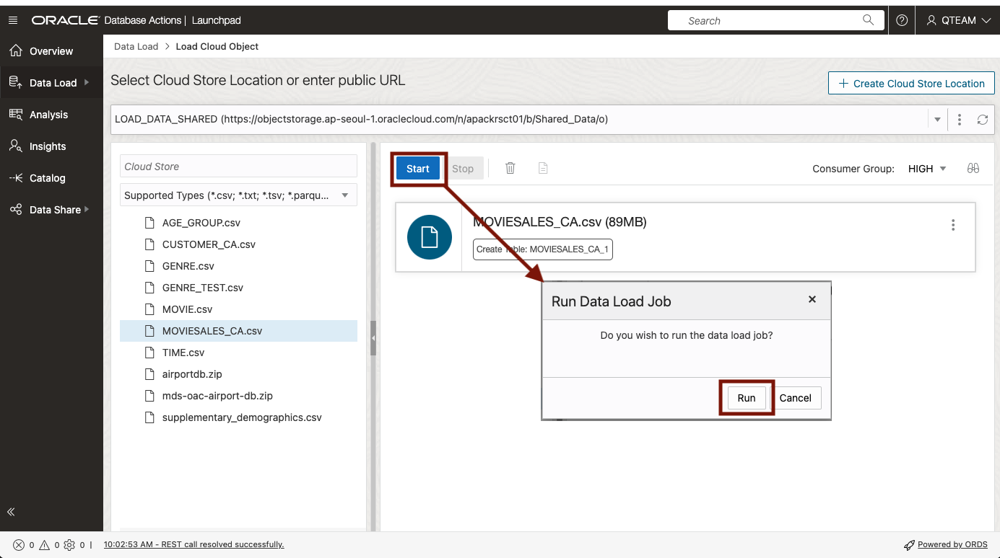
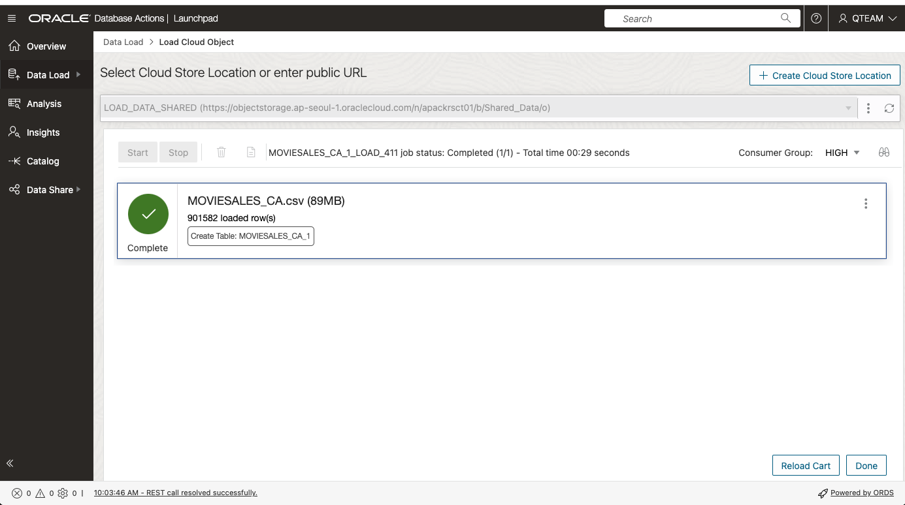
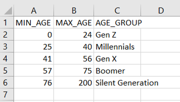
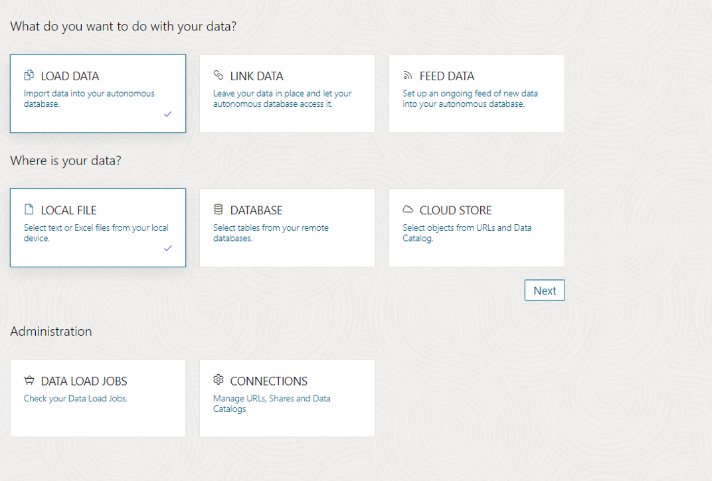
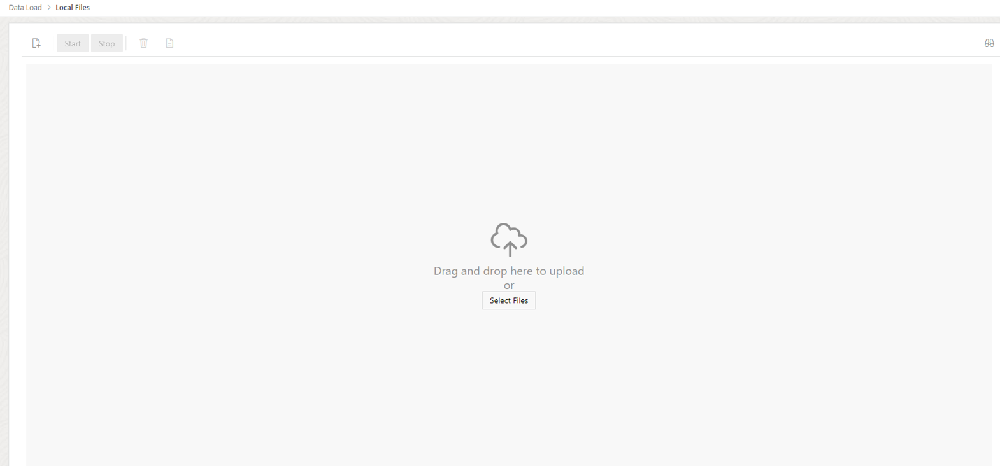
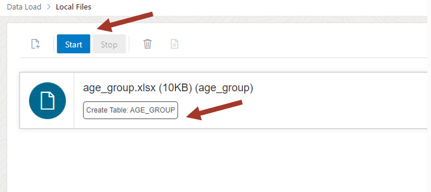

# 분석용 데이터 로드

- [분석용 데이터 로드](#분석용-데이터-로드)
  - [개요](#개요)
  - [Task 1: Object Storage Bucket 에 있는 데이터 로딩](#task-1-object-storage-bucket-에-있는-데이터-로딩)
  - [Task 2: Local PC 의 Excel 파일 로딩](#task-2-local-pc-의-excel-파일-로딩)


## 개요

이 랩에서는 Oracle Autonomous Database에 내장된 Data Studio의 **Data Load** 도구를 사용하여 새로운 데이터를 로딩하는 과정을 살펴보겠습니다.

- Object Storage 에 있는 데이터 로딩
- Local PC 에 있는 Excel 파일 로딩

예상 소요 시간: 10분

<!---
Watch the video below for a quick walk-through of the lab.
[Create a database user](videohub:1_o5j922rh)
-->

## Task 1: Object Storage Bucket 에 있는 데이터 로딩

매일 Object Storage Bucket 에 Upload 되는 판매 실적 데이터를 Autonomous Database 에 로딩하는 과정입니다.

1. **Database Actions** 페이지의 **Data Studio** 도구 모음에서 **DATA LOAD** 를 클릭합니다.

    

2. **LOAD DATA** 를 선택하고, 데이터 위치 정보는 **CLOUD STORE**를 선택한 후 Next 를 클릭하여 데이터 로딩 작업을 시작합니다.

    

3. **Select Cloud Store Location** 페이지에서 **Create Cloud Store Location** 을 클릭하여 로딩할 데이터가 있는 Object Storage 정보를 등록합니다.  
   기존에 등록해 놓은 Cloud Store Location 정보가 있다면, drop-down 메뉴에서 선택하면 됩니다.

    

4. **Add Cloud Store Location** 페이지에서 다음의 정보를 입력합니다.
   - Name: **LODA_DATA_SHARED**
   - Object Storage Location:
     - **Public Bucket** 선택 :   
                테스트를 위해서 Public Bucket을 사용합니다.
                Private Object Store 를 등록할 경우 다음 문서를 참조하세요. [Managing Cloud Storage Connections🔗
](https://docs.oracle.com/en-us/iaas/autonomous-database-serverless/doc/manage-cloud-connections.html#GUID-0AB44485-17A3-4794-ACAF-AF55C77D24EF)
     - **Bucket URI** 선택
     - **Bucket URI** : `https://objectstorage.ap-seoul-1.oraclecloud.com/n/apackrsct01/b/Shared_Data/o`

        

5. **Select Cloud Store Location** 페이지의 왼쪽 프레임의 Object Store 에 있는 파일 들 중 로딩 대상 파일인 **MOVIESALES_CA.csv** 파일을 끌어놓습니다.

    

6. **Start** 버튼을 클릭합니다.   
   이후 **Run Data Load Job** 창이 뜨면, **Run** 버튼을 클릭하여 로딩 작업을 수행합니다.

    

7. 일정 시간이 지난 후 다음과 같이 로딩 작업이 완료됩니다. MOVIESALES_CA 테이블에 약 90만건의 데이터가 로딩됩니다.

    


## Task 2: Local PC 의 Excel 파일 로딩

연령별 영화 판매 데이터 분석이 필요합니다.  기존 데이터는 연령 그룹 정보가 없다는 것을 발견하여 연령 그룹 정보를 위한 새로운 테이블을 로딩합니다.


1. 연령대 그룹 정보를 위한 로컬 데이터 파일 생성 

   연령 그룹 정보를 위한 **AGE_GROUP** 에 대한 로컬 데이터 파일을 생성합니다.  
   다음 표의 내용을 Excel 시트에 입력합니다. 

    | MIN\_AGE      | MAX\_AGE | AGE\_GROUP |
    | ----------- | ----------- | ----------- |
    | 0 | 24 |  Gen Z  | 
    | 25 | 40 |  Millennials  | 
    | 41 | 56 |  Gen X  | 
    | 57 | 75 |  Boomer  | 
    | 76 | 200 |  Silent Generation  | 

    Excel sheet 이름을 **AGE_GROUP** 으로 변경하고, Excel 통합 문서를 **AGE_GROUP.xlsx** 이름으로 Local PC에 저장합니다.

 
    

    만약, Excel 이 없으면 아래 데이터로 CSV 파일을 만들고, **AGE_GROUP.csv** 로 저정합니다.
    
    ```
    MIN_AGE,MAX_AGE,AGE_GROUP
    0,24,Gen Z
    25,40,Millennials
    41,56,Gen X
    57,75,Boomer
    76,200,Silent Generation
    ```

2. **Database Actions** 페이지의 **Data Studio** 도구 모음에서 **DATA LOAD** 를 클릭합니다.

    
    
3. **LOAD DATA** 를 선택하고, 데이터 위치 정보는 **LOCAL FILE**을 선택한 후 Next 를 클릭하여 데이터 로딩 작업을 시작합니다.

    

4.  Local PC 에 저장되어 있는 **AGE_GROUP.xlsx** 파일을 끌어 놓습니다.

    

5.  **Start** 버튼을 클릭하여 로딩을 시작합니다. 

    
    

이제 분석에 필요한 모든 데이터가 준비되었습니다.

