# 분석을 위한 데이터 변환

- [분석을 위한 데이터 변환](#분석을-위한-데이터-변환)
  - [개요](#개요)
  - [Task 1: Data Transforms 도구 실행](#task-1-data-transforms-도구-실행)
  - [Task 2: 데이터베이스 접속 설정](#task-2-데이터베이스-접속-설정)
  - [Task 3: Data Flow를 생성하여 고객 판매 데이터 분석을 위한 데이터 준비](#task-3-data-flow를-생성하여-고객-판매-데이터-분석을-위한-데이터-준비)
  - [\[참조\] How to debug](#참조-how-to-debug)

## 개요

Autonomous Database 에 내장된 **Data Transforms** 기능을 활용하여 분석을 위한 데이터 준비 및 다양한 데이터 변환 방법을 살펴보겠습니다.

예상 소요 시간 : 30 분

<!---
Watch the video below for a quick walk-through of the lab.
[Create a database user](videohub:1_g5x49pk2)
-->

## Task 1: Data Transforms 도구 실행

이번 실습에서는 판매 실적 데이터의 구매 횟수 기준으로 고객을 다섯 등급으로 분류한 후 등급을 할당하여 **CUSTOMER_SALES_ANALYSIS** 테이블을 생성합니다.  
또한, **CUSTOMER_CA, AGE_GROUP, GENRE** 테이블에서 분석을 위한 다양한 고객 속성 정보를 **CUSTOMER_SALES_ANALYSIS** 테이블에 추가하는 방법을 살펴 보겠습니다.

**Data Studio** 의 **Data Transforms** 도구를 활용하면 분석용 데이터를 위한 다양한 데이터 변환 및 준비 작업을 손쉽게 수행할 수 있습니다.

1.  **DATA TRANSFORMS** 을 클륵합니다. 

    >**NOTE:** 만약 **DATA TRANSFORM** 메뉴가 보이지 않는다면, **DATA_TRANSFORM_USER** Role 이 사용자에게 부여되어 있는지 확인해 보시기 바랍니다. 

    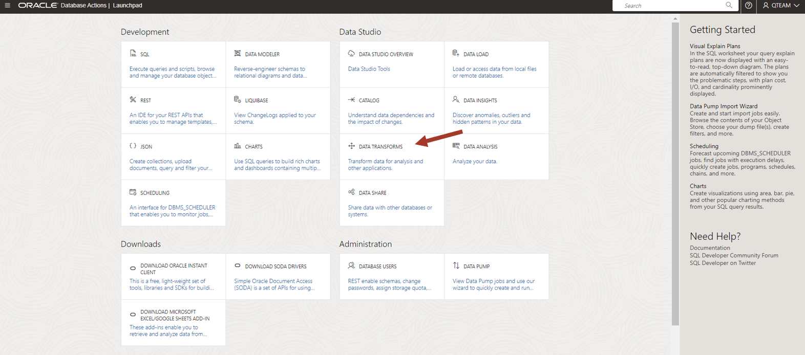

2.  **SIGN in to Oracel Data Integrator** 화면에서 데이터베이스 사용자명 QTEAM 과 암호를 입력합니다.

    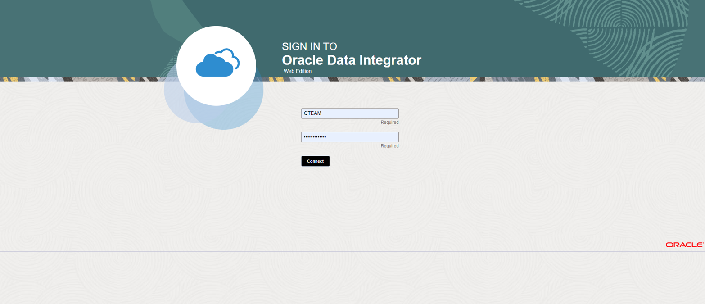

3.  프로비저닝이 진행되는 것을 확인할 수 있습니다.  포로비저닝 작업은 약 5-10분 정도 소요될 수 있습니다.

    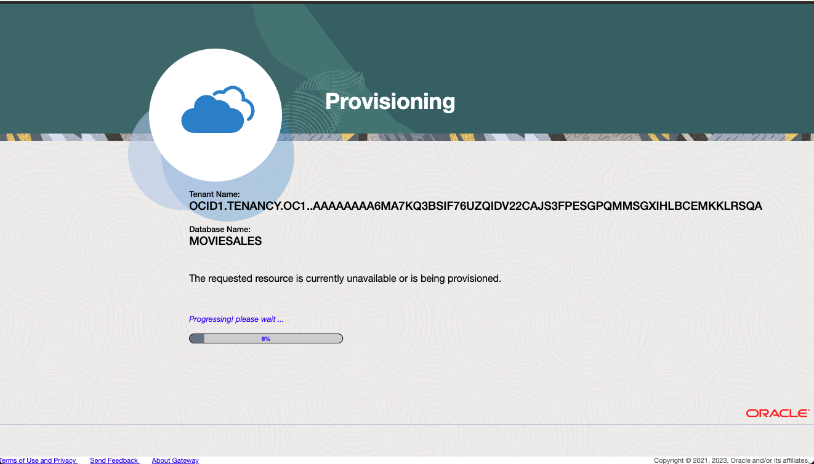

4.  프리비저닝 완료 

    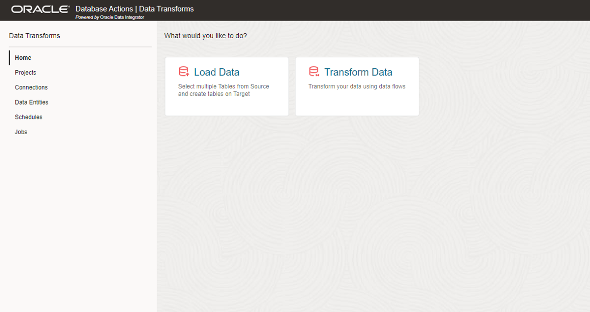

## Task 2: 데이터베이스 접속 설정

1.  왼쪽 메뉴의 **Connections** 을 클릭하여 Database 접속 정보를 생성합니다.

    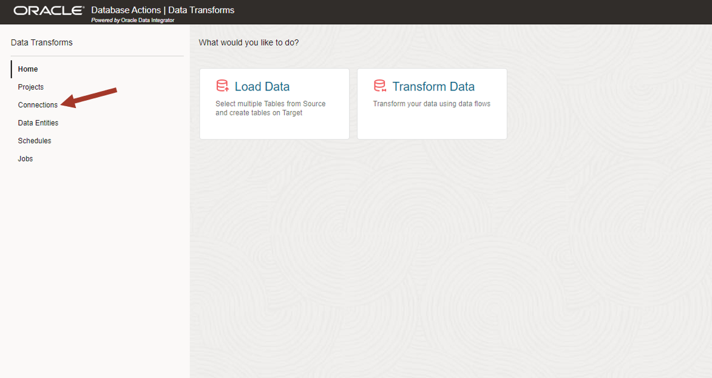

2.  이미 현재 사용중인 Autonomous Database를 위한 Connection 정보가 존재합니다.  접속 정보를 클릭하여 구성을 확인하고 완료합니다. 

    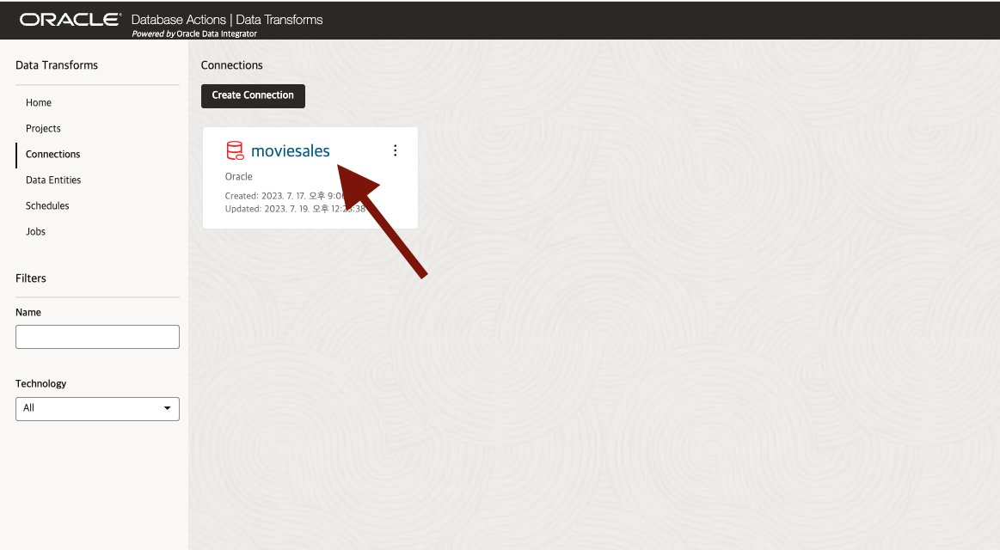

3.  QTEAM 사용자명과 암호를 입력한 후 **Test Connection** 을 클릭하여 정상 접속여부를 확인합니다.  성공하면 **Update** 클릭하여 접속 정보를 저장합니다.

    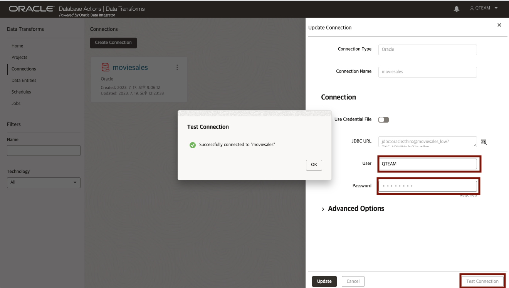

<!--    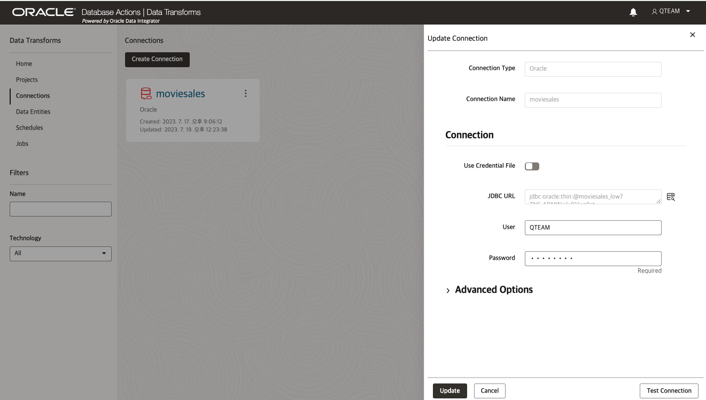 -->

## Task 3: Data Flow를 생성하여 고객 판매 데이터 분석을 위한 데이터 준비

1.  왼쪽 메뉴의 **Home** 클릭 후, **Transform Data** 를 클릭하여 Data Transform 위자드를 실행합니다.

    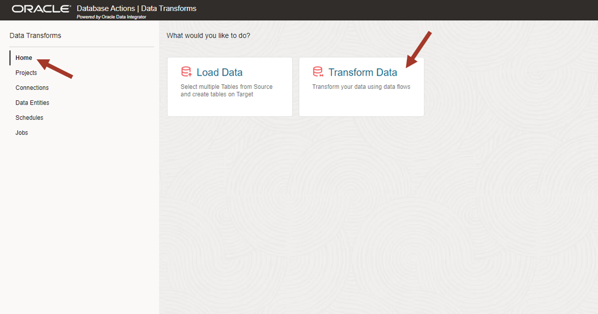

2.  Data Flow 명과 설명을 입력합니다. 

    Name: **load_customer\_sales\_analysis**  
    Description: **Load customer sales table with quintiles and other attributes**
        
    Data Transform 툴을 처음 사용하면 Project 가 없기 때문에 **+** 를 클릭하여 새로운 Project 를 생성합니다.  Project 이름은 **SalesData** 로 입력합니다.
    
    **Next** 클릭.

    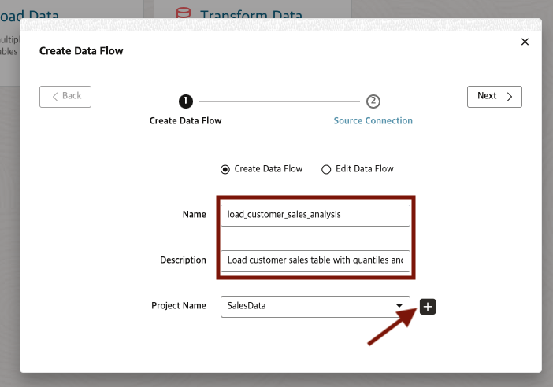

3.  앞에서 생성한 접속 정보를 선택하고 스키마는 **QTEAM** 을 선택합니다.
    
    **Save** 클릭.

    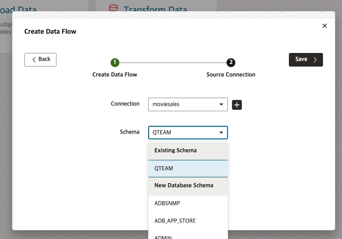

4.  Data Flow 편집 화면입니다. 왼쪽 메튜의 **QTEAM(Importing Data Entities)** 를 클릭하여 필요한 데이터 엔티티를 로딩합니다. (로딩 작업은 4-5분 소요될 수 있습니다.)  
    완료되면 QTEAM 스키마의 테이블 및 객체 리스트를 보여줍니다. 

    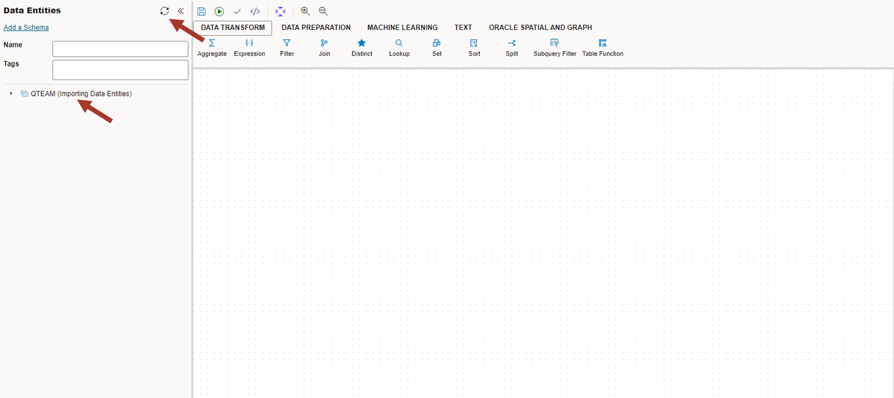

5.  Data Flow 편집 화면의 메뉴 정보는 다음과 같습니다. 

    1: 다양한 Transform을 조합하여 Data Flow를 생성하는 기본 편집 캔버스
    
    2: Data Entity 브라우저.  데이터 엔터티는 Data Flow의 소스 또는 타겟으로 사용될 수 있습니다. + 아이콘을 클릭하여 더 많은 연결을 추가할 수 있으며 목록이 큰 경우 이름이나 태그로 엔터티를 필터링할 수 있습니다.  Data Flow를 구축하기 위해 엔터티를 기본 캔버스로 끌어옵니다.
    
    3: Transform 은 다양한 범주로 그룹화됩니다. 다양한 그룹을 클릭하면 어떤 종류의 변환이 가능한지 확인할 수 있습니다. 기본 변환은 **DATA TRANSFORM** 및 **DATA PREPARATION** 그룹 아래에 있습니다. 이러한 변환을 기본 캔버스로 끌어서 Data Flow를 구축합니다.
    
    4: 속성: 소스/대상 엔터티를 클릭하거나 변환 단계를 클릭하면 다양한 속성을 보고 편집할 수 있습니다.
    
    5: 저장, 실행, Validation 작업
    
    6: 메인 캔버스의 빈 부분을 클릭하면 Data Flow의 실행 상태를 제공합니다.
    
    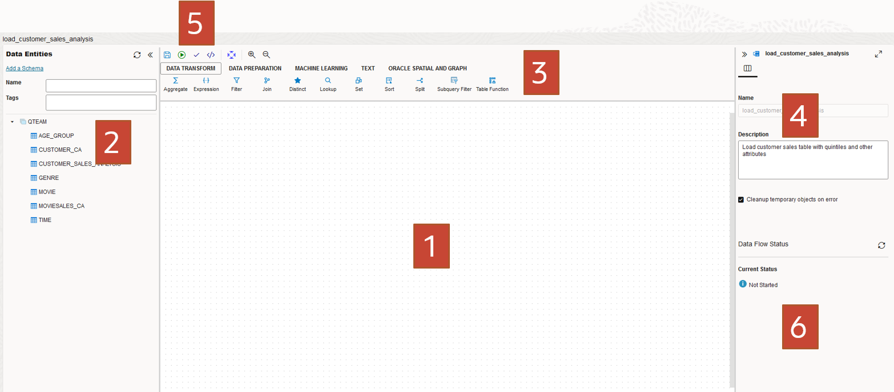

6.  그럼 이제 고객 당 매출을 집계하여 고객을 5 등급으로 분류하는 과정을 살펴보겠습니다.

    먼저, **MOVIESALES_CA** 테이블을 캔버스로 끌어 놓은 후, **DATA TRANSFORM** 메뉴의 **Aggregate** 변환을 캔버스로 끌어놓습니다.

    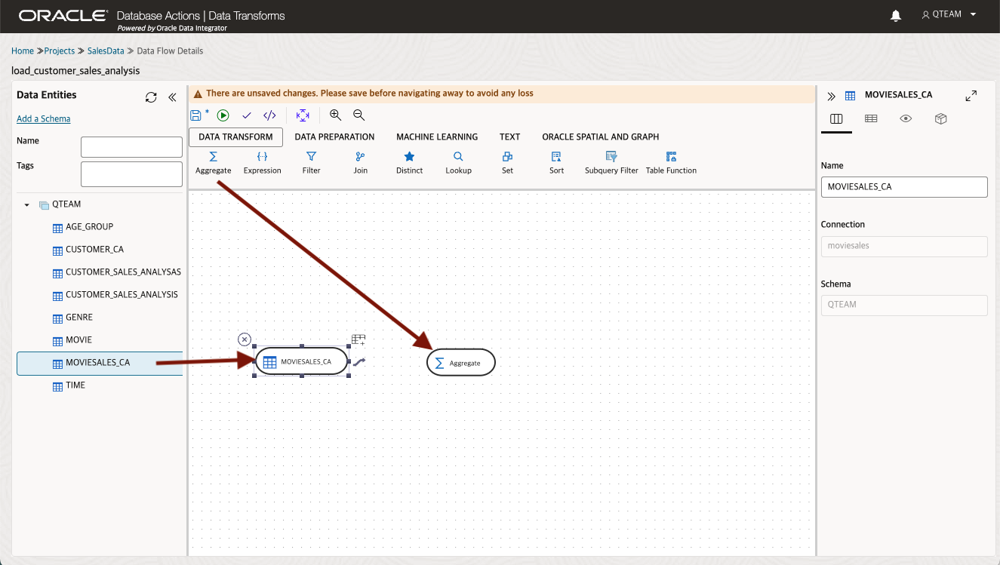

7.  다음으로 **DATA PREPARATION** 메뉴의 **Quantile Binning** 변환을 캔버스로 끌어 놓습니다.

    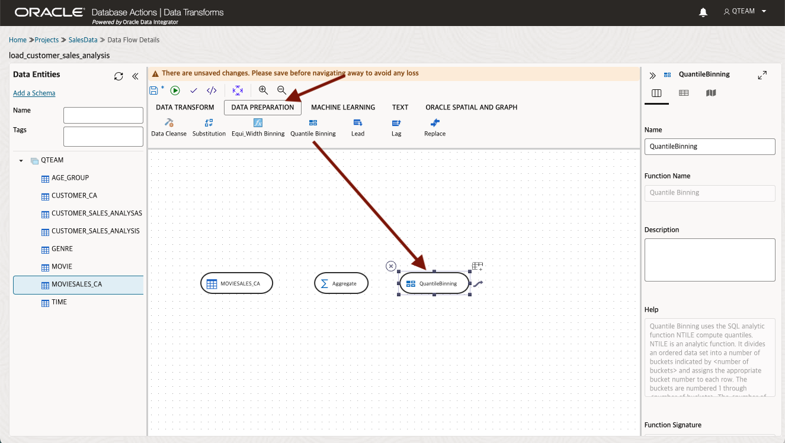

8.  **MOVIESALES_CA**를 클릭한 후 작은 화살표를 드래그하여 **Aggregate** 변환에 연결합니다.  이 후의 변환 단계를 연결하는 과정은 동일합니다. 

    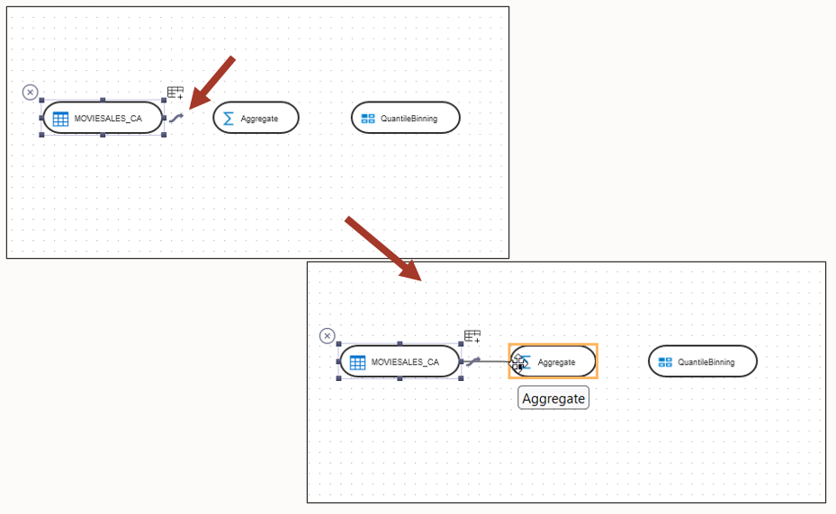

9.  이제 **Aggregate** 변환의 속성을 설정합니다.  **Aggregate** 변환을 클릭한 후 오른쪽 메뉴의 **Attribute** 아이콘을 클릭합니다.  오른쪽 가장 위에 있는 아이콘을 클릭하여 속성 창을 확장할 수 있습니다.

    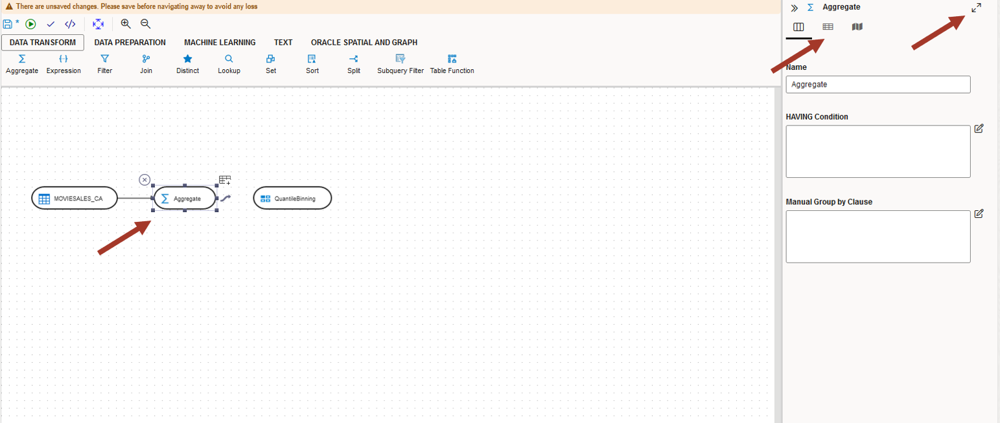

10. 왼쪽 메뉴의 **Attribute** 를 클릭합니다.  이전 단계의 모든 컬럼 정보를 확인할 수 있습니다.(MOVIESALES_CA 테이블)   
    고객 별 매출 합계 정보만 필요하기 때문에 **CUST_ID** 컬럼과 **TOTAL_SALES** 컬럼을 제외하고 모두 삭제합니다.
    각 컬럼 리스트에서 **CUST_ID, TOTAL_SALES** 컬럼을 제외하고 checkbox 를 선택한 후 휴지통 아이콘을 클릭하여 불필요한 컬럼들을 삭제합니다.

    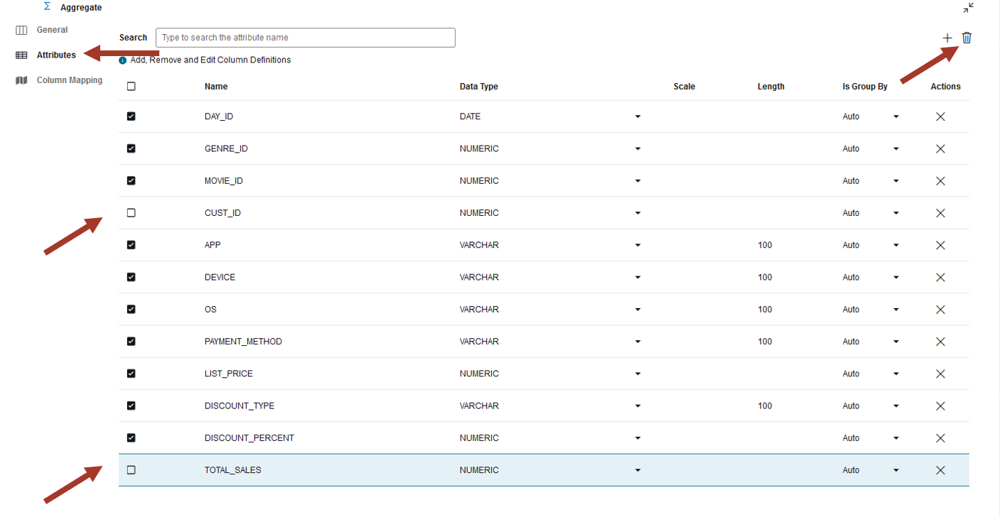

11. 의미를 명확히 하기 위해 **TOTAL_SALES** 컬럼 명을 **CUST_SALES** 로 변경합니다.  CUST_SALES 컬럼은 고객 별 매출 총합 정보를 가지도록 변경할 예정입니다.

    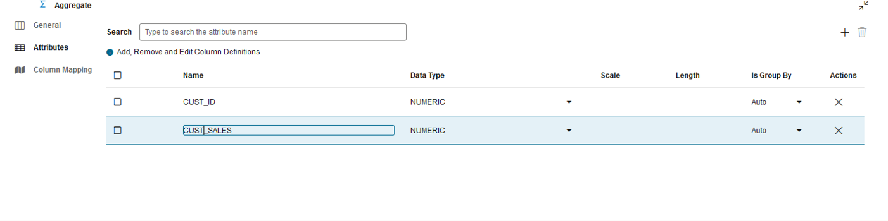

12. 집계 정보를 생성하기 위해 **Column Mapping** 을 클릭합니다.  먼저 **Auto Map** 을 선택하여 Expression 정보를 기존 테이블의 컬럼으로 자동 지정합니다. 

    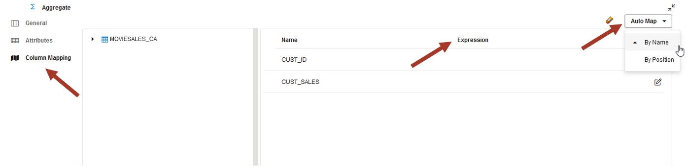

13. **CUST_SALES** 컬럼의 **Editior** 아이콘을 클릭하여 **CUST_SALES** 컬럼에 대한 집계 정보를 설정해 줍니다. 

    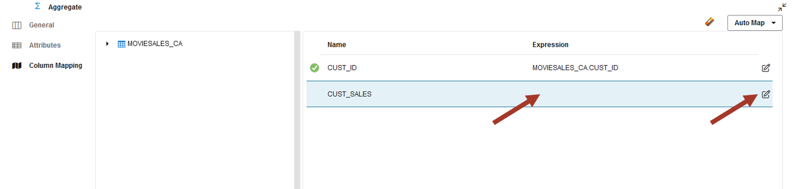

14. **Expression Editor** 창으로 **TOTAL_SALES** 컬럼을 끌어다 놓습니다. 이후 Expression 에디터에 다음과 같이 집계 정보 생성을 위한 expression 을 작성합니다.

    Expression: **SUM ( MOVIESALES_CA.TOTAL_SALES )**

    **OK** 클릭

    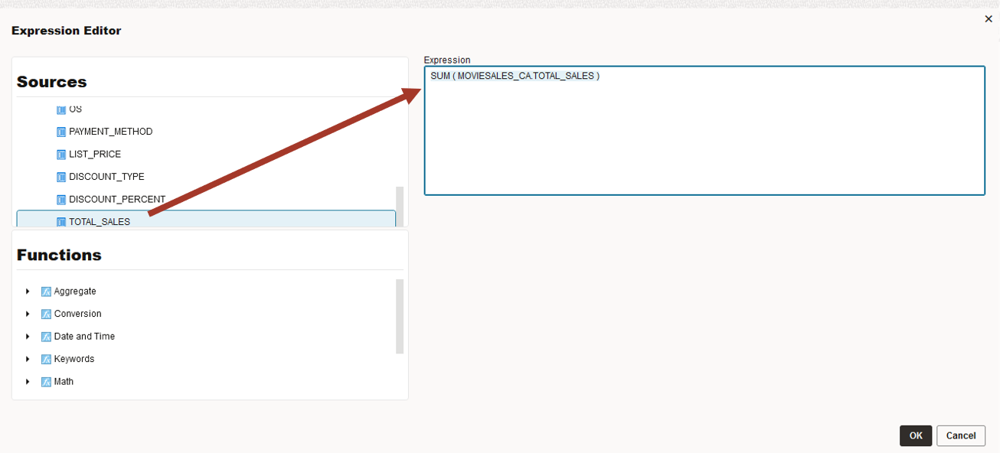

15. **CUST_SALES** 컬럼 정보가 **CUST_ID** 별 **TOTAL_SALES** 의 합계로 구하는 것을 확인한 후 오른쪽 위의 아이콘을 클릭하여 속성 편집 화면을 닫습니다.  이 후의 속성 편집은 유사한 과정으로 수행합니다.

    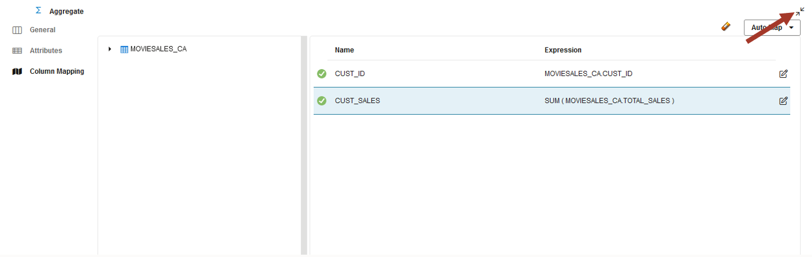

16. **Aggregate** 변환과 **Quantile Binning** 변환을 연결해 줍니다.   
    **Quantile Binning** 변환을 클릭한 후 필요한 속성 정보를 수정합니다.

    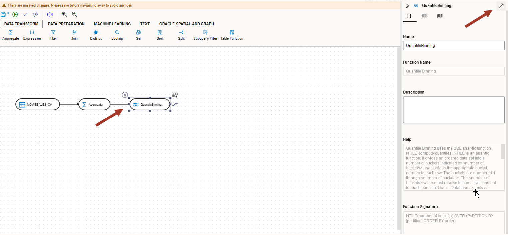

17. **Attribute** 섹션에서 **OUTPUT1** 을 클릭합니다.  
    속성 명 **Return** 을 **CUST_VALES** 로 변경합니다.  Quantile Binning 결과 값은 **CUST_VALUE** 컬럼으로 저장됩니다.
    
    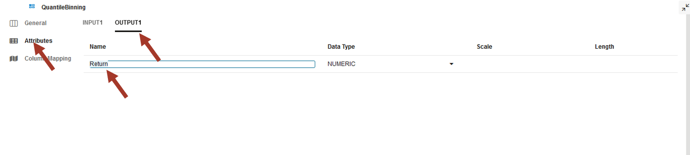

18. **Column Mapping** 을 클릭한 후 **Expression** 정보를 다음과 같이 변경합니다. 
    
    **number of buckets** : 5  
    **order** : Aggregate 정보의 **CUST_SALES** 컬럼 끌어놓기 

    총 고객 판매량 정보를 사용하여 고객을 5개의 버킷으로 나누는 것을 의미합니다. 이는 고객의 등급을 나타내는 데 사용됩니다.

    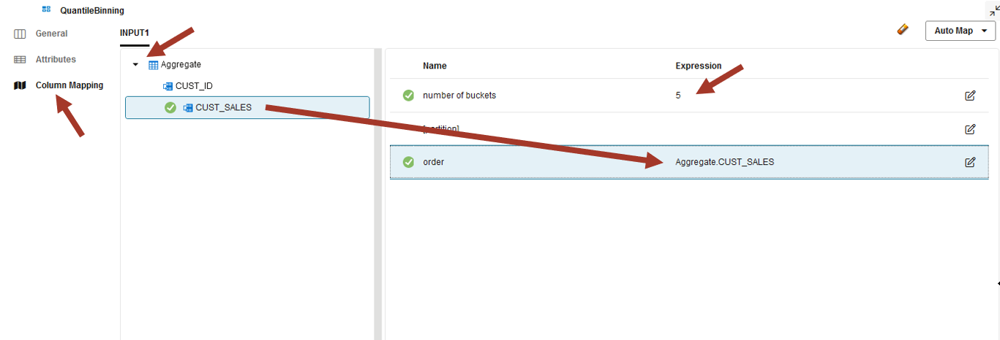

    완료 후 속성 창을 닫습니다. (오른쪽 위 아이콘 클릭))

19. 데이터 소스와 변환을 캔버스에 추가하고 해당 속성을 편집하는 기본 방법을 살펴보았습니다. 

    다음으로 **DATA TRANSFORMS** 그룹의 **Join** 변환을 캔버스로 가져옵니다.
    **CUSTOMER\_CA** 테이블도 끌어 놓은 후 **Join** 변환과 연결해 줍니다.  
    Join의 Attribute 속성을 클릭하여 확인하면 조인 관련 속성이 자동으로 설정되어 있는 것을 확인할 수 있습니다.  필요한 경우 수동으로 편집할 수도 있습니다.

    Join Condition 확인 : **Aggregate.CUST_ID=CUSTOMER_CA.CUST_ID**

    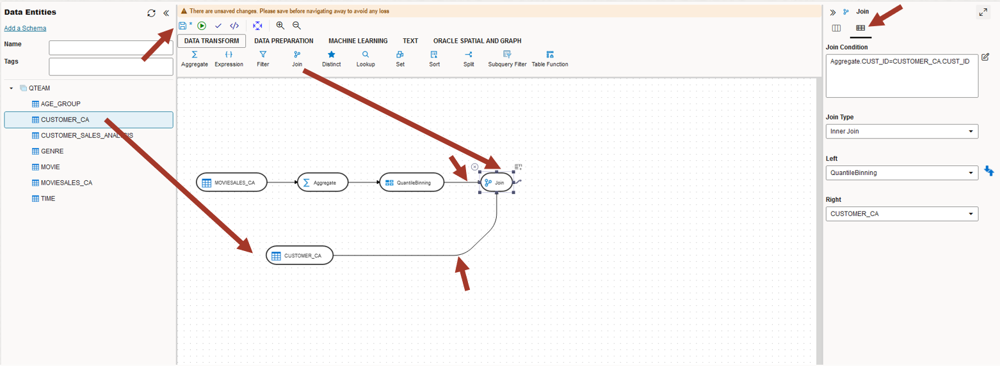

20. **AGE_GROUP** 테이블과 **Lookup** 변환을 끌어 놓은 후 아래 화면과 같이 연결해 줍니다.  

    먼저, **Join** 을  **Lookup** 변환과 연결하고, **AGE\_GROUP** 테이블을 **Lookup** 과 연결합니다. 
    >**Note:** **Lookup** 변환은 연결 순서가 중요합니다.  **AGE_GROUP** 이 lookup 의 소스이어야 합니다. 

    Lookup Condition 을 다음과 같이 설정합니다. : **CUSTOMER\_CA.AGE between AGE\_GROUP.MIN\_AGE and AGE\_GROUP.MAX_AGE**
    
    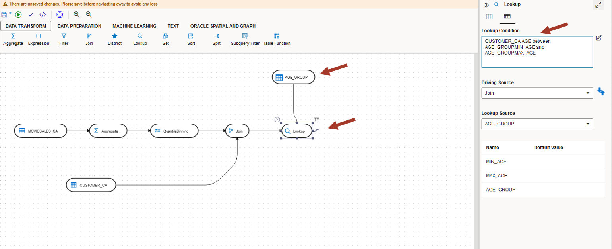

21. 분석을 위해 트랜잭션 데이터를 추가합니다.  
    왼쪽 브라우저 창에서 **MOVIESALES\_CA** 테이블을 캔버스에 끌어 놓습니다. 

    테이블 명이 **MOVIESALES_CA1** 으로 표시되는데, 동일한 테이블에 두번 사용되었기 때문에 suffix 가 자동으로 추가됩니다.
    
    **Join** 변환을 끌어놓은 후, **Lookup** 변환과 **MOVIESALES_CA1** 테이블을 연결해 줍니다. 조인 조건은 동일한 컬럼 명이 있으면 자동으로 설정됩니다.  
    Join 조건이 다음과 같이 설정되어 있는지 확인합니다 : **Aggregate.CUST_ID=MOVIESALES_CA1.CUST_ID**  
        
    다음으로, 영화 **GENRE** 테이블을 가져와 조인합니다.   
    Join 조건이 다음과 같이 설정되어 있는지 확인합니다 : **MOVIESALES\_CA1.GENRE_ID=GENRE.GENRE\_ID**

    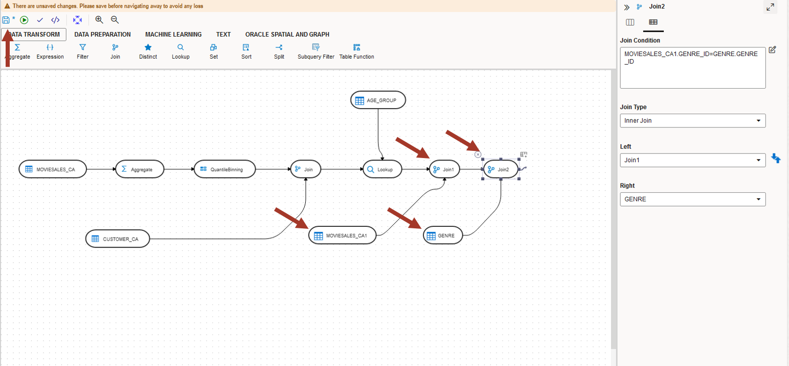

22. 분석 데이터 생성을 위한 **Data Flow** 생성 작업은 완료되었습니다.  
    완료된 결과 데이터를 Target 테이블인 **CUSTOMER_SALES_ANALYSIS** 에 추가합니다. **CUSTOMER_SALES_ANALYSIS** 테이블은 후속 랩에서 분석 작업을 위해 사용됩니다.

     왼쪽 엔터티 브라우저에서 **CUSTOMER_SALES_ANALYSIS** 테이블을 캔버스로 끌어 놓고, 마직막 **Join** 변환과 연결해 줍니다.

    >**참고:** Data Flow에서 새로운 Target 테이블을 생성할 수도 있지만 단순화를 위해 이 워크숍에서는 미리 생성된 테이블 정의를 사용합니다.
    
    대상 테이블의 정확한지 확인하기 위해, 캔버스에서 대상 테이블을 클릭하고 오른쪽 상단 모서리를 클릭하여 속성 패널을 확장합니다.

    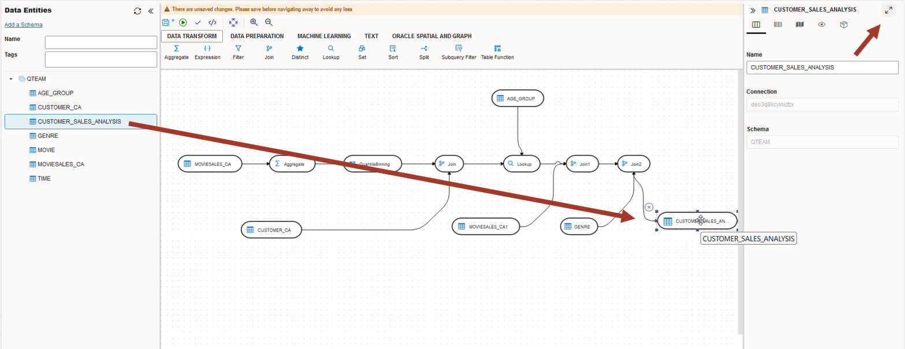

23. **Column Mapping**을 클릭하고 Expression 정보를 확인합니다.  모든 컬럼이 매핑되어 있는지 확인하고, 변경하려는 경우 수동으로 편집할 수도 있습니다. 
    
    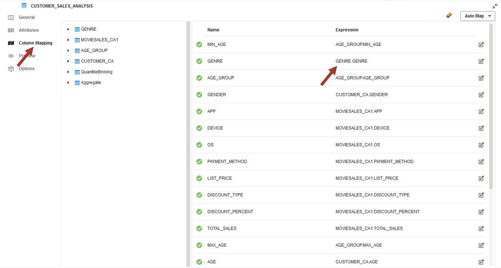

24. **Options** 을 선택한 후, **Drop and create target table** 속성을 **true** 로 설정합니다.  
    이 옵션을 설정하면 Data Flow 를 수행할 때마다 테이블을 새롭게 생성합니다.  기존 테이블을 재생성하지 않고 테이블을 trancate 하거나, 기존 테이블에 추가로 로딩하는 옵션도 가능합니다. 

    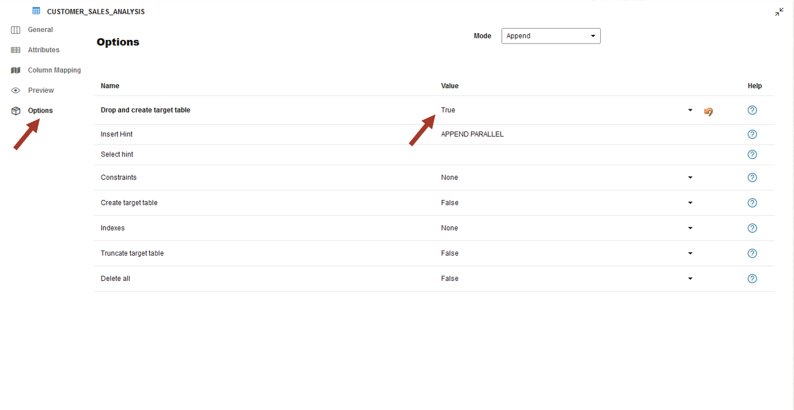

25. 대상 테이블 속성 창을 닫은 후 main 캔버스에서 **Save** 를 한 후, **Validate** 작업을 수행합니다. 

    아래 화면과 같이 오류가 발생하지 않아야 합니다.  만약, 오류가 발생한다면 **Data Flow** 생성 과정을 확인하시기 바랍니다.  대부분의 오류는 매핑되지 않은 속성이나 잘못된 **Expression** 으로 인해 발생합니다.

    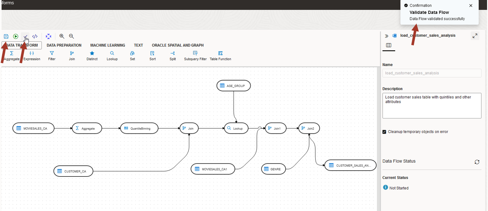

26. **Execute** 아이콘(녹색 플레이 버튼)을 클릭하여 **Data Flow** 작업을 수행합니다.  
    **Start Data Flow** 창에서 **Start** 를 클릭합니다.  확인 창이 뜨면, OK 를 클릭합니다.

    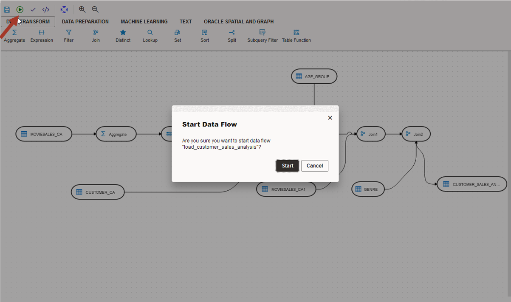

27. Data Flow 수행 상태 정보는 오른쪽 패널의 아래 부분에서 확인할 수 있습니다.  
    Data Flow 작업이 완료되면 **Current Status** 정보가 **Done** 이 됩니다. 
    
    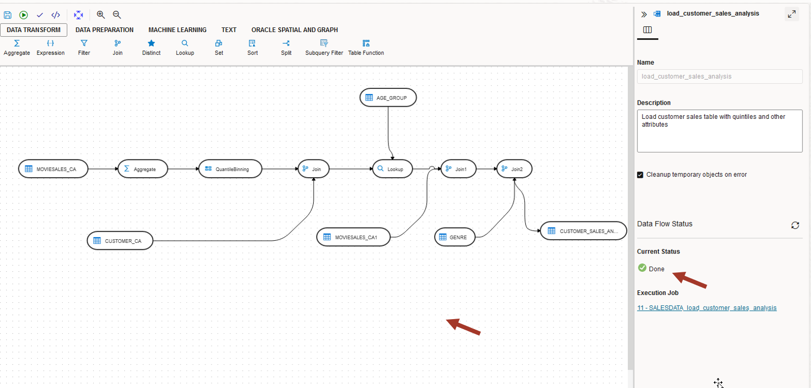

28. Data Flow 작업이 정상적으로 수행되었는지 확인하기 위해 생성된 데이터를 확인합니다.  
    캔버스에서 대상 테이블(**CUSTOMER_SALES_ANALYSIS**)을 클릭한 후, **Preview** 아이콘을 클릭하여 데이터를 확인할 수 있습니다. 

    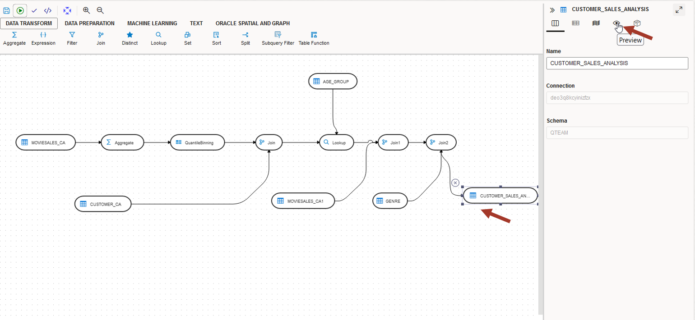

29. 아래와 같이 모든 컬럼이 정상적으로 데이터가 생성된 것을 확인할 수 있습니다.  

    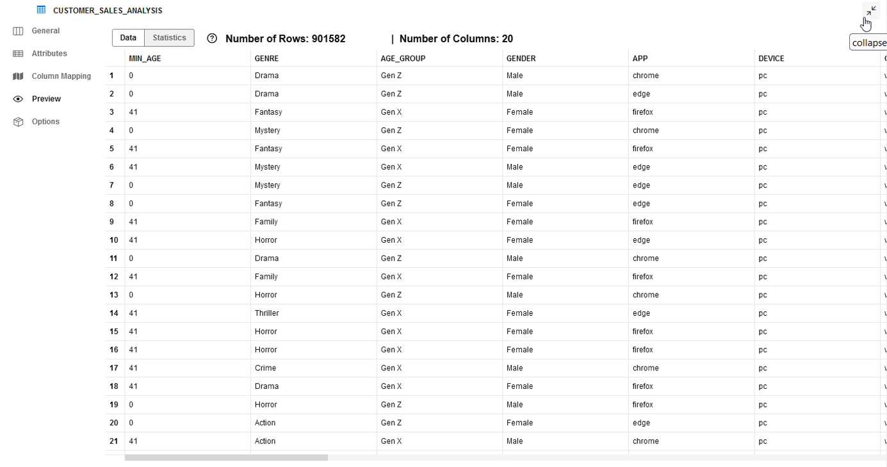

30. 생성된 데이터를 살펴보기 위해 **Statistics** 탭을 클릭하면 데이터의 다양한 분석 정보를 확인할 수 있습니다.  
    지금은 단지 대략적인 데이터만 살펴보는 것뿐입니다. 이 데이터를 분석하고 많은 흥미로운 패턴을 찾으려면 **Data Analysis** 도구를 사용해야 합니다.

    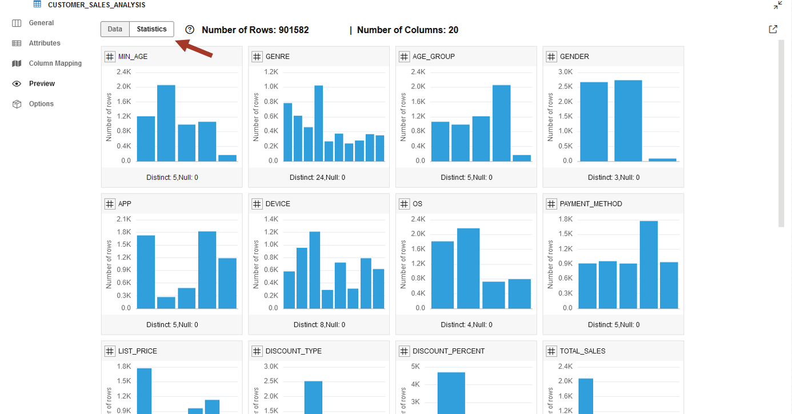

## [참조] How to debug

>**Note:** This is for advanced users. Skip if you don't have any errors and you want 
to straight go to the next lab.

1.  Go back to the data flow canvas and click on the empty space in the
    canvas. On the top, there is a Code Simulation icon. Click on it. This
    will show you the code to be generated.

    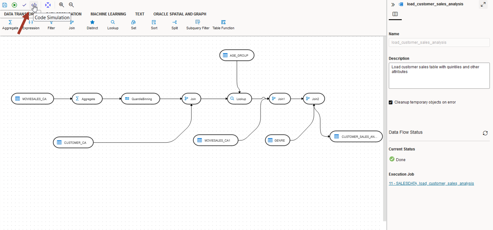

2.  Look at the generated SQL. Imagine writing this SQL without the
    graphical interface. It is complex. Isn't it? 
    Advanced users will find this useful for debugging purposes.

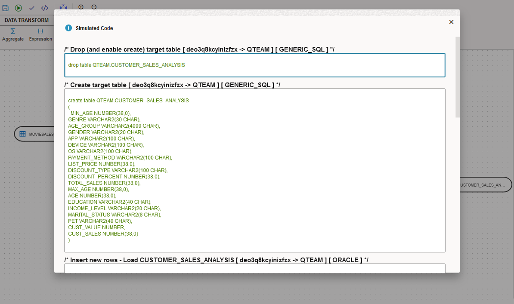

3.  Next, look at the **Data Flow Status** on the right side. If there are
    any errors, then you can click on the **Execution Job** in the
    **Data Flow Status** panel to debug. It will take you to the jobs
    screen where you can look at the executed steps, processed row
    counts and corresponding SQL.

    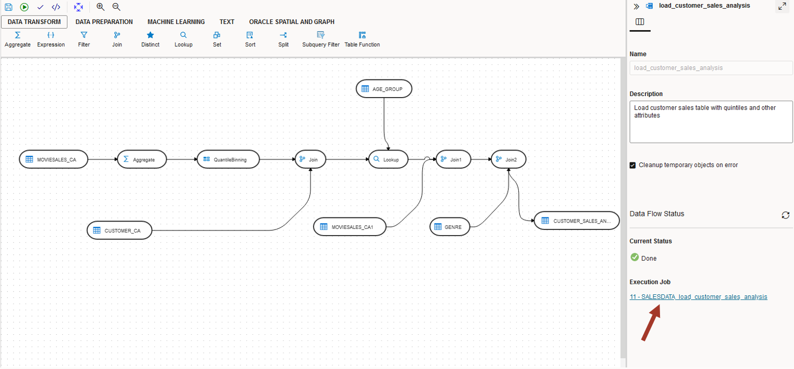

4.  Notice different steps in the execution. You can also get the
    executed SQL (same as the simulated SQL seen earlier) by clicking
    on the step.
    
    To go back to your data flow, click on the **Design Object** link.
    
    From anywhere in the UI, you can go back to the Home screen by clicking on
    the top left link.

    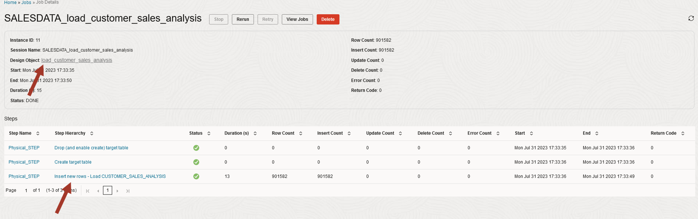

