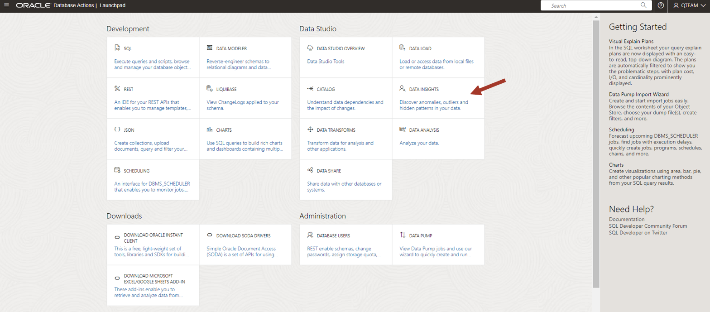
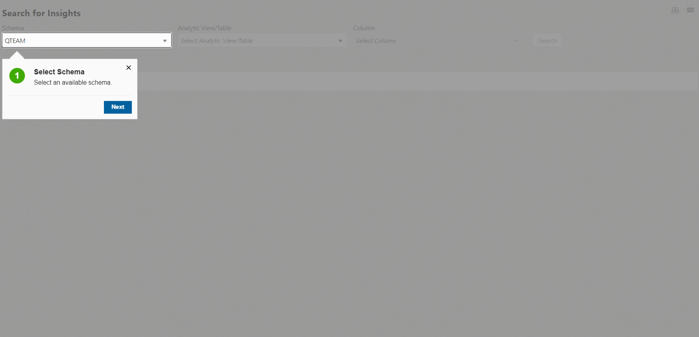
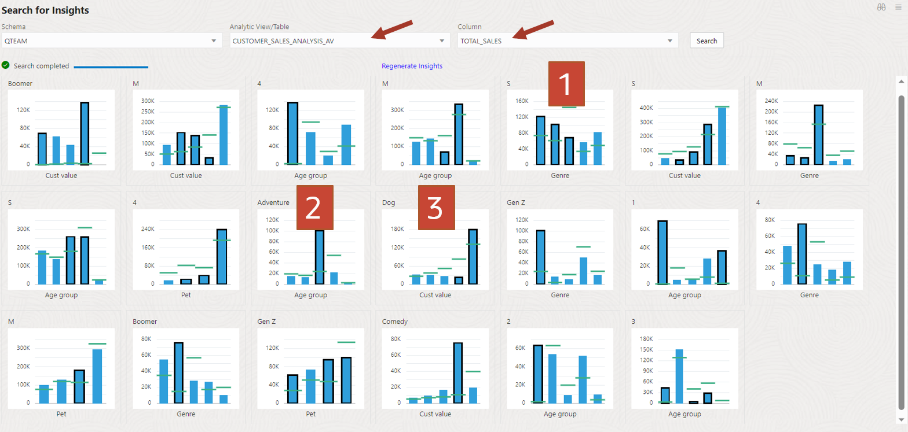
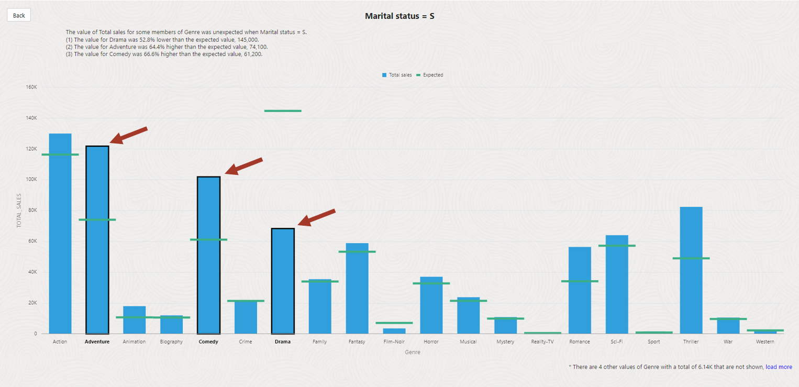
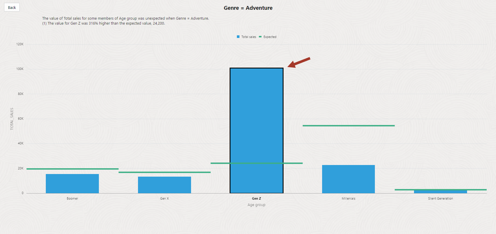
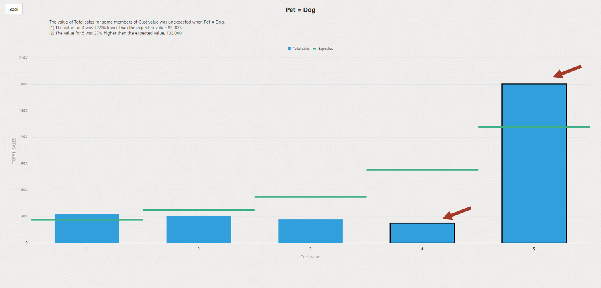
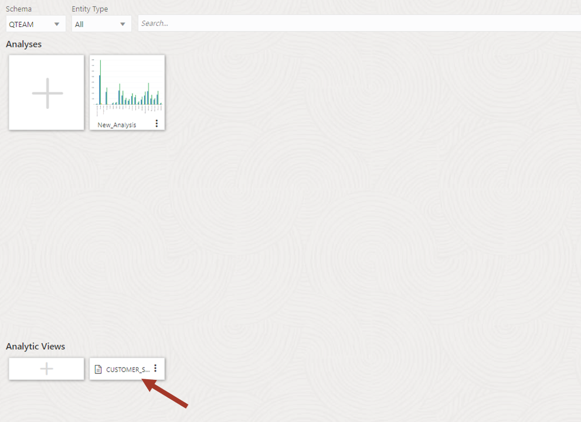
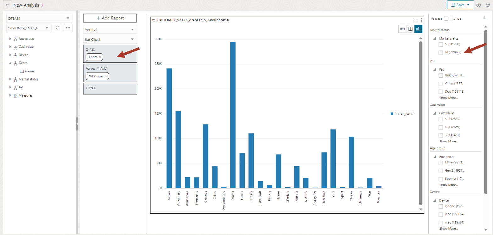
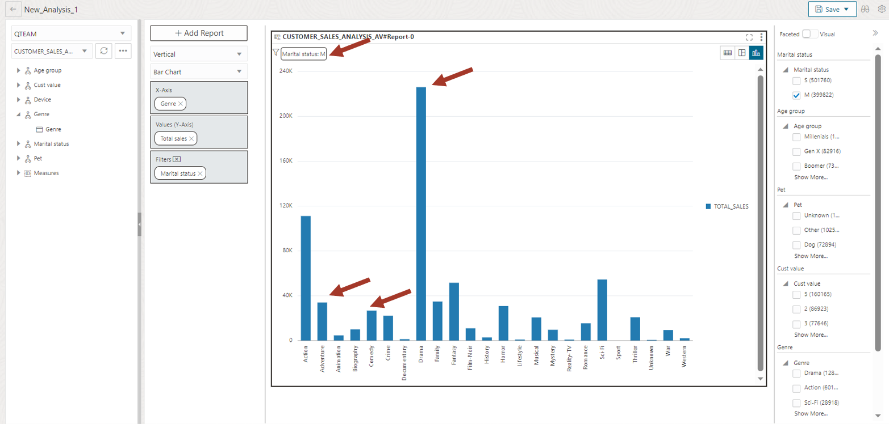
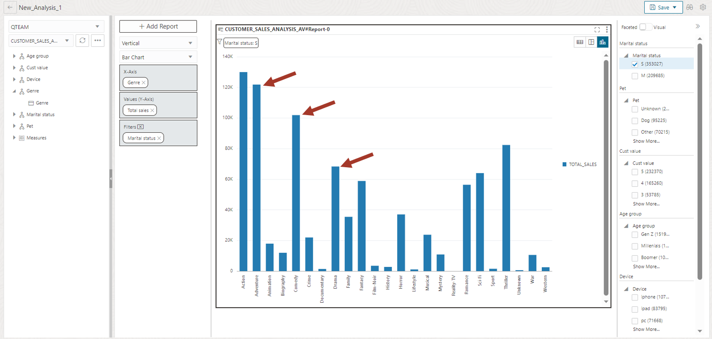

# Data Insights - 데이터에 숨겨진 패턴 탐색

- [Data Insights - 데이터에 숨겨진 패턴 탐색](#data-insights---데이터에-숨겨진-패턴-탐색)
  - [Introduction](#introduction)
  - [Task 1: Data Insights 도구 사용](#task-1-data-insights-도구-사용)

## Introduction
이 랩에서는 Oracle Autonomous Database에 내장된 Data Studio의 **Data Insights** 도구를 소개하고 데이터 Insights를 탐색하고 해석하는 방법을 보여줍니다.

예상 시간: 15분

## Task 1: Data Insights 도구 사용

Data Studio의 insights 프로세스는 백그라운드에서 실행되어 데이터에서 흥미로운 패턴을 찾아 줍니다. 이는 데이터에 숨어 있는 다양한 insights 를 자동으로 찾아주는 접근 방식입니다.  
이 실습에서는 **Data Insights** 도구를 통해 생성된 몇 가지 샘플 Insights를 확인합니다. 이 후, 수동 분석을 통해 교차 확인 및 추가 분석을 수행할 수 있습니다.

>**참고:** Insights 프로세스는 데이터 세트의 복잡성과 사용 가능한 컴퓨팅 리소스에 따라 수행 시간이 길 수도 있습니다. 그러나 실행 중에 insights 목록이 새로 고쳐지는 것을 확인할 수 있습니다.

1.  상단의 Database Actions 링크를 클릭한 후 Data Studio 메뉴에서 **DATA INSIGHTS**를 클릭합니다.

    

2.  스키마에서 **QTEAM** 을 선택합니다.

    

3.  Insights 를 수행할 Analytics View 나 테이블을 선택합니다.  
    앞에서 생성한 **CUSTOMER_SALES_ANALYSIS_AV** Analytic View 를 선택하고, measure 컬럼은 **TOTAL_SALES** 컬럼을 선택합니다.
    
    **Search** 를 클릭합니다.
    
    다양한 Insights 목록이 시간이 지나면서 추가되어 페이지에 표시됩니다. **Data Insights** 도구는 데이터를 검토하고 영화 판매 데이터를 기반으로 다양한 패턴을 찾아서 보여줍니다.

    워크숍에서는 스크린샷에 표시된 세 가지 Insights 정보를 관심있게 보도록 하겠습니다:

     1: 장르별 싱글 구매 패턴
     2: 연령대 별 어드벤처 장르에 대한 관심
     3: 연령대별 반려견 소유자의 구매 형태

    >**참고:** Insights 가 수행되는 동안 화면에 표시되는 순서는 다를 수 있으므로 각 타일의 레이블을 확인하시기 바랍니다.

    

4.  상단에 S(미혼)라고 표시되고 하단에 장르인 그래프를 선택합니다.
    
    다음의 정보를 확인할 수 있습니다:

    1: 미혼(Martial Stuts=S)의 장르별 TOTAL_SALES(measure정보) 정보를 파란색 Bar 차트로 보여줍니다. 
    
    2: 각 Bar 에는 평균을 나타내는 **녹색** 수평선이 있습니다.  즉, 결혼 유무와 상관없는 평균의 기대값을 보여줍니다.  필터(결혼 여부=S)에 따라 파란색 Bar와 차이가 클 경우 데이터가 치우쳐 있다는 것을 의미합니다. 
    
    3: 몇 개의 Bar는 검은색 테두리로 둘러싸여 있습니다(화살표로 표시). 이는 예외적인 값을 강조 표시해 줍니다. 
    
    아래 그래프를 보면 다음과 같은 패턴을 확인할 수 있습니다:  
    *싱글은 평균보다 모험과 코미디를 더 많이 구매하고 있으며 드라마에는 별로 관심이 없다.*
 
    

    **Back** 버튼을 클릭하여 목록화면으로 돌아갑니다.

5.  상단에 **Adventure**라고 표시되고 하단에 **Age Group** 이 표시된 그래프를 선택합니다. 

    이 그래프를 통해 Z세대가 어드벤처 장르에 평균 이상의 관심을 가지고 있음을 알 수 있습니다.

    

    **Back** 버튼을 클릭하여 목록화면으로 돌아갑니다.

6.  이제 애완동물 소유와 영화구매 관계를 살펴보도록 하겠습니다.

    상단에 **Dog** 으로 표시되고 하단에 **Cust Value** 가 표시된 그래프를 클릭합니다.
    
    개를 소유한 사람 중 최고 등급(5등급) 고객이 개를 소유하지 않은 사람에 비해 평균보다 훨씬 더 많은 영화를 구매하고 있음을 보여줍니다.   
    단순한 상관 관계일 수도 있지만 이 데이터를 사용하여 등급이 높은 고객에게 강아지 관련 제품을 제공할 수 있습니다.

    

    **Data Insights** 도구를 사용하여 데이터를 크롤링하는 것만으로 데이터의 다양한 패턴을 발견할 수 있습니다.

    **Back** 버튼을 클릭하여 목록화면으로 돌아갑니다.

목록에는 다른 많은 Insights 들이 있습니다.  목록으로 돌아가서 다른 몇 가지를 확인해 보시기 바랍니다.

<!--
## Task 2: Peeling the layers of Data Insights

This section is an attempt to explain the insights by manually running
queries and correlating them with what we can see in insights.

1.  Let's go back and look at the first insight again.

    Click on the tile marked **S** on the top and **Genre** at the bottom. This 
    was the movie genre preference of singles. It showed singles are purchasing 
    adventure and comedy more than the average and purchasing less drama genre than 
    the average.

    

2.  We can go back to the **Data Analysis** tool to confirm this
    insight. Go back to the data analysis tool and click on the previously created AV to create a new analysis.

    

3.  In this new report we will analyze **sales** by **Genre** for married and singles alternately.

    Drag **Genre** on X-Axis (you will have to expand the tree on the left). 
    Pick **M** in the filter box on the right for marital status.

    

4.  Married people are watching **Drama** a lot and not much
    **Adventure** and **Comedy**.

    

5.  Now let's compare it for singles. Deselect **M** and select **S** in the right hand side filter for marital status.

    This is what you get. Notice high purchases in the **Adventure** and
    **Comedy** genre by singles and not much **Drama** (compared to
    married people).

    

**Isn’t that what Data Insights told us?! It discovered that without any input from us!**

While doing manual analysis in the **Data Analysis** tool, 
we must actively look at and compare the data for
certain hierarchies. There are many combinations, but people use their
experience to guide their analysis steps. In comparison, **Data
Insights** is a hands-off approach and it finds patterns without
understanding what hierarchies mean.

We think that both are complementary to each other and provide valuable
tools to use in "a day in the life of a data analyst".

-->