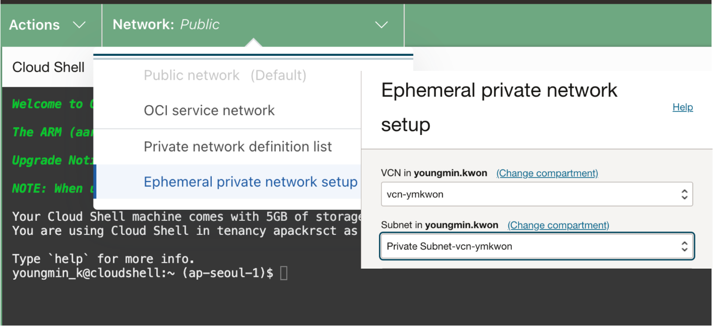

# HeatWave GenAI


- [HeatWave GenAI](#heatwave-genai)
  - [MySQL Database System 및 HeatWave 환경 구성](#mysql-database-system-및-heatwave-환경-구성)
  - [Object Storage Bucket 생성 및 파일 Upload](#object-storage-bucket-생성-및-파일-upload)
  - [Setup the Vector Store](#setup-the-vector-store)
  - [HeatWave Chat](#heatwave-chat)
  - [Generating Text-Based Content](#generating-text-based-content)
  - [Vector Search 및 RAG](#vector-search-및-rag)
  - [한글 PDF 문서 로딩 및 Chat 테스트](#한글-pdf-문서-로딩-및-chat-테스트)


## MySQL Database System 및 HeatWave 환경 구성

MySQL Database System 과 HeatWave Provisioning 과정은 다음과 같습니다.

- VCN 생성 : VCN Wizard Default 로 생성
  - Security List for Private Subnet : Ingress Rule 추가
    - Source CIDR : `0.0.0.0/0`
    - Destination Port Range : `3306,33060`
- HeatWave Database System 프로비저닝
  - Database - HeatWave - DB Systems - Create DB system
  - Development or Testing 선택
  - Administrator : admin/WElcome12345__
  - Standalone
  - VCN - Private Subnet 선택
  - HeatWave Database System ECPU Shape - `MySQL.32` 로 선택
  - Data Storage Size : 1000 GB
  - Automatic Backup - Disable
  - Version `9.0.0 - Innovation` 이상
    - Version 정보는 Advanced Options -> Configuration 탭에서 확인 및 변경 가능
- HeatWave Cluster 구성
  - `HeatWave.512GB` shape 을 선택해야 함
  - HeatWave Lakehouse 가 enabled 되어 있어야 함
    - HeatWave Cluster 구성 시 HeatWave Lakehouse 선택
    - Console 에서 HeatWave Lakehouse Enable 하는 방법
      - Databases -> HeatWave - DB System 클릭
      - HeatWave Cluster - Attached 선택
      - DB System 클릭하여 DB System details 페이지
      - DB System information tab - HeatWave cluster
      - Enable HeatWave Lake dialog box - Enable 클릭
- Enable the database system to access an OCI Object Storage bucket
  - Dynamic Group 생성
    - Identity & Security -> Domain 선택 -> Dynamic Groups
    - `Create Dynamic Group` 클릭
      - Matching Rules :
        - `"ALL{resource.type='mysqldbsystem', resource.compartment.id = '<compartment_id>' }"`
<!--
compartment_id = ocid1.compartment.oc1..aaaaaaaaqbxqpipylndoxf3ph6fitnj2fnakfxxcj7q4vmzeuvqjan6rlxaa 
-->

  - Policy 설정 - 해당 Compartment 에 설정
    ```
    allow dynamic-group <dynamicGroupName> to read buckets in compartment <compartmentName>       
    allow dynamic-group <dynamicGroupName> to read objects in compartment <compartmentName>
    ```

<!-- 
allow dynamic-group HWGENAI to read buckets in compartment youngmin.kwon
allow dynamic-group HWGENAI to read objects in compartment youngmin.kwon -
-->

- `mysqlsh` 설치 및 접속 확인
  - 설치 참고 문서 - [Installing MySQL Shell](https://dev.mysql.com/doc/mysql-shell/8.4/en/mysql-shell-install.html)

  - Cloud Shell 에는 mysqlsh 이 설치되어 있음. Cloud Shell 환경에서 테스트

  - Cloud Shell 의 Network 을 해당 VCN 으로 설정 (단, Home Region 의 VCN 만 가능. 이를 위해 MDS를 Home Region 인 Ashburn 에 구성)

    

  - 접속 테스트
    ```
    mysqlsh -uadmin -pPassword -hPrivateIP --sqlc
    ```
    <!-- 
      mysqlsh -uadmin -pWElcome12345__ -h10.0.1.181 --sqlc 
      -->
- 테스트 문서 다운로드
  - [HeatWave user guide PDF (A4)](https://downloads.mysql.com/docs/heatwave-en.a4.pdf)
  - [Oracle Cloud 고객 성공 사례 - PDF](https://www.oracle.com/a/ocom/docs/customer-stories_stories-from-oracle-cloud-v3.pdf)

## Object Storage Bucket 생성 및 파일 Upload

- Object Storage Bucket 생성
  - Name : `quickstart_bucket`
- 앞에서 다운로드한 두개의 PDF 문서를 Object Storage Bucket (`quickstart_bucket`) 에 Upload
  - `heatwave-en.a4.pdf`
  - `customer-stories_stories-from-oracle-cloud-v3.pdf` (한글 PDF)
  - Object Name Prefix = `quickstart_bucket/`

## Setup the Vector Store

- MySQL Database Service 접속  
  ```
  mysqlsh -uAdmin -pPassword -hPrivateIP --sqlc
  ```

- Create a new Database
  ```
  create database quickstart_db;     
  use quickstart_db
  ```

- 다음의 명령을 수행하여 Task Management 를 위한 스키마 생성
  ```sql
  select mysql_task_management_ensure_schema();

  +---------------------------------------+
  | mysql_task_management_ensure_schema() |
  +---------------------------------------+
  | 0 |
  +---------------------------------------+
  ```

- Vector Table 생성 및 소스 문서 로딩:  
  Object Storage 의 파일로 부터 Vector Embedding을 생성하고, 생성된 Vector Embedding 을 HeatWave 로 로딩하기 위해서 `vector_store_load` 프로시저를 사용합니다.
  ```sql
  call sys.vector_store_load('oci://BucketName@Namespace/Path/Filename', '{"table_name": "EmbeddingsTableName"}');
  ```

  프로시저에 사용되는 값들은 다음과 같습니다:

  - *BucketName* : OCI Object Storage Bucket Name
  - *Namespace* : Object Storage Bucket Namespace 정보. Tenancy 이름
  - *Path* : Bucket 생성 시 지정한 Object Name Prefix
  - *Filename* : 로딩할 파일 명
  - *EmbeddingTableName* : Vector Embedding 이 저장될 테이블 명.  테이블을 새롭게 생성됨

  파일명 URL 은 PAR(Pre-Authenticated Request) URL 을 사용할 수 있습니다.

  앞에서 Object Storage Bucket 에 Upload 한 파일을 Vector Store 에 로딩하기 위한 프로시저는 다음과 같습니다.
  ```sql
  call sys.vector_store_load('oci://quickstart_bucket@apackrsct01/quickstart_bucket/heatwave-en.a4.pdf', '{"table_name": "quickstart_embeddings"}');

  +---------+----------------------------------------------------------------------------+
  | task_id | task_status_query                                                          |
  +---------+----------------------------------------------------------------------------+
  | 3       | SELECT id, name, message, progress, status, scheduled_time,estimated_completion_time, estimated_remaining_time, progress_bar FROM mysql_task_management.task_status WHERE id=1`G |`{=tex}
  +---------+----------------------------------------------------------------------------+
  ```
  
  위 명령을 수행하면 지정한 테이블(`quickstart_embeddings`)에 Vector Embedding 을 로딩하는 작업이 background 로 수행됨

- 작업 진행 과정은 다음의 명령을 통해 확인 가능
  ```sql
  select id, name, message, progress,
  status, scheduled_time,
  estimated_completion_time,
  estimated_remaining_time,
  progress_bar
  FROM mysql_task_management.task_status
  WHERE id=3;           -- vector_store_load 수행 시 출력되는 task_id

  +----+---------------------+------------------------+----------+---------+---------------------+---------------------------+--------------------------+--------------+
  | id | name | message | progress | status | scheduled_time | estimated_completion_time | estimated_remaining_time | progress_bar |
  +----+---------------------+------------------------+----------+---------+---------------------+---------------------------+--------------------------+--------------+
  | 3 | Vector Store Loader | Loading in progress... | 40 | RUNNING | 2024-08-13 08:00:50 | 2024-08-13 08:01:40 | 30.00000 | ####______ |
  +----+---------------------+------------------------+----------+---------+---------------------+---------------------------+--------------------------+--------------+
  ```

- 결과 - Vector Embedding 작업 완료 확인
  ```sql
  select id, name, message, progress,
  status, scheduled_time,
  estimated_completion_time,
  estimated_remaining_time,
  progress_bar
  FROM mysql_task_management.task_status
  WHERE id=3;

  +----+---------------------+-----------------+----------+-----------+---------------------+---------------------------+--------------------------+--------------+
  | id | name | message | progress | status | scheduled_time | estimated_completion_time | estimated_remaining_time | progress_bar |
  +----+---------------------+-----------------+----------+-----------+---------------------+---------------------------+--------------------------+--------------+
  | 3 | Vector Store Loader | Task completed. | 100 | COMPLETED | 2024-08-13 08:00:50 | 2024-08-13 08:02:29 | 0.00000 | ########## |
  +----+---------------------+-----------------+----------+-----------+---------------------+---------------------------+--------------------------+--------------+
  ```

- 작업 완료(Task completed.)후, 지정한 Vector Embedding 테이블에 데이터가 정상적으로 로딩되었는지 확인
  ```sql
  select count(*) from quickstart_embeddings;

  +----------+
  | count(*) |
  +----------+
  | 2318     |
  +----------+
  ```

- Object Storage 의 파일이 변경되었을 때 Vector Store의 내용을 변경하려면, 기존 Vector Embedding 테이블을 삭제하고 Vector Store 구성 작업을 재수행하여야 합니다.

## HeatWave Chat

- 이전 상태 제거
  ```
  set @chat_options=NULL;
  ```

- HeatWave Chat 을 사용하여 자연어 질의
  ```sql
  call sys.heatwave_chat("What is HeatWave AutoML?");
  ```

  `sys.heatwave_chat` 프로시져는 자동으로 LLM 을 로딩하고 가능한 Vector Store 에서 Contextual Search를 자동으로 수행합니다.  
  수행 결과는 다음과 같습니다.
  ```
  -- 수행 결과

  | response +------------------------------------------------------------------------------+
  | HeatWave AutoML is a feature of MySQL HeatWave that makes it easy to use machine learning, whether you are a novice user or an experienced ML practitioner. It analyzes the characteristics of the data and creates an optimized machine learning model that can be used to generate predictions and explanations. The data and models never leave MySQL HeatWave, saving time and effort while keeping the data and models secure. HeatWave AutoML is optimized for HeatWave shapes and scaling, and all HeatWave AutoML processing is performed on the HeatWave Cluster. |
  +------------------------------------------------------------------------------+
  1 row in set (44.2144 sec)

  Query OK, 0 rows affected (44.2144 sec)
  ```

- 추가 질문
  ```
  call sys.heatwave_chat("How to set it up?");

  +-------------------------------------------------------------------------------------+
  | response |
  +-------------------------------------------------------------------------------------+
  | To set up HeatWave AutoML in MySQL HeatWave, you need to follow these steps:

  1.  Connect to the MySQL DB System using a MySQL client.
  2.  Create a new HeatWave Cluster.
  3.  Enable HeatWave AutoML on the HeatWave Cluster.
  4.  Load data into the HeatWave Cluster.
  5.  Train the model using HeatWave AutoML.
  6.  Use the trained model to generate predictions and explanations.

  Do you have any questions about these steps or would you like more information on how to set up HeatWave AutoML in MySQL HeatWave? |
  +-------------------------------------------------------------------------------------+
  1 row in set (26.1318 sec)

  Query OK, 0 rows affected (26.1318 sec)
  ```

- HeatWave Chat 기능은 [Visual Studio Code Plug in for MySQL Shell](https://dev.mysql.com/doc/mysql-shell-gui/en/mysql-shell-for-vscode-setup.html) 을 통해 VS Code 와 통합된 GUI 환경도 제공합니다.


### Chat 세션 상세 정보 조회  <!-- omit in toc -->

- Chat session 상세 정보는 다음과 같이 확인할 수 있습니다.

- `@chat_options` 세션 변수 조회
  ```sql
  select JSON_PRETTY(@chat_options);

  
  +------------------------------------------------------------------------------------------------+
  | JSON_PRETTY(@chat_options) |
  +------------------------------------------------------------------------------------------------+
  | {
  "tables": [
  {
  "table_name": "`quickstart_embeddings`",
  "schema_name": "`quickstart_db`"
  }
  ],
  "response": " To set up HeatWave AutoML in MySQL HeatWave, you need to follow these steps:`rn`{=tex}`rn1`{=tex}. Connect to the MySQL DB System using a MySQL client.`rn2`{=tex}. Create a new HeatWave Cluster.`rn3`{=tex}. Enable HeatWave AutoML on the HeatWave Cluster.`rn4`{=tex}. Load data into the HeatWave Cluster.`rn5`{=tex}. Train the model using HeatWave AutoML.`rn6`{=tex}. Use the trained model to generate predictions and explanations.`rn`{=tex}`rnDo `{=tex}you have any questions about these steps or would you like more information on how to set up HeatWave AutoML in MySQL HeatWave?","documents": [
  {
  "id": "https://objectstorage.us-ashburn-1.oraclecloud.com/n/apackrsct01/b/quickstart_bucket/o/quickstart_bucket/heatwave-en.a4.pdf",
  "title": "heatwave-en.a4.pdf",
  "segment": "3. Ask a follow-up question:`ncall `{=tex}sys.HEATWAVE_CHAT("How to set it up?");`nThe `{=tex}output is similar to the following:`n`{=tex}| To set up HeatWave AutoML in MySQL HeatWave, you need to follow these steps:",
  "distance": 0.0754004716873169
  },
  {
  "id": "https://objectstorage.us-ashburn-1.oraclecloud.com/n/apackrsct01/b/quickstart_bucket/o/quickstart_bucket/heatwave-en.a4.pdf",
  "title": "heatwave-en.a4.pdf",
  "segment": "3.2 Before You Begin Before you begin using HeatWave AutoML, the following is assumed:`n `{=tex}You have an operational MySQL DB System and are able to connect to it using a MySQL client. If not, complete the steps described in Getting Started in the HeatWave on OCI Service Guide.`n `{=tex}Your MySQL DB System has an operational HeatWave Cluster. If not, complete the steps described in Adding a HeatWave Cluster in the HeatWave on OCI Service Guide.",
  "distance": 0.15018784999847412
  },
  {
  "id": "https://objectstorage.us-ashburn-1.oraclecloud.com/n/apackrsct01/b/quickstart_bucket/o/quickstart_bucket/heatwave-en.a4.pdf",
  "title": "heatwave-en.a4.pdf",
  "segment": "| HeatWave AutoML is a feature of MySQL HeatWave that makes it easy to use machine learning, whether you are a novice user or an experienced ML practitioner. It analyzes the characteristics of the data and creates an optimized machine learning model that can be used to generate predictions and explanations. The data and models never leave MySQL HeatWave, saving time and effort while keeping the data and models secure. HeatWave AutoML is optimized for HeatWave shapes and scaling, and all",
  "distance": 0.18539071083068848
  }
  ],
  "chat_history": [
  {
  "user_message": "What is HeatWave AutoML?",
  "chat_query_id": "cdd84a17-5950-11ef-8cbf-0200170d1d77",
  "chat_bot_message": " HeatWave AutoML is a feature of MySQL HeatWave that makes it easy to use machine learning, whether you are a novice user or an experienced ML practitioner. It analyzes the characteristics of the data and creates an optimized machine learning model that can be used to generate predictions and explanations. The data and models never leave MySQL HeatWave, saving time and effort while keeping the data and models secure. HeatWave AutoML is optimized for HeatWave shapes and scaling, and all HeatWave AutoML processing is performed on the HeatWave Cluster."
  },
  {
  "user_message": "How to set it up?",
  "chat_query_id": "1e378d92-5951-11ef-8cbf-0200170d1d77",
  "chat_bot_message": " To set up HeatWave AutoML in MySQL HeatWave, you need to follow these steps:`rn`{=tex}`rn1`{=tex}. Connect to the MySQL DB System using a MySQL client.`rn2`{=tex}. Create a new HeatWave Cluster.`rn3`{=tex}. Enable HeatWave AutoML on the HeatWave Cluster.`rn4`{=tex}. Load data into the HeatWave Cluster.`rn5`{=tex}. Train the model using HeatWave AutoML.`rn6`{=tex}. Use the trained model to generate predictions and explanations.`rn`{=tex}`rnDo `{=tex}you have any questions about these steps or would you like more information on how to set up HeatWave AutoML in MySQL HeatWave?"
  }
  ],
  "model_options": {
  "model_id": "mistral-7b-instruct-v1"
  },
  "request_completed": true
  } |
  +--------------------------------------------------------------------------------------------------+
  ```

## Generating Text-Based Content

텍스트 기반 콘텐츠를 생성하고 문서를 요약하려면 다음의 프로시져 사용:
- `ML_MODEL_LOAD` : HeatWave Cluster 로 LLM(Large Language Model) 을 로드
- `ML_GENERAGE` : LLM 을 사용하여 텍스트 생성

### Generating Content    <!-- omit in toc -->

- `ML_MODEL_LOAD` 프로시져를 사용하여 LLM 을 HeatWave 메모리에 로드
  ```
  call sys.ML_MODEL_LOAD('LLMModel', NULL);
  ```
  - `LLMModel` 파라미터에 원하는 LLM 지정.  
  - 현재 사용 가능한 모델:
    - `mistral-7b-instruct-v1`
    - `llama2-7b-v1`

  ```
  call sys.ML_MODEL_LOAD('mistral-7b-instruct-v1', NULL);
  ```
- 세션 변수를 사용하여 원하는 자연어 질의를 생성 후, `ML_GENERATE` 프로시져를 사용하여 텍스트 콘텐츠 생성
  - Task Parameter : `"generation"`

  ```
  set @query="Write an article on Artificial intelligence in 200 words.";

  select sys.ML_GENERATE(@query, JSON_OBJECT("task", "generation", "model_id", "mistral-7b-instruct-v1"));

  -- 결과
  +--------------------------------------------------------------------------------------------------+
  | sys.ML_GENERATE(@query, JSON_OBJECT("task", "generation", "model_id", "mistral-7b-instruct-v1")) |
  +--------------------------------------------------------------------------------------------------+
  | {"text": " Artificial Intelligence, commonly referred to as AI, is a rapidly growing field that focuses on creating intelligent machines capable of performing tasks that typically require human intelligence. These tasks include things like understanding natural language, recognizing images, and making decisions.`n`{=tex}`nAI `{=tex}technology has come a long way in recent years, thanks to advances in machine learning and deep learning algorithms. These algorithms allow machines to learn from data and improve their performance over time. This has led to the development of more advanced AI systems, such as virtual assistants like Siri and Alexa, which can help users with tasks like setting reminders and answering questions.`n`{=tex}`nAI `{=tex}is also being used in a variety of other industries, including healthcare, finance, and transportation. In healthcare, AI is being used to help doctors diagnose diseases and develop treatment plans. In finance, AI is being used to detect fraud and make investment decisions. In transportation, AI is being used to develop self-driving cars and improve traffic flow.`n`{=tex}`nDespite `{=tex}the many benefits of AI, there are also concerns about its potential impact on society. Some worry that AI could lead to job displacement and a loss of privacy. Others worry that AI could be used for malicious purposes, such as cyber attacks or surveillance.`n`{=tex}"} |
  +---------------------------------------------------------------------------------+
  1 row in set (20.7261 sec)
  ```

### Summarizing Content     <!-- omit in toc -->

- `ML_MODEL_LOAD` 프로시져를 사용하여 LLM 을 HeatWave 메모리에 로드  
  ```
  call sys.ML_MODEL_LOAD('LLMModel', NULL);
  ```

  - `LLMModel` 파라미터에 원하는 LLM 지정.  
  - 현재 사용 가능한 모델:
    - `mistral-7b-instruct-v1
    - `llama2-7b-v1`

  ```
      call sys.ML_MODEL_LOAD('mistral-7b-instruct-v1', NULL);
  ```

- 세션 변수를 사용하여 요약을 원하는 텍스트 생성 후, `ML_GENERATE` 프로시져를 사용하여 텍스트 요약 생성

  - Task Parameter : `"summarization"`

  ``` sql
  set @text="Artificial Intelligence (AI) is a rapidly growing field that has the potential to revolutionize how we live and work. AI refers to the development of computer systems that can perform tasks that typically require human intelligence, such as visual perception, speech recognition, decision-making, and language translation.nnOne of the most significant developments AI in recent years has been the rise of machine learning, a subset of AI that allows computers to learn from data without being explicitly programmed. Machine learning algorithms can analyze vast amounts of data and identify patterns, making them increasingly accurate at predicting outcomes and making decisions.nnAI is already being used in a variety of industries, including healthcare, finance, and transportation. In healthcare, AI is being used to develop personalized treatment plans for patients based on their medical history and genetic makeup. In finance, AI is being used to detect fraud and investment recommendations. In transportation, AI is being used to develop self-driving cars and improve traffic flow.nnDespite the many benefits of AI, there are also concerns about its potential impact society. Some worry that AI could lead to job displacement, as machines become more capable of performing tasks traditionally done by humans. Others worry that AI could be used for malicious ";

  select sys.ML_GENERATE(@text, JSON_OBJECT("task", "summarization", "model_id", "mistral-7b-instruct-v1"));

  -- 결과
  +---------------------------------------------------------------------------------------------------+
  | sys.ML_GENERATE(@text, JSON_OBJECT("task", "summarization", "model_id", "mistral-7b-instruct-v1"))|
  +---------------------------------------------------------------------------------------------------+
  | {"text": " Artificial Intelligence (AI) is a rapidly growing field with the potential to revolutionize how we live and work. It refers to computer systems that can perform tasks requiring human intelligence, such as visual perception, speech recognition, decision-making, and language translation. Machine learning, a subset of AI, allows computers to learn from data without being explicitly programmed, making them increasingly accurate at predicting outcomes and making decisions. AI is already being used in healthcare, finance, and transportation industries for personalized treatment plans, fraud detection, and self-driving cars. However, there are concerns about its potential impact on society, including job displacement and malicious use."} |
  +---------------------------------------------------------------------------------------------------+
  1 row in set (18.3601 sec)
  ```

## Vector Search 및 RAG

내장된 Vector Store 와 Retrieval Augmented Generation(RAG)을 활용하여 HeatWave 생태계 내에서 자연어를 사용하여 Object Store 에 저장된 비정형 문서를 로드하고 쿼리할 수 있습니다.

Vector Search 를 설정하고 사용하는 방법에 살펴보겠습니다.

### Vector Store 구성     <!-- omit in toc -->

앞의 **Setup Vector Store** 테스트 시 수행한 `sys.vector_store_load` 함수를 사용하여 원하는 파일을 HeatWave 의 Vector Embedding 테이블로 로딩합니다.

### Retrieval-Augmented Generation(RAG) 수행    <!-- omit in toc -->

HeatWave는 RAG를 수행하기 위해 Vector Store에서 콘텐츠를 검색하여 LLM에 컨텍스트로 제공합니다.  
이를 위해 다음의 프로시저를 사용합니다:
- `ML_MODEL_LOAD` : LLM 로딩
- `ML_RAG` : RAG를 실행하여 쿼리에 대한 정확한 응답 생성

RAG 를 수행하는 과정은 다음과 같습니다.

- `ML_MODEL_LOAD` 프로시져를 사용하여 LLM 을 HeatWave 메모리에 로드
  ```
  call sys.ML_MODEL_LOAD('mistral-7b-instruct-v1', NULL);
  ```

- 세션 변수를 사용하여 Vector Embedding 을 추출할 테이블 지정  
  ```
  set @options = JSON_OBJECT("vector_store", JSON_ARRAY("quickstart_db.quickstart_embeddings"));
  ```

- 세션 변수를 사용하여 수행할 자연어 질의를 정의
  ```
  set @query="What is HeatWave AutoML?";
  ```

- `ML_RAG` 프로시저를 사용하여 응답 생성
  ```sql
  call sys.ML_RAG(@query,@output,@options);

  select JSON_PRETTY( @output );
  -- 결과
  +--------------------------------------------------------------------------------------------------+
  | JSON_PRETTY( @output ) |
  +--------------------------------------------------------------------------------------------------+
  | {
  "text": " HeatWave AutoML is a feature of MySQL HeatWave that makes it easy to use machine learning, whether you are a novice user or an experienced ML practitioner. It analyzes the characteristics of the data and creates an optimized machine learning model that can be used to generate predictions and explanations. The data and models never leave MySQL HeatWave, saving time and effort while keeping the data and models secure. HeatWave AutoML is optimized for HeatWave shapes and scaling, and all HeatWave AutoML processing is performed on the HeatWave Cluster.",
  "citations": [
  {
  "segment": "1.3 HeatWave AutoML With HeatWave AutoML, data and models never leave HeatWave, saving you time and effort while keeping your data and models secure. HeatWave AutoML is optimized for HeatWave shapes and scaling, and all HeatWave AutoML processing is performed on the HeatWave Cluster. HeatWave distributes ML computation among HeatWave nodes, to take advantage of the scalability and massively parallel processing capabilities of HeatWave. For more information about the machine learning",
  "distance": 0.2342180013656616,
  "document_name": "https://objectstorage.us-ashburn-1.oraclecloud.com/n/apackrsct01/b/quickstart_bucket/o/quickstart_bucket/heatwave-en.a4.pdf"
  },
  {
  "segment": "| HeatWave AutoML is a feature of MySQL HeatWave that makes it easy to use machine learning, whether you are a novice user or an experienced ML practitioner. It analyzes the characteristics of the data and creates an optimized machine learning model that can be used to generate predictions and explanations. The data and models never leave MySQL HeatWave, saving time and effort while keeping the data and models secure. HeatWave AutoML is optimized for HeatWave shapes and scaling, and all",
  "distance": 0.23633229732513428,
  "document_name": "https://objectstorage.us-ashburn-1.oraclecloud.com/n/apackrsct01/b/quickstart_bucket/o/quickstart_bucket/heatwave-en.a4.pdf"
  },
  {
  "segment": "3.1 HeatWave AutoML Features HeatWave AutoML makes it easy to use machine learning, whether you are a novice user or an experienced ML practitioner. You provide the data, and HeatWave AutoML analyzes the characteristics of the data and creates an optimized machine learning model that you can use to generate predictions and explanations. An ML model makes predictions by identifying patterns in your data and applying those patterns to unseen data. HeatWave AutoML explanations help you understand",
  "distance": 0.2543092370033264,
  "document_name": "https://objectstorage.us-ashburn-1.oraclecloud.com/n/apackrsct01/b/quickstart_bucket/o/quickstart_bucket/heatwave-en.a4.pdf"
  }
  ],
  "vector_store": [
  "quickstart_db.quickstart_embeddings"
  ]
  } |
  +---------------------------------------------------------------------------------------------------+
  ```

  RAG에 의해 생성된 출력은 다음의 두분으로 구성:

  - Text Section : LLM에서 쿼리에 대한 응답으로 생성한 텍스트 기반 콘텐츠
  - Citation Section : 세그먼트와 문서 등의 콘텍스트 정보

## 한글 PDF 문서 로딩 및 Chat 테스트

- 한글 PDF 문서 로딩 - 테이블 : `KO_EMBEDDINGS`
  - `sys.vector_store_load` 프로시져 수행 시 Vector Embedding 테이블이 새로 생성됨. 따라서, 기존 테이블과 다른 테이블 명을 사용해야 함

  ``` sql
  call sys.vector_store_load('oci://quickstart_bucket@apackrsct01/quickstart_bucket/customer-stories_stories-from-oracle-cloud-v3.pdf', '{"table_name": "ko_embeddings"}');

  select id, name, message, progress, 
         status, scheduled_time,
         estimated_completion_time, 
         estimated_remaining_time, 
         progress_bar 
  FROM mysql_task_management.task_status 
  WHERE id=4;    -- sys.vector_store_load 수행 시 task_id

  select count(*) from ko_embeddings;

  +----------+
  | count(*) |
  +----------+
  |       88 |
  +----------+
  ```

### HeatWave Chat   <!-- omit in toc -->

- 이전 상태 제거
  ```
  set @chat_options=NULL;
  ```

- HeatWave Chat 을 사용하여 자연어 질의
  ```sql

  call sys.heatwave_chat("Autonomous Database를 사용하는 고객 리스트를 알려줘");

  +--------------------------------------------------------+
  | response |
  +--------------------------------------------------------+
  | Answer: The list of customers using Oracle Autonomous Database includes JASCI Software, Kingold, MESTEC, UTFRONT Media, SK asil, Telecom Fiji, and Oracle Cloud. |
  +--------------------------------------------------------+
  1 row in set (13.3616 sec)

  call sys.heatwave_chat("Autonomous Database를 채택한 사례에 대해 요약해줘. 한글로 번역해");

  +-----------------------------------------------------------------------------+
  | response |
  +-----------------------------------------------------------------------------+
  | Summary of Oracle Autonomous Database and JASCI Software

  Oracle Autonomous Database is a cloud-based database management system that automates many tasks such as backups, patching, and performance tuning. It also provides features such as autonomous data warehousing and autonomous transaction processing. The system can be used in various industries such as finance, healthcare, and retail.

  JASCI Software is a software company that specializes in artificial intelligence (AI) and cloud-based solutions. They offer products such as AI-powered chatbots, AI-powered virtual assistants, and AI-powered analytics tools. JASCI Software also provides cloud-based solutions for various industries such as finance, healthcare, and retail.

  Oracle Autonomous Database is used by several companies including JASCI Software, Kingold, MESTEC, UTFRONT Media, SK asil, Telecom Fiji, and Oracle Cloud Infrastructure. It is also used by SKY Brasil IT for autonomous data warehousing and autonomous transaction processing.

  JASCI Software uses Oracle Autonomous Database for their AI-powered chatbots and virtual assistants. They also use it for their cloud- |
  +-----------------------------------------------------------------------------+
  1 row in set (52.9922 sec)

  ```

- Chat 세션 상세 정보 확인
  ```sql
  select JSON_PRETTY(@chat_options);

  +---------------------------------------------------------------------------------+
  | JSON_PRETTY(@chat_options) |
  +---------------------------------------------------------------------------------+
  | {
  "tables": [
  {
  "table_name": "`quickstart_embeddings`",
  "schema_name": "`quickstart_db`"
  },
  {
  "table_name": "`ko_embeddings`",
  "schema_name": "`quickstart_db`"
  }
  ],
  "response": " Summary of Oracle Autonomous Database and JASCI Software`n`{=tex}`nOracle `{=tex}Autonomous Database is a cloud-based database management system that automates many tasks such as backups, patching, and performance tuning. It also provides features such as autonomous data warehousing and autonomous transaction processing. The system can be used in various industries such as finance, healthcare, and retail.`n`{=tex}`nJASCI `{=tex}Software is a software company that specializes in artificial intelligence (AI) and cloud-based solutions. They offer products such as AI-powered chatbots, AI-powered virtual assistants, and AI-powered analytics tools. JASCI Software also provides cloud-based solutions for various industries such as finance, healthcare, and retail.`n`{=tex}`nOracle `{=tex}Autonomous Database is used by several companies including JASCI Software, Kingold, MESTEC, UTFRONT Media, SK asil, Telecom Fiji, and Oracle Cloud Infrastructure. It is also used by SKY Brasil IT for autonomous data warehousing and autonomous transaction processing.`n`{=tex}`nJASCI `{=tex}Software uses Oracle Autonomous Database for their AI-powered chatbots and virtual assistants. They also use it for their cloud-","documents": [
  {
  "id": "https://objectstorage.us-ashburn-1.oraclecloud.com/n/apackrsct01/b/quickstart_bucket/o/quickstart_bucket/customer-stories_stories-from-oracle-cloud-v3.pdf",
  "title": "customer-stories_stories-from-oracle-cloud-v3.pdf",
  "segment": "Oracle Autonomous Database* **** ** *** *** ***** **`n*`{=tex}** *** *** ** *** *** *** ***** *** ***** ** **** *** ***. ** *** **** ** ***** *** ***** ** *** ** ***** **** **** ***. JASCI Software* AI* **** *** **** *** ** *** ** **, **, **, **, ** *** ******* 24** ** **** ***** *** **** **** SaaS *** ** *****.`nJASCI `{=tex}Software* ** *** ***** *** SaaS ******. JASCI Software* *** **, ** **, **, **, ** * *** *** * ** *** ** ****** **** *****.",
  "distance": 0.2924168109893799
  },
  {
  "id": "https://objectstorage.us-ashburn-1.oraclecloud.com/n/apackrsct01/b/quickstart_bucket/o/quickstart_bucket/customer-stories_stories-from-oracle-cloud-v3.pdf",
  "title": "customer-stories_stories-from-oracle-cloud-v3.pdf",
  "segment": "10 10 Oracle Cloud *** **** ** **`n*`{=tex}** Oracle Autonomous Database * `n`{=tex}. `nOracle `{=tex}Autonomous Transaction Processing* Oracle Autonomous Data Ware use* ** *** *.`n*`{=tex}.`n `{=tex}JASC re *`n `{=tex}Kingold **`n `{=tex}MESTEC **`n*`{=tex}* UTFRONT Media`nSK `{=tex}asil`n `{=tex}Telecom Fiji`nOracle `{=tex}Autonomous Database(*** **** ******)* ***** *** **** *** ** *** *** *** ***** ******* **** *** * **** **** *** * ****.`n*`{=tex}",
  "distance": 0.3014553189277649
  },
  {
  "id": "https://objectstorage.us-ashburn-1.oraclecloud.com/n/apackrsct01/b/quickstart_bucket/o/quickstart_bucket/customer-stories_stories-from-oracle-cloud-v3.pdf",
  "title": "customer-stories_stories-from-oracle-cloud-v3.pdf",
  "segment": "Oracle Cloud Infrastructure* *** *****, Autonomous Data Warehouse* ***** ***** ***** **** **** **** *** *** * ** ****.`n*`{=tex}** ***(Andr Nazare) SKY Brasil IT ***`nSKY `{=tex}Brasil* Oracle Autonomous Database* *** *** **** *** * **** ** ******.`n1996`{=tex}* SKY* *** ** ** * *** *** *** *** ******. *** ** **** **** ** *** **** ** ** **** *** *** ***** **** ****. SKY* *** *** **** ** ** *** ***** **** ** *** *** **** ******.",
  "distance": 0.3603794574737549
  }
  ],
  "chat_history": [
  {
  "user_message": "Autonomous Database를 사용하는 고객 리스트를 알려줘",
  "chat_query_id": "2f1a5e85-5953-11ef-8cbf-0200170d1d77",
  "chat_bot_message": " Answer: The list of customers using Oracle Autonomous Database includes JASCI Software, Kingold, MESTEC, UTFRONT Media, SK asil, Telecom Fiji, and Oracle Cloud."
  },
  {
  "user_message": "Autonomous Database를 사용하는 고객 리스트 한글로 알려줘",
  "chat_query_id": "ca98c278-5955-11ef-8cbf-0200170d1d77",
  "chat_bot_message": " Answer: 자산시스템, 킹골드, 메테스크, UTFRONT 미디어, SK 아시일, 텔덕 피지, Oracle Autonomous Database(***** *******, ***** *******, ***** *******, ***** *******, ***** *******, ***** *******, ***** *******, ***** *******, ***** *******, *****)"
  },
  {
  "user_message": "Autonomous Database를 채택한 사례에 대해 요약해줘. 한글로 번역해",
  "chat_query_id": "0a0f19b3-5956-11ef-8cbf-0200170d1d77",
  "chat_bot_message": " Summary of Oracle Autonomous Database and JASCI Software`n`{=tex}`nOracle `{=tex}Autonomous Database is a cloud-based database management system that automates many tasks such as backups, patching, and performance tuning. It also provides features such as autonomous data warehousing and autonomous transaction processing. The system can be used in various industries such as finance, healthcare, and retail.`n`{=tex}`nJASCI `{=tex}Software is a software company that specializes in artificial intelligence (AI) and cloud-based solutions. They offer products such as AI-powered chatbots, AI-powered virtual assistants, and AI-powered analytics tools. JASCI Software also provides cloud-based solutions for various industries such as finance, healthcare, and retail.`n`{=tex}`nOracle `{=tex}Autonomous Database is used by several companies including JASCI Software, Kingold, MESTEC, UTFRONT Media, SK asil, Telecom Fiji, and Oracle Cloud Infrastructure. It is also used by SKY Brasil IT for autonomous data warehousing and autonomous transaction processing.`n`{=tex}`nJASCI `{=tex}Software uses Oracle Autonomous Database for their AI-powered chatbots and virtual assistants. They also use it for their cloud-"
  }
  ],
  "model_options": {
  "model_id": "mistral-7b-instruct-v1"
  },
  "request_completed": true
  } |
  +-----------------------------------------------------------------------+
  ```

- HeatWave GenAI Chat 세션에서는 따로 명시하지 않아도 모든 Vector Embedding 테이블들을 대상으로 RAG 를 수행하는 것으로 보임

- 아직 한글 자연어 질의 응답은 잘 되지 않는 것 같음
